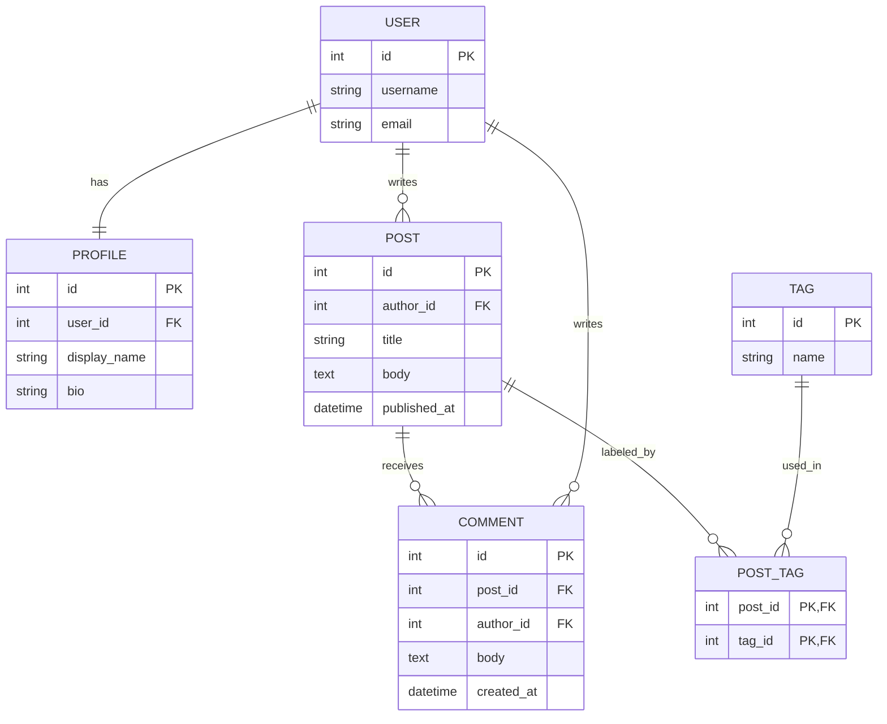

# ブログドメインのER図（Mermaid）

以下をMarkdownに貼るとプレビューできます。

```mermaid
erDiagram
  USER {
    int id PK
    string username
    string email
  }

  PROFILE {
    int id PK
    int user_id FK
    string display_name
    string bio
  }

  POST {
    int id PK
    int author_id FK
    string title
    text body
    datetime published_at
  }

  COMMENT {
    int id PK
    int post_id FK
    int author_id FK
    text body
    datetime created_at
  }

  TAG {
    int id PK
    string name
  }

  POST_TAG {
    int post_id PK,FK
    int tag_id PK,FK
  }

  USER  ||--|| PROFILE : has
  USER  ||--o{ POST    : writes
  POST  ||--o{ COMMENT : receives
  USER  ||--o{ COMMENT : writes
  POST  ||--o{ POST_TAG : labeled_by
  TAG   ||--o{ POST_TAG : used_in
```

- 多対多は中間テーブル（`POST_TAG`）で表現しています。
- 記号: `|`必須、`o`任意、`{`多。
