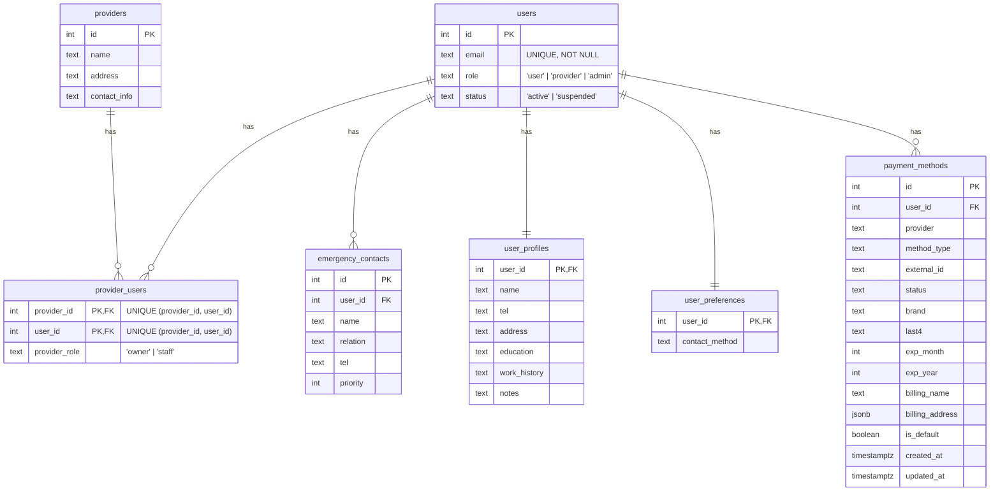

# CommunityHubのER図

```mermaid
erDiagram
  users {
    int id PK
    text email　"UNIQUE, NOT NULL"
    text role "'user' | 'provider' | 'admin'"
    text status "'active' | 'suspended'"
  }

  provider_users {
    int provider_id PK, FK "UNIQUE (provider_id, user_id)"
    int user_id PK, FK "UNIQUE (provider_id, user_id)"
    %% UNIQUE (provider_id, user_id)
    text provider_role "'owner' | 'staff'"
  }

  providers {
    int id PK
    text name
    text address
    text contact_info
  }
  
  %% Relationships
  users ||--o{ provider_users : has
  providers ||--o{ provider_users : has

  emergency_contacts {
    int id PK
    int user_id FK
    text name
    text relation
    text tel
    int priority
  }

  %% 1対多
  users ||--o{ emergency_contacts : has

  user_profiles {
    int user_id PK, FK
    text name
    text tel
    text address
    text education
    text work_history
    text notes
  }

  users ||--|| user_profiles : has

  user_preferences {
    int user_id PK, FK
    text contact_method
  }

  users ||--|| user_preferences : has

  payment_methods {
    int id PK
    int user_id FK
    text provider
    text method_type
    text external_id
    text status
    text brand
    text last4
    int exp_month
    int exp_year
    text billing_name
    jsonb billing_address
    boolean is_default
    timestamptz created_at
    timestamptz updated_at
  }

  users ||--o{ payment_methods : has

```
