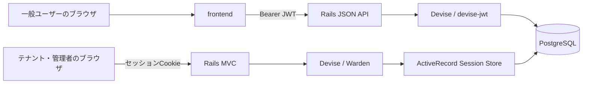
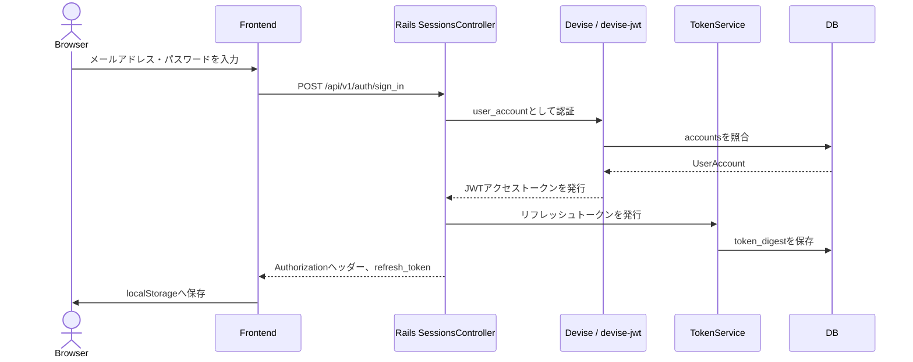
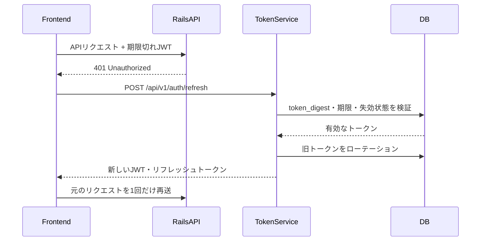
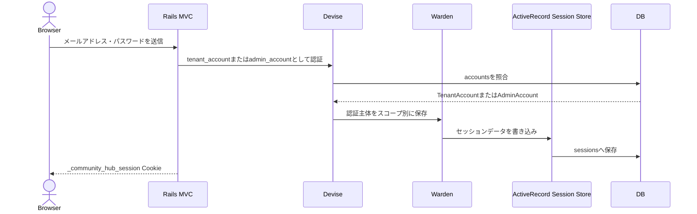
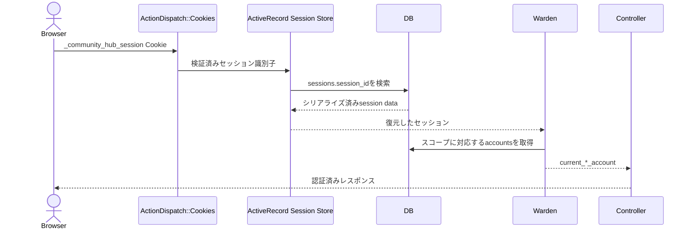

# アカウント・認証アーキテクチャ

## 目的

一般ユーザー、テナント、運営管理者の認証方式と責務境界を定義する。

本書では認証処理の流れとコンポーネントの責務を扱う。テーブル、カラム、外部キーなどのデータ構造は [`docs/er/00-account.md`](../er/00-account.md) を参照する。

認証後のロール、操作権限、Policyによる認可については [`01-authorization.md`](./01-authorization.md) を参照する。

## 認証主体

認証主体は次の3種類とし、いずれも `accounts` テーブルを認証情報の共通基盤として利用する。

| 認証主体 | Deviseスコープ | 認証方式 | 主な利用画面 |
| --- | --- | --- | --- |
| 一般ユーザー | `user_account` | JWTアクセストークン、リフレッシュトークン | frontendから利用するJSON API |
| テナント | `tenant_account` | DBセッション | Rails MVCのテナント画面 |
| 運営管理者 | `admin_account` | DBセッション | Rails MVCの管理画面 |

各Deviseモデルは同じ `accounts` テーブルを参照し、`account_type` で対象レコードを限定する。

- `UserAccount`: `account_type = user`
- `TenantAccount`: `account_type = tenant`
- `AdminAccount`: `account_type = admin`

認証後の業務情報は認証主体ごとに分離する。

- 一般ユーザー: `Account -> User -> UserProfile`
- テナント: `Account -> TenantMember -> Tenant`
- 運営管理者: `Account -> Admin`

## 全体構成



一般ユーザー向けAPIと、テナント・管理者向けMVCでは認証情報の保存場所とリクエスト経路が異なる。相互の認証情報を代用しない。

## 一般ユーザー認証

### 方針

一般ユーザーはRailsのDBセッションを使用せず、JWTアクセストークンと独自のリフレッシュトークンを使用する。

Wardenの `user_account` スコープは `store: false` とし、認証結果を `sessions` テーブルに保存しない。認証が必要なAPIは `authenticate_user_account!` でJWTを検証する。

### ログイン



ブラウザには次の値を保存する。

| 保存キー | 内容 | 用途 |
| --- | --- | --- |
| `communityHubAccessToken` | JWTアクセストークン | APIの `Authorization` ヘッダー |
| `communityHubRefreshToken` | リフレッシュトークン | JWTの再発行と失効 |
| `communityHubAccount` | 表示用の最小アカウント情報 | UI表示 |
| `communityHubDeviceId` | ブラウザ端末を識別するUUID | 端末単位のトークン管理 |

`communityHubAccount` は表示用途に限定し、サーバー側の認可判断には使用しない。

### 認証済みAPI

frontendはJWTを次の形式で送信する。

```http
Authorization: Bearer <access_token>
```

Rails APIはJWTから `current_user_account` を復元し、業務データは関連する `User` を起点に取得する。他ユーザーのIDをリクエストから受け取って認可の起点にしない。

### トークン更新

アクセストークンの有効期限は15分とする。APIが `401 Unauthorized` を返した場合、frontendは保存済みリフレッシュトークンで `POST /api/v1/auth/refresh` を呼び出す。



リフレッシュトークンの生値はDBに保存せず、SHA-256ダイジェストのみを保存する。

### ログアウト

現在のfrontendのログアウトでは次を行う。

1. `DELETE /api/v1/auth/refresh` でリフレッシュトークンを失効する。
2. frontendのlocalStorageから認証情報を削除する。

現在のfrontendはDeviseのサインアウトエンドポイントを呼び出していないため、発行済みJWTは `jwt_denylists` に登録されず、有効期限まで最大15分間有効である。即時失効を要件とする場合は、ログアウト時にDeviseのサインアウトも呼び出してJWTのJTIを拒否リストへ登録する。

## テナント・運営管理者認証

### 方針

テナントと運営管理者はDeviseとWardenによるRails MVCのセッション認証を使用する。

- テナント: `/tenant/auth/*`
- 運営管理者: `/admin/auth/*`

Wardenの `tenant_account` と `admin_account` スコープは `store: true` とし、認証結果をサーバー側セッションへ保存する。両スコープは同じCookie名と `sessions` テーブルを共有するが、Warden内では別スコープとして管理する。

### セッションCookie

セッションCookieの設定は次のとおりとする。

| 項目 | 値 | 意図 |
| --- | --- | --- |
| Cookie名 | `_community_hub_session` | アプリケーション共通のセッション識別 |
| `HttpOnly` | `true` | JavaScriptからの読み取りを防止 |
| `Secure` | productionのみ`true` | 本番環境ではHTTPS通信だけに送信 |
| `SameSite` | `Lax` | クロスサイト送信を制限 |

Cookieには業務データやアカウントレコード自体を格納しない。RailsがCookieからセッション識別子を復元し、対応する実データをPostgreSQLの `sessions` テーブルから取得する。

### ログイン



ログイン後は、テナントを `/tenant`、運営管理者を `/admin` へリダイレクトする。

### 認証済みリクエスト



ActiveRecord Session StoreはCookieから得た公開セッションIDを内部用の `private_id` に変換し、`sessions.session_id` を検索する。`sessions.session_id` の一意インデックスを利用する。

### Controllerの認証境界

テナント画面は `Tenant::BaseController` で次を必須とする。

```ruby
before_action :authenticate_tenant_account!
```

運営管理画面は `Admin::BaseController` で次を必須とする。

```ruby
before_action :authenticate_admin_account!
```

これらのメソッドはDeviseが動的に生成し、対象スコープを指定してWardenへ認証を要求する。

```ruby
def authenticate_admin_account!(opts = {})
  opts[:scope] = :admin_account
  opts[:locale] = I18n.locale
  warden.authenticate!(opts) unless devise_controller?
end
```

Cookieの読み取りやDBセッションの検索はこのメソッド内ではなく、先行するRailsミドルウェアが担当する。`authenticate_*_account!` の責務は、復元済みセッションを対象スコープで検証し、未認証リクエストを拒否することである。

### テナントコンテキスト

認証後のテナントと所属情報は次の関連から取得する。

```text
current_tenant_account
  -> tenant_member
    -> tenant
```

- `current_tenant_account`: Deviseが復元した認証アカウント
- `current_tenant_member`: テナント内の権限と状態
- `current_tenant_organization`: 所属テナント

テナント固有データの取得・更新では、リクエストパラメーターの `tenant_id` ではなく `current_tenant_organization` を認可の起点とする。

### ログアウト

Deviseのサインアウト処理で対象Wardenスコープの認証情報をセッションから削除する。サインアウト後は各ログイン画面へリダイレクトする。

- テナント: `/tenant/auth/sign_in`
- 運営管理者: `/admin/auth/sign_in`

## コンポーネントの責務

| コンポーネント | 責務 |
| --- | --- |
| `ActionDispatch::Cookies` | Cookieの読み取りと書き込み |
| `ActionDispatch::Session::ActiveRecordStore` | セッションIDの解決、`sessions` の検索・保存・削除 |
| Devise | ログイン処理、認証モデル、認証ヘルパー、失敗時の応答 |
| Warden | スコープ別の認証状態管理と認証戦略の実行 |
| `devise-jwt` | 一般ユーザー用JWTの発行と検証 |
| `Auth::TokenService` | リフレッシュトークンの発行、検証、ローテーション、失効 |
| BaseController | 画面・API単位の認証必須化 |
| 各業務Controller | `current_*` を起点にした認可とデータ操作 |

## セキュリティ上の注意

- 一般ユーザーのトークンはlocalStorageに保存するため、XSSが発生すると読み取られる可能性がある。MVP後にHttpOnly CookieまたはBFF構成への移行を再検討する。
- テナントと管理者の状態変更リクエストはCSRF保護を必須とする。
- 現在、テナントのログイン `create` のみCSRF検証をスキップしている。ログインCSRFへの対策として、原因解消後にスキップを撤廃することを検討する。
- 本番環境はHTTPSを必須とし、セッションCookieの `Secure` を有効にする。
- 認証済みであることと、対象データを操作できることは分けて判定する。Controllerは所属テナント、ロール、所有者を追加で検証する。
- 現在のセッションストアには `expire_after` が設定されていない。ブラウザCookieが失われてもDBレコードは残るため、`sessions.updated_at` を基準とした定期削除の運用を別途定める。

## 関連文書

- [認可・権限アーキテクチャ](./01-authorization.md)
- [アカウント関連ER図](../er/00-account.md)
- [認証設計](../authentication.md)
- [API認証境界設計](../api-auth-boundary-design.md)
- [テナントアカウント作成設計](../tenant-account-creation-design.md)
- [ユーザープロフィール設計](../user-profile-design.md)
