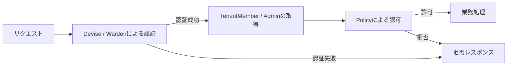

# 認可・権限アーキテクチャ

## 目的

認証済みのテナントユーザーと運営管理者について、「誰が、どのリソースに、どの操作を実行できるか」を一貫して判定する。

本書では固定ロールとPolicyクラスによるRBACを定義する。認証方式は [`00-account.md`](./00-account.md)、ロールを保存するテーブルは [`../er/00-account.md`](../er/00-account.md) を参照する。

## 認証と認可の境界

認証と認可は別の責務として扱う。

- 認証: リクエスト元のアカウントが誰かを確認する。
- 認可: 認証済みアカウントが対象操作を実行できるか判定する。



`account_type` は認証主体を分ける値であり、個別操作の権限判定には使用しない。認可には `tenant_members.role` または `admins.role` を使用する。

## ロール

### テナントロール

| ロール | 責務 |
| --- | --- |
| `owner` | テナントの管理責任者。組織情報、メンバー、掲載情報を管理する。 |
| `staff` | テナントの日常運用担当者。主に掲載情報を操作する。 |

ロールはテナントへの所属を表す `tenant_members.role` に保存する。

### 運営管理者ロール

| ロール | 責務 |
| --- | --- |
| `super_admin` | 運営全体の管理責任者。重要操作と管理者管理を含むすべての管理操作を行う。 |
| `operator` | 通常の運営業務担当者。テナントや掲載情報を管理するが、重要操作は行わない。 |

ロールは `admins.role` に保存する。

### ステータス

ロールとは別に `status` で利用可否を管理する。`active` の主体だけに操作を許可する。

Policyはロールを確認する前に、対象の `TenantMember` または `Admin` が有効であることを確認する。無効な主体にロール由来の権限を与えない。

## 権限マトリクス

マトリクスまたはPolicyに定義されていない操作はデフォルトで拒否する。

### テナント

| リソース・操作 | owner | staff |
| --- | :---: | :---: |
| テナント情報の閲覧 | ○ | ○ |
| テナント情報の更新 | ○ | × |
| メンバーの閲覧 | ○ | × |
| メンバーの追加・更新 | ○ | × |
| メンバーの削除 | ○ | × |
| 掲載情報の閲覧 | ○ | ○ |
| 掲載情報の作成 | ○ | ○ |
| 掲載情報の更新 | ○ | ○ |
| 掲載情報の公開・終了 | ○ | ○ |
| 掲載情報の削除 | ○ | × |

`owner` 自身の削除や降格によってテナントから `owner` が不在になる操作は禁止する。複数ownerを許可する場合は、少なくとも1人の有効なownerが残ることをトランザクション内で検証する。

### 運営管理者

| リソース・操作 | super_admin | operator |
| --- | :---: | :---: |
| テナントの閲覧 | ○ | ○ |
| テナントの作成 | ○ | ○ |
| テナントの更新 | ○ | ○ |
| テナントの削除 | ○ | × |
| 掲載情報の閲覧 | ○ | ○ |
| 掲載情報の更新・公開停止 | ○ | ○ |
| 管理者の閲覧 | ○ | × |
| 管理者の追加・更新 | ○ | × |
| 管理者のロール変更 | ○ | × |
| 管理者の削除 | ○ | × |
| システム設定 | ○ | × |

`super_admin` 自身の削除や降格によって有効な `super_admin` が不在になる操作は禁止する。

## Policyクラスによる認可

### 方針

ロールを固定値としてコードで管理し、認可ルールをPolicyクラスに集約する。`policies`、`roles`、`permissions` などの権限管理テーブルは使用しない。

すべてのPolicyはデフォルト拒否とし、許可する操作だけを個別のPolicyで明示する。

```ruby
class BasePolicy
  def show?
    false
  end

  def create?
    false
  end

  def update?
    false
  end

  def destroy?
    false
  end
end
```

ControllerやViewからPolicyを経由せず、次のようなロール比較を直接記述してはならない。

```ruby
current_admin.role == "super_admin"
current_tenant_member.role == "owner"
```

Policyの公開メソッドは、ロール名ではなく業務操作を表す名前にする。

```ruby
show?
create?
update?
destroy?
publish?
manage_members?
change_role?
```

ControllerとViewはPolicyの公開メソッドだけに依存し、ロールの保存方式や判定方法へ依存しない。

### Policyの配置

認証主体の名前空間ごとにPolicyを分離する。

```text
backend/app/policies/
├── tenant/
│   ├── base_policy.rb
│   ├── organization_policy.rb
│   ├── tenant_member_policy.rb
│   └── listing_policy.rb
└── admin/
    ├── base_policy.rb
    ├── tenant_account_policy.rb
    ├── listing_policy.rb
    └── admin_policy.rb
```

同じリソースに対してテナントと運営管理者では権限の意味が異なるため、Policyを共有しない。

### Policyへ渡す主体

Policyには認証モデルの `Account` ではなく、ロールと所属を持つ認可主体を渡す。

- テナント画面: `current_tenant_member`
- 運営管理画面: `current_admin`

`Admin::BaseController` は `current_admin_account.admin` から `current_admin` を取得する。対応する `TenantMember` または `Admin` が存在しない場合は認可失敗として扱う。

### Policyの判定順序

Policyは原則として次の順序で判定する。

1. 認可主体が存在するか。
2. 認可主体の `status` が `active` か。
3. 対象リソースが操作可能なスコープ内にあるか。
4. ロールが対象操作を許可しているか。
5. 最後のowner削除禁止など、操作固有の不変条件を満たすか。

ロールが強いことを理由にテナント境界の確認を省略しない。テナントの `owner` が操作できるのは、自身が所属するテナントのリソースだけである。

### Policyの例

```ruby
class Tenant::OrganizationPolicy
  def initialize(member, organization)
    @member = member
    @organization = organization
  end

  def show?
    active? && same_tenant?
  end

  def update?
    active? && same_tenant? && @member.role == "owner"
  end

  private

  def active?
    @member&.status == "active"
  end

  def same_tenant?
    @member&.tenant_id == @organization.id
  end
end
```

ロールの直接比較はPolicy内部に限定する。

## Controller

Controllerは次の順序で処理する。

1. Deviseで認証する。
2. 認可主体を取得する。
3. 対象リソースを認可主体のスコープから取得する。
4. Policyで対象操作を認可する。
5. 業務処理を実行する。

```ruby
def update
  organization = current_tenant_organization
  authorize organization, :update?
  organization.update!(organization_params)
end
```

`params[:tenant_id]` から直接テナントを取得せず、`current_tenant_organization` を起点とする。掲載情報も次のように所属テナント経由で取得する。

```ruby
current_tenant_organization.listings.find(params[:id])
```

Policyは取得スコープの代替ではない。スコープ制限と操作認可の両方を行う。

## 一覧取得

一覧画面ではPolicy Scope相当の仕組みを使い、閲覧可能なレコードだけを取得する。

- テナント: 所属テナントのレコードだけを返す。
- `operator`: 運営業務として許可されたレコードを返す。
- `super_admin`: 管理対象となるすべてのレコードを返す。

一覧取得後にRubyで許可されないレコードを除外するのではなく、ActiveRecordのクエリ段階でスコープを適用する。

## View

操作ボタンの表示可否もControllerと同じPolicyを使用する。

```erb
<% if policy(@organization).update? %>
  <%= link_to "編集", edit_tenant_organization_path %>
<% end %>
```

Viewでボタンを非表示にしても認可にはならない。URLを直接呼び出された場合に備え、Controller側のPolicy判定を必須とする。

テナント画面と運営管理画面はそれぞれ共通ヘッダーを持ち、ログイン中のメールアドレスとロールを表示する。

- テナント画面: 「テナント管理画面」の識別表示、`current_tenant_account.email`、`current_tenant_member.role`
- 運営管理画面: 「運営管理画面」の識別表示、`current_admin_account.email`、`current_admin.role`

## 認可失敗時

認証失敗と認可失敗を区別する。

| 状況 | HTML | JSON API |
| --- | --- | --- |
| 未認証 | ログイン画面へリダイレクト | `401 Unauthorized` |
| 認証済みだが権限なし | 安全な画面へ戻しエラー表示、または`403` | `403 Forbidden` |
| 自テナント外のリソース | `404 Not Found` | `404 Not Found` |

他テナントのリソースが存在することを漏らさないため、所属スコープ外のIDは `404 Not Found` とする。

## データ制約

アプリケーションのvalidationに加え、DBでも不正なロールを保存できないようにする。

### tenant_members

- `role` を `NOT NULL` にする。
- 許可値を `owner`、`staff` に制限する。
- `status` を `NOT NULL` にする。

### admins

- `role` を `NOT NULL` にする。
- 許可値を `super_admin`、`operator` に制限する。
- `status` を `NOT NULL` にする。
- `account_id` の一意制約を維持する。

既存データにNULLや許可値以外が存在する場合は、データを補正してから制約を追加する。

## アカウント生成境界

認証アカウントと認可主体は同じトランザクションで生成する。

### テナントアカウント

`TenantAccounts::CreateService` が次のレコードを生成する。

```text
TenantAccount
Tenant
TenantMember
```

`TenantMember` の初期値は `role = owner`、`status = active` とする。いずれかの保存に失敗した場合は、すべての生成をロールバックする。

運営管理者のテナントアカウント作成画面には、初期ロールが変更不可の `owner` であることを表示する。

### 運営管理者アカウント

`AdminAccounts::CreateService` が次のレコードを生成する。

```text
AdminAccount
Admin
```

`Admin` のロールは呼び出し元が `super_admin` または `operator` を明示し、初期statusは `active` とする。いずれかの保存に失敗した場合は、すべての生成をロールバックする。

Controller、seed、管理タスクは認証アカウントと認可主体を個別に生成せず、対応するServiceを使用する。

## テスト方針

Policy単体テストでは、各ロールの許可と拒否を検証する。

- `owner` が自テナントの組織を更新できる。
- `staff` が自テナントの組織を更新できない。
- `staff` が自テナントの掲載を作成・更新できる。
- どのテナントロールも他テナントのリソースを操作できない。
- `super_admin` がテナントを削除できる。
- `operator` がテナントを更新できるが削除できない。
- `operator` が管理者のロールを変更できない。
- `status` が `active` でない主体はロールにかかわらず操作できない。
- 最後の `owner` と最後の `super_admin` を削除・降格できない。

ControllerテストではPolicyが適用され、許可時に処理が成功し、拒否時にデータが変更されないことを確認する。テナント境界を伴う取得は、他テナントのIDに対して `404 Not Found` になることを確認する。

## セキュリティ上の注意

- デフォルトは拒否とし、明示的に許可した操作だけを実行する。
- 認証済みであることだけを理由に管理操作を許可しない。
- `super_admin` であっても、操作対象と監査要件を確認する。
- ロール変更、削除、公開停止などの重要操作は、操作者、対象、変更内容、日時を監査ログへ記録する。
- ロール変更後は次のリクエストから新しい権限を適用する。権限情報をセッションへ長期間固定保存しない。
- バックグラウンドジョブやサービスクラスから実行する操作にも、呼び出し元と認可済みであることが分かる境界を設ける。

## 関連文書

- [アカウント・認証アーキテクチャ](./00-account.md)
- [アカウント関連ER図](../er/00-account.md)
- [API認証境界設計](../api-auth-boundary-design.md)
