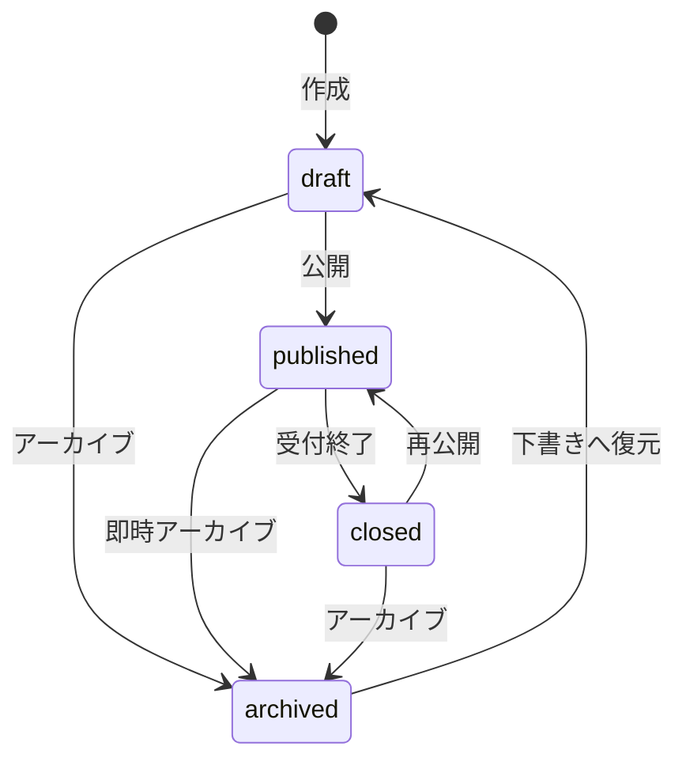

# Listing共通定義

## 目的

求人・滞在に共通するListingのカラム、状態遷移、画像、お気に入り、権限、削除・保持を定義する。

- 求人固有仕様: [`02-listing-job.md`](./02-listing-job.md)
- 滞在固有仕様: [`02-listing-stay.md`](./02-listing-stay.md)
- 住所・位置情報: [`03-location.md`](./03-location.md)
- テーブル間の関連: [`../er/01-listing.md`](../er/01-listing.md)

## 記載ルール

各カラムについて次を定義する。

- 業務上の意味
- 必須性と初期値
- 許可値、数値範囲、文字数
- 単位と表示形式
- 更新可能な操作
- 検索・並び替え用途
- 関連カラムとの整合条件

`要定義` の項目は、仕様確定時に具体的な値へ置き換える。

## 共通入力規則

文字項目は前後の空白を除去し、任意項目の空文字はNULLとして扱う。説明文はプレーンテキストのみとし、HTMLとMarkdownは解釈せず、改行だけを表示へ反映する。

| 項目 | 最大文字数 |
| --- | ---: |
| Listingタイトル | 120 |
| Listing説明 | 10,000 |
| 画像代替テキスト | 200 |

## listings

| カラム | 型 | 必須 | 初期値 | 定義 | 制約・更新条件 |
| --- | --- | :---: | --- | --- | --- |
| `id` | bigint | ○ | 自動採番 | Listingの識別子 | 作成後変更不可 |
| `tenant_id` | bigint | ○ | なし | Listingを所有するテナント | 作成後変更不可 |
| `created_by_tenant_member_id` | bigint | × | ログイン中メンバー | 作成したテナントメンバー | メンバー削除時はNULL |
| `updated_by_tenant_member_id` | bigint | × | ログイン中メンバー | 最後に更新したテナントメンバー | 更新操作ごとに設定、メンバー削除時はNULL |
| `listing_type` | string | ○ | なし | Listingの種別 | `job / stay`、作成後変更不可 |
| `title` | string | ○ | なし | 一覧・詳細に表示するタイトル | 最大120文字、前後空白を除去 |
| `description` | text | × | NULL | Listingの説明本文 | プレーンテキスト、最大10,000文字、公開時は必須 |
| `status` | string | ○ | `draft` | 公開・受付状態 | `draft / published / closed / archived` |
| `published_at` | datetime | × | NULL | 初回公開日時 | 初回公開時のみ設定し、再公開時は変更しない |
| `last_published_at` | datetime | × | NULL | 最新公開日時 | 初回公開・再公開のたびに更新する |
| `closed_at` | datetime | × | NULL | 現在の受付終了日時 | `closed`への遷移時に設定し、再公開時にNULLへ戻す |
| `closed_reason` | string | × | NULL | 受付終了理由 | `closed`の場合のみ設定可能 |
| `archived_at` | datetime | × | NULL | 現在のアーカイブ日時 | `archived`への遷移時に設定し、下書きへの復元時にNULLへ戻す |
| `created_at` | datetime | ○ | 自動設定 | 作成日時 | アプリケーションから変更しない |
| `updated_at` | datetime | ○ | 自動設定 | 更新日時 | 保存時に自動更新 |

1つのListingは最大1つの `listing_location` を持つ。住所・位置情報はListing本体に保持せず、作成・更新時は [`03-location.md`](./03-location.md) の整合条件に従う。

### description

| 項目 | 定義 |
| --- | --- |
| 入力形式 | プレーンテキスト |
| 最大文字数 | 10,000文字 |
| HTMLの許可 | 許可しない。入力値をテキストとしてエスケープ表示する |
| 改行の表示方法 | 入力された改行を保持して表示する |

## listing_images

| カラム | 型 | 必須 | 初期値 | 定義 | 制約・更新条件 |
| --- | --- | :---: | --- | --- | --- |
| `id` | bigint | ○ | 自動採番 | 画像の識別子 | 作成後変更不可 |
| `listing_id` | bigint | ○ | なし | 対応するListing | Listing削除時に連動削除 |
| `position` | integer | ○ | なし | 表示順 | 1以上、Listing内で一意 |
| `alt_text` | string | × | NULL | 画像の代替テキスト | 最大200文字 |
| `created_at` | datetime | ○ | 自動設定 | 作成日時 | アプリケーションから変更しない |
| `updated_at` | datetime | ○ | 自動設定 | 更新日時 | 保存時に自動更新 |

| 項目 | 定義 |
| --- | --- |
| 保存方式 | Active Storageの`has_one_attached :image`。メタデータを`listing_images`に保持する |
| 画像数上限 | 1つのListingにつき20件 |
| 対応形式 | JPEG、PNG、WebP。SVGとアニメーションGIFは受け付けない |
| 最大ファイルサイズ | 1ファイル10MB |
| 推奨解像度 | 1,200×800px以上 |
| 代表画像 | `position`が最小の画像。専用フラグは持たない |
| 画像削除・並び替え時のposition | 1から始まる欠番なしの連番へ、トランザクション内で振り直す |

画像の公開必須性はListing種別ごとに定義する。滞在Listingは1件以上を必須とし、求人Listingは任意とする。下書きでは種別によらず画像なしで保存できる。画像を任意とするListingの一覧・詳細画面では、未登録時にListing種別ごとのプレースホルダー画像を表示する。

## favorites

| カラム | 型 | 必須 | 初期値 | 定義 | 制約・更新条件 |
| --- | --- | :---: | --- | --- | --- |
| `id` | bigint | ○ | 自動採番 | お気に入りの識別子 | 作成後変更不可 |
| `user_id` | bigint | ○ | ログイン中ユーザー | お気に入り登録したユーザー | `listing_id`との組み合わせで一意 |
| `listing_id` | bigint | ○ | 対象Listing | お気に入り対象 | `user_id`との組み合わせで一意 |
| `created_at` | datetime | ○ | 自動設定 | 登録日時 | アプリケーションから変更しない |
| `updated_at` | datetime | ○ | 自動設定 | 更新日時 | 保存時に自動更新 |

| 項目 | 定義 |
| --- | --- |
| 非公開Listingの表示 | お気に入り一覧には表示しない。再公開時に再表示する |
| closed Listingの表示 | お気に入り一覧には表示しない。再公開時に再表示する |
| Listingアーカイブ時 | お気に入りを保持するが一覧には表示しない |
| Listing物理削除時 | favoritesを連動削除 |
| User削除時 | favoritesを連動削除 |

## Listing状態遷移

| 遷移元 | 遷移先 | 操作名 | 許可条件 | 日時カラムの更新 |
| --- | --- | --- | --- | --- |
| `draft` | `published` | 公開 | 共通および種別固有の公開条件を満たす | `published_at`がNULLの場合のみ現在日時を設定し、`last_published_at`を現在日時に更新 |
| `draft` | `archived` | アーカイブ | アーカイブ権限を持つ | `archived_at`を現在日時に設定 |
| `published` | `closed` | 受付終了 | 受付終了操作が可能 | `closed_at`を現在日時に設定し、指定された場合は`closed_reason`を設定 |
| `published` | `archived` | 即時アーカイブ | アーカイブ権限を持つ | `archived_at`を現在日時に設定 |
| `closed` | `published` | 再公開 | 現在の公開条件を満たす | `last_published_at`を現在日時に更新し、`closed_at`と`closed_reason`をNULLへ戻す |
| `closed` | `archived` | アーカイブ | アーカイブ権限を持つ | `archived_at`を現在日時に設定し、`closed_at`と`closed_reason`をNULLへ戻す |
| `archived` | `draft` | 下書きへ復元 | 復元権限を持つ | `archived_at`をNULLへ戻す |

定義されていない状態遷移は拒否する。`archived`から`published`への直接遷移と、`published`から`draft`への遷移は許可しない。

### 状態の意味

| 状態 | 一般公開 | 新規応募・予約 | 編集 | 用途 |
| --- | :---: | :---: | --- | --- |
| `draft` | × | × | ○ | 必須項目が未完成でも保存できる未公開状態 |
| `published` | ○ | ○ | ○ | 公開条件を満たし、応募・予約を受け付ける状態 |
| `closed` | × | × | ○ | 内容を保持したまま募集・受付を一時終了し、再公開できる状態 |
| `archived` | × | × | × | 通常運用では使用しないListingを保管する状態。編集する場合は先に`draft`へ復元する |

公開済みListingの内容を編集するために `draft` へ戻さない。非公開にする場合は `closed`、通常運用から廃止する場合は `archived` へ遷移させる。

### 受付終了理由

`closed_reason` は任意項目とする。設定する場合は任意の表示文言ではなく、Listing種別ごとに定義した識別子を保存する。

| Listing種別 | 値 | 意味 |
| --- | --- | --- |
| job | `capacity_reached` | 募集定員に到達 |
| job | `deadline_reached` | 募集期限が終了 |
| job | `manual` | テナントが手動で終了 |
| stay | `sales_period_ended` | 販売期間が終了 |
| stay | `no_availability` | 受付可能な在庫がない |
| stay | `operator_closed` | 施設都合で終了 |

状態遷移の履歴はListing本体に保持しない。公開・終了履歴や変更者・理由の監査が必要になった場合は、`listing_status_histories` の導入を別途設計する。

### 実装方針

状態はRailsの `enum` で表現し、状態遷移専用のクラスに許可遷移、公開条件、日時カラムの更新を集約する。Controllerから `status` を直接更新しない。

遷移処理はListingをロックしたトランザクション内で実行し、遷移元の確認と状態・日時カラムの更新を同時に行う。

現時点ではAASMなどのステートマシンGemを導入しない。状態が4種類、許可遷移が7種類であり、独自の公開条件と日時更新を明示的な処理として管理できるためである。状態数、遷移イベント、ガード、コールバックが増え、遷移定義のDSL化によって保守性が向上する段階で導入を再検討する。

## 種別と詳細テーブルの整合性

| `listing_type` | 必須の詳細 | 禁止する詳細 |
| --- | --- | --- |
| `job` | `job_listings` 1件 | `stay_listings` |
| `stay` | `stay_listings` 1件 | `job_listings` |

Listingと詳細は同じトランザクションで保存する。どちらかの保存に失敗した場合は、すべてロールバックする。

## 公開条件

| 条件 | job | stay |
| --- | :---: | :---: |
| titleが設定されている | ○ | ○ |
| descriptionが設定されている | ○ | ○ |
| 種別詳細が存在する | ○ | ○ |
| 画像が1件以上存在する | 任意 | ○ |
| 種別固有の公開条件を満たす | [`求人仕様`](./02-listing-job.md) | [`滞在仕様`](./02-listing-stay.md) |

公開済みListingの更新でも現在の公開条件を維持しなければならない。公開必須項目を欠く更新は拒否し、条件を外したい場合は先にListingを`closed`へ遷移させる。

## 更新権限

| 操作 | owner | staff | 条件 |
| --- | :---: | :---: | --- |
| 閲覧 | ○ | ○ | 自テナントのListing |
| 作成 | ○ | ○ | activeなメンバー |
| 更新 | ○ | ○ | 自テナントのListing |
| 公開 | ○ | ○ | 共通および種別固有の公開条件を満たす |
| 受付終了 | ○ | ○ | 対象がpublished |
| アーカイブ | ○ | ○ | 自テナントのListing |
| 削除 | ○ | × | 一度も公開していないdraftかつ参照データがない場合のみ |

認可の共通方針は [`01-authorization.md`](./01-authorization.md) を参照する。

## 削除・保持

| 対象 | 削除方式 | 関連データの扱い |
| --- | --- | --- |
| Listing | 原則`archived`。限定条件を満たす下書きだけ物理削除 | 取引・監査データから参照されるListingは保持 |
| job_listing | Listingと連動 | Listing削除時に削除 |
| stay_listing | Listingと連動 | Listing削除時に削除 |
| listing_location | Listingと連動 | Listing削除時に削除 |
| listing_images | Listingと連動 | Active Storageの添付ファイルとBlobを連動削除 |
| favorites | Listing・Userと連動 | アーカイブ時は保持、物理削除時は連動削除 |

物理削除は、`status = draft`、`published_at IS NULL`であり、応募、予約、チャット、お気に入りが1件も存在しない場合に限りownerへ許可する。それ以外はアーカイブする。物理削除時は種別詳細、位置情報、画像、画像Blob、その他の所有子レコードを同一処理で連動削除する。

公開履歴または取引データがあるListingは、保持期間を定める法務・運用要件が確定するまで無期限に保持する。将来の保持期限処理はListingを直接削除せず、応募・予約・決済・メッセージの保持要件と合わせた専用ジョブとして設計する。

## インデックス

| 検索・並び替え | 対象カラム | インデックス |
| --- | --- | --- |
| テナント別Listing一覧 | `tenant_id` | index |
| 種別・状態別一覧 | `listing_type, status` | composite index |
| 公開Listing一覧 | `status, published_at` | composite index |
| 作成者・更新者検索 | `created_by_tenant_member_id`, `updated_by_tenant_member_id` | individual index |
| 追加する検索条件 | 要定義 | 要定義 |

## テスト条件

- Listing共通の必須カラム、許可値、日時カラムの整合性を検証する。
- Listing種別と詳細テーブルの整合性を検証する。
- 許可された状態遷移と拒否される状態遷移を検証する。
- 共通および種別固有の公開条件を満たす場合と満たさない場合を検証する。
- 自テナントと他テナントの境界を検証する。
- Listingと詳細の保存失敗時に全体がロールバックされることを検証する。
- 一意制約と削除時の関連データを検証する。
