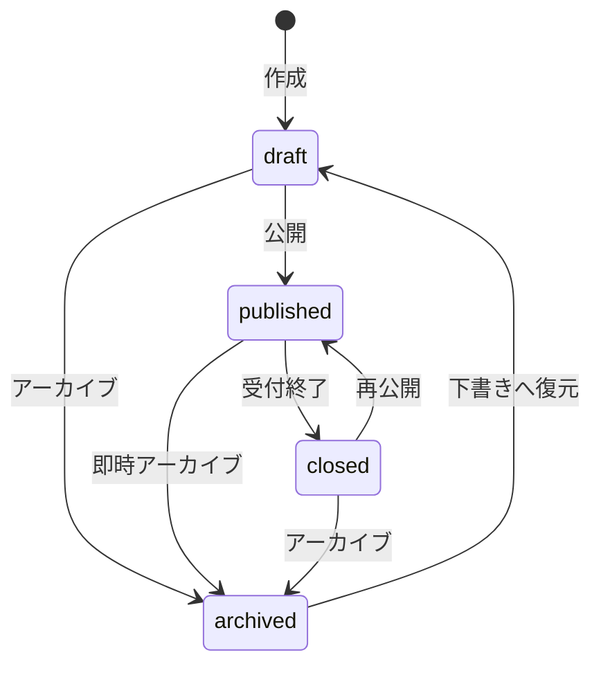

# Listing共通定義

## 目的

求人・滞在に共通するListingの責務、状態遷移、画像、お気に入り、権限、削除・保持の業務ルールを定義する。

- 求人固有仕様: [`02-listing-job.md`](./02-listing-job.md)
- 滞在固有仕様: [`02-listing-stay.md`](./02-listing-stay.md)
- 住所・位置情報: [`03-location.md`](./03-location.md)
- テーブル構造: [`../er/01-listing.md`](../er/01-listing.md)

カラム、型、NULL、初期値、外部キー、一意制約およびインデックスはERを正本とし、本書には重複記載しない。

## Listingの責務

Listingは、求人と滞在に共通する掲載単位であり、次を管理する。

- 所有テナントと作成・更新を行ったテナントメンバー
- 求人または滞在という掲載種別
- 一覧・詳細に表示するタイトルと説明
- 公開、受付終了、アーカイブのライフサイクル
- 初回公開、最新公開、受付終了、アーカイブの業務日時

掲載種別は作成後に変更できない。1つのListingは、掲載種別に対応する求人詳細または滞在詳細を1つだけ持つ。

住所・位置情報はListing本体へ重複保存せず、テナントが所有する拠点を`tenant_location_id`で任意に参照する。拠点の登録、再利用、公開条件は[`03-location.md`](./03-location.md)に従って管理する。

## 共通入力規則

文字項目は前後の空白を除去し、任意項目の空文字は未設定として扱う。最大文字数はERを参照する。

説明文は次の規則で扱う。

| 項目 | 定義 |
| --- | --- |
| 入力形式 | プレーンテキスト |
| HTML | 解釈せず、テキストとしてエスケープ表示する |
| Markdown | 解釈しない |
| 改行 | 入力された改行を保持して表示する |

## 画像管理

Listing画像は施設全体または求人全体を表す画像であり、表示順と代替テキストを持つ。滞在の客室内や寝具など特定のRoom Typeを表す販売用画像はListing画像へ混在させず、Room Typeへ紐づける。画像本体の保存方法とデータ構造はERを参照する。

| 項目 | 定義 |
| --- | --- |
| 画像数上限 | 1つのListingにつき20件 |
| 対応形式 | JPEG、PNG、WebP。SVGとアニメーションGIFは受け付けない |
| 最大ファイルサイズ | 1ファイル10MB |
| 推奨解像度 | 1,200×800px以上 |
| 代表画像 | 表示順が最初の画像。専用フラグは持たない |
| 削除・並び替え | 1から始まる欠番なしの表示順へ、同一処理内で振り直す |

滞在Listingは公開時に1件以上の画像を必須とし、求人Listingは任意とする。下書きでは種別によらず画像なしで保存できる。

画像を任意とするListingで画像がない場合は、Listing種別ごとのプレースホルダー画像を表示する。

## お気に入り

一般ユーザーは、同じListingを重複せずお気に入り登録できる。お気に入りはListingの公開状態とは独立して保持し、一覧への表示だけを公開状態に応じて切り替える。

| Listingの状態・操作 | お気に入りの扱い |
| --- | --- |
| `published` | お気に入り一覧へ表示する |
| `draft / closed / archived` | 関連を保持するが、お気に入り一覧には表示しない |
| 再公開 | 保持していたお気に入りを再表示する |
| Listing物理削除 | お気に入りも削除する |
| User物理削除 | そのUserのお気に入りを削除する |

## Listing状態遷移

| 遷移元 | 遷移先 | 操作名 | 許可条件 | 業務日時の扱い |
| --- | --- | --- | --- | --- |
| `draft` | `published` | 公開 | 共通および種別固有の公開条件を満たす | 初回公開日時を未設定時だけ記録し、最新公開日時を更新 |
| `draft` | `archived` | アーカイブ | アーカイブ権限を持つ | アーカイブ日時を記録 |
| `published` | `closed` | 受付終了 | 受付終了操作が可能 | 受付終了日時と指定された終了理由を記録 |
| `published` | `archived` | 即時アーカイブ | アーカイブ権限を持つ | アーカイブ日時を記録 |
| `closed` | `published` | 再公開 | 現在の公開条件を満たす | 最新公開日時を更新し、受付終了日時と理由を解除 |
| `closed` | `archived` | アーカイブ | アーカイブ権限を持つ | アーカイブ日時を記録し、受付終了日時と理由を解除 |
| `archived` | `draft` | 下書きへ復元 | 復元権限を持つ | アーカイブ日時を解除 |

定義されていない状態遷移は拒否する。`archived`から`published`への直接遷移と、`published`から`draft`への遷移は許可しない。

### 状態の意味

| 状態 | 一般公開 | 新規応募・予約 | 編集 | 用途 |
| --- | :---: | :---: | --- | --- |
| `draft` | × | × | ○ | 必須項目が未完成でも保存できる未公開状態 |
| `published` | ○ | ○ | ○ | 公開条件を満たし、応募・予約を受け付ける状態 |
| `closed` | × | × | ○ | 内容を保持したまま受付を一時終了し、再公開できる状態 |
| `archived` | × | × | × | 通常運用で使用しないListingを保管する状態。編集する場合は下書きへ復元する |

公開済みListingの内容を編集するために`draft`へ戻さない。非公開にする場合は`closed`、通常運用から廃止する場合は`archived`へ遷移させる。

### 受付終了理由

受付終了理由は任意の表示文言ではなく、Listing種別ごとに定義した識別子として扱う。

| Listing種別 | 値 | 意味 |
| --- | --- | --- |
| job | `capacity_reached` | 募集定員に到達 |
| job | `deadline_reached` | 募集期限が終了 |
| job | `manual` | テナントが手動で終了 |
| stay | `sales_period_ended` | 販売期間が終了 |
| stay | `no_availability` | 受付可能な在庫がない |
| stay | `operator_closed` | 施設都合で終了 |

状態遷移の履歴はListing本体に保持しない。公開・終了履歴や変更者・理由の監査が必要になった場合は、状態変更履歴を別途設計する。

### 状態遷移の実装方針

状態はRailsの`enum`で表現し、許可遷移、公開条件、業務日時の更新を状態遷移専用の処理へ集約する。Controllerから状態を直接更新しない。

遷移処理はListingをロックしたトランザクション内で実行し、遷移元の確認と状態・業務日時の更新を同時に行う。

現時点ではAASMなどのステートマシンGemを導入しない。状態数や遷移イベントが増え、DSL化によって保守性が向上する段階で再検討する。

## 種別と固有詳細の整合性

| Listing種別 | 必須の固有詳細 | 禁止する固有詳細 |
| --- | --- | --- |
| `job` | 求人詳細1件 | 滞在詳細 |
| `stay` | 滞在詳細1件 | 求人詳細 |

Listingと固有詳細は同じトランザクションで保存する。どちらかの保存に失敗した場合は、処理全体をロールバックする。

## 公開条件

| 条件 | job | stay |
| --- | :---: | :---: |
| タイトルが設定されている | ○ | ○ |
| 説明が設定されている | ○ | ○ |
| 種別に対応する固有詳細が存在する | ○ | ○ |
| 画像が1件以上存在する | 任意 | ○ |
| 種別固有の公開条件を満たす | [`求人仕様`](./02-listing-job.md) | [`滞在仕様`](./02-listing-stay.md) |

公開済みListingの更新でも現在の公開条件を維持しなければならない。公開必須項目を欠く更新は拒否し、条件を外したい場合は先にListingを`closed`へ遷移させる。

## 更新権限

| 操作 | owner | staff | 条件 |
| --- | :---: | :---: | --- |
| 閲覧 | ○ | ○ | 自テナントのListing |
| 作成 | ○ | ○ | activeなメンバー |
| 更新 | ○ | ○ | 自テナントのListing |
| 公開 | ○ | ○ | 共通および種別固有の公開条件を満たす |
| 受付終了 | ○ | ○ | 対象が`published` |
| アーカイブ | ○ | ○ | 自テナントのListing |
| 物理削除 | ○ | × | 一度も公開していない下書きかつ参照データがない場合のみ |

認可の共通方針は[`01-authorization.md`](./01-authorization.md)を参照する。

## 削除・保持

Listingは原則として物理削除せず、`archived`で保持する。

物理削除は、次の条件をすべて満たす場合に限りownerへ許可する。

- 下書きである
- 一度も公開されていない
- 応募、予約、チャット、お気に入りから参照されていない

物理削除時は、求人・滞在の固有詳細、Location、画像と添付ファイル、その他の所有子データを同一処理で削除する。

公開履歴または取引データがあるListingは、保持期間を定める法務・運用要件が確定するまで無期限に保持する。将来の保持期限処理はListingを直接削除せず、応募、予約、決済、メッセージの保持要件と合わせた専用処理として設計する。

## テスト条件

- Listing共通の必須属性、許可値、業務日時の整合性を検証する。
- Listing種別と固有詳細の整合性を検証する。
- 許可された状態遷移と拒否される状態遷移を検証する。
- 共通および種別固有の公開条件を満たす場合と満たさない場合を検証する。
- 自テナントと他テナントの境界を検証する。
- Listingと固有詳細の保存失敗時に処理全体がロールバックされることを検証する。
- 一意制約と削除時の関連データはERに従って検証する。
