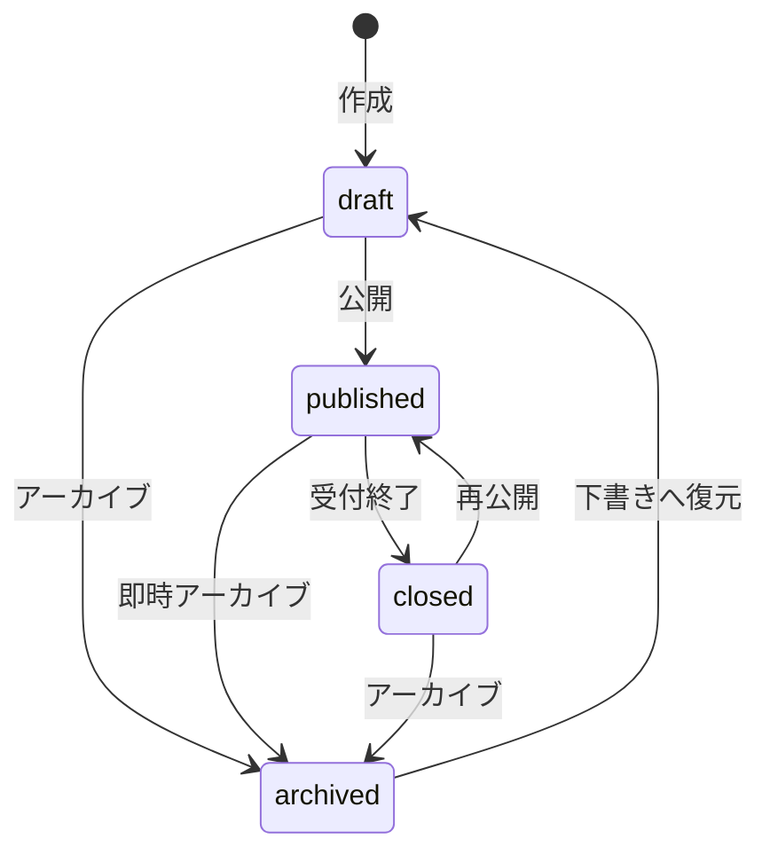

# Listing 定義

## 目的

求人・宿泊Listingの各カラムの意味、入力制約、更新条件、状態遷移を定義する。

テーブル間の関連とカラム構成は [`../er/01-listing.md`](../er/01-listing.md) を参照する。
住所・位置情報とGoogle Maps表示は [`03-location.md`](./03-location.md) を参照する。

## 記載ルール

各カラムについて次を定義する。

- 業務上の意味
- 必須性と初期値
- 許可値、数値範囲、文字数
- 単位と表示形式
- 更新可能な操作
- 検索・並び替え用途
- 関連カラムとの整合条件

`要定義` の項目は、仕様確定時に具体的な値へ置き換える。

## TODO

以下を優先度順に決定し、対応する本文の `要定義` を具体的な仕様へ置き換える。

### 1. 公開条件

- [ ] Listing 共通項目の公開必須条件を決める
- [ ] 求人 Listing の公開必須条件を決める
- [ ] 滞在 Listing の公開必須条件を決める

### 2. 金額

- [ ] 滞在料金の通貨を日本円に固定するか決める
- [ ] 滞在料金を整数の円単位で保持するか決める
- [ ] 滞在料金を税込・税抜のどちらとして扱うか決める
- [ ] 滞在料金が一室単位か、一人単位か決める

### 3. 募集上限

- [ ] `application_limit` が `NULL` の場合の意味を決める
- [ ] `application_limit` が `0` の場合の意味と、許可するかを決める
- [ ] 募集上限の判定対象となる応募ステータスを決める

### 4. 滞在可能期間

- [ ] `available_from` と `available_until` を両方必須とするか決める
- [ ] 過去の日付を指定できるか決める
- [ ] 予約期間全体が滞在可能期間内に収まることを必須とするか決める
- [ ] 予約期間の重複をどの機能で制御するか決める

### 5. 削除と保持

- [ ] Listing を物理削除するか、`archived` で保持するか決める
- [ ] `draft` のみ物理削除を許可するか決める
- [ ] 応募、予約、チャットが存在する場合の削除可否を決める
- [ ] Listing 削除後に関連データを保持する期間を決める

### 6. 画像

- [ ] 画像の保存方式を決める
- [ ] 登録可能な最大枚数、ファイルサイズ、形式を決める
- [ ] 一覧や詳細で使用する代表画像の決定方法を決める
- [ ] 画像削除・並び替え時の `position` の扱いを決める

### 7. 本文と入力形式

- [ ] `description` の必須条件、最大文字数、改行や装飾の扱いを決める
- [ ] `skills` の入力形式と検索方法を決める
- [ ] `amenities` の入力形式と検索方法を決める

## listings

| カラム | 型 | 必須 | 初期値 | 定義 | 制約・更新条件 |
| --- | --- | :---: | --- | --- | --- |
| `id` | bigint | ○ | 自動採番 | Listingの識別子 | 作成後変更不可 |
| `tenant_id` | bigint | ○ | なし | Listingを所有するテナント | 作成後変更不可 |
| `created_by_tenant_member_id` | bigint | × | ログイン中メンバー | 作成したテナントメンバー | メンバー削除時はNULL |
| `updated_by_tenant_member_id` | bigint | × | ログイン中メンバー | 最後に更新したテナントメンバー | 更新操作ごとに設定、メンバー削除時はNULL |
| `listing_type` | string | ○ | なし | Listingの種別 | `job / stay`、作成後変更不可 |
| `title` | string | ○ | なし | 一覧・詳細に表示するタイトル | 最大文字数: 要定義 |
| `description` | text | × | NULL | Listingの説明本文 | 記法・最大文字数: 要定義 |
| `status` | string | ○ | `draft` | 公開・受付状態 | `draft / published / closed / archived` |
| `published_at` | datetime | × | NULL | 初回公開日時 | 初回公開時のみ設定し、再公開時は変更しない |
| `last_published_at` | datetime | × | NULL | 最新公開日時 | 初回公開・再公開のたびに更新する |
| `closed_at` | datetime | × | NULL | 現在の受付終了日時 | `closed` への遷移時に設定し、再公開時にNULLへ戻す |
| `closed_reason` | string | × | NULL | 受付終了理由 | `closed` の場合のみ設定可能 |
| `archived_at` | datetime | × | NULL | 現在のアーカイブ日時 | `archived` への遷移時に設定し、下書きへの復元時にNULLへ戻す |
| `created_at` | datetime | ○ | 自動設定 | 作成日時 | アプリケーションから変更しない |
| `updated_at` | datetime | ○ | 自動設定 | 更新日時 | 保存時に自動更新 |

1つのListingは最大1つの `listing_location` を持つ。住所・位置情報はListing本体に保持せず、作成・更新時は [`03-location.md`](./03-location.md) の整合条件に従う。

### description

| 項目 | 定義 |
| --- | --- |
| 入力形式 | 要定義: プレーンテキスト / Markdown |
| 最大文字数 | 要定義 |
| HTMLの許可 | 要定義 |
| 改行の表示方法 | 要定義 |

## job_listings

| カラム | 型 | 必須 | 初期値 | 定義 | 制約・単位 |
| --- | --- | :---: | --- | --- | --- |
| `id` | bigint | ○ | 自動採番 | 求人詳細の識別子 | 作成後変更不可 |
| `listing_id` | bigint | ○ | なし | 対応する求人Listing | 一意、`listing_type = job` |
| `recruitment_type` | string | × | NULL | 募集形態 | `ongoing / spot` |
| `employment_type` | string | × | NULL | 契約上の雇用形態 | `regular_employee / contract_employee / part_time / temporary_staff / other` |
| `job_category_id` | bigint | × | NULL | 職種カテゴリーマスター | 公開時は有効なカテゴリーを必須とする |
| `salary_unit` | string | × | NULL | 給与の算定単位 | `hourly / daily / monthly / annual / per_shift` |
| `salary_min_amount` | integer | × | NULL | 最低額または固定額 | 公開時は必須、1以上、整数の円単位 |
| `salary_max_amount` | integer | × | NULL | 上限額 | NULLまたは`salary_min_amount`以上 |
| `currency` | string | ○ | `JPY` | ISO 4217通貨コード | 初期仕様では`JPY`のみ |
| `transportation_fee` | integer | ○ | `0` | 給与とは別に支給する交通費 | 0以上、整数の円単位 |
| `salary_notes` | text | × | NULL | 給与条件、手当、試用期間中の差異 | 最大文字数: 要定義 |
| `work_starts_at` | datetime | × | NULL | 単発勤務の開始日時 | `spot` の公開時は必須、`work_ends_at`より前 |
| `work_ends_at` | datetime | × | NULL | 単発勤務の終了日時 | `spot` の公開時は必須、`work_starts_at`より後 |
| `application_deadline` | datetime | × | NULL | 応募締切日時 | `spot` の公開時は必須、`work_starts_at`以前 |
| `break_minutes` | integer | ○ | `0` | 単発勤務の休憩時間 | `spot` で使用、0以上かつ勤務時間未満 |
| `work_days` | string | × | NULL | 継続求人の勤務日・勤務頻度の表示文 | `ongoing`の公開時は必須、最大255文字 |
| `working_hours` | string | × | NULL | 継続求人の勤務時間の表示文 | `ongoing`の公開時は必須、最大255文字 |
| `required_skills` | text | × | NULL | 必須スキル・経験 | 入力形式・最大文字数: 要定義 |
| `welcome_skills` | text | × | NULL | 歓迎スキル・経験 | 入力形式・最大文字数: 要定義 |
| `benefits` | text | × | NULL | 福利厚生 | 入力形式・最大文字数: 要定義 |
| `application_limit` | integer | × | NULL | 応募受付上限数 | 0以上、NULLと0の意味: 要定義 |
| `created_at` | datetime | ○ | 自動設定 | 作成日時 | アプリケーションから変更しない |
| `updated_at` | datetime | ○ | 自動設定 | 更新日時 | 保存時に自動更新 |

### 職種カテゴリーマスター

職種カテゴリーは自由入力やコード内の固定値ではなく、`job_categories` で管理する。1つの求人は1つの主要カテゴリーに所属する。

| カラム | 型 | 必須 | 初期値 | 定義 | 制約・更新条件 |
| --- | --- | :---: | --- | --- | --- |
| `id` | bigint | ○ | 自動採番 | 職種カテゴリーの識別子 | 作成後変更不可 |
| `code` | string | ○ | なし | システム内部で使用する識別子 | 一意、作成後変更不可 |
| `name` | string | ○ | なし | 画面に表示するカテゴリー名 | 最大文字数: 要定義 |
| `description` | text | × | NULL | 運営向けの説明 | 最大文字数: 要定義 |
| `position` | integer | ○ | なし | 選択肢の表示順 | 0以上、同順位はID昇順で表示する |
| `active` | boolean | ○ | true | 新規選択と公開に使用できるか | 無効化しても既存関連を保持する |
| `created_by_admin_id` | bigint | × | 操作中の管理者 | 作成した管理者 | 管理者削除時はNULL |
| `updated_by_admin_id` | bigint | × | 操作中の管理者 | 最後に更新した管理者 | 更新操作ごとに設定、管理者削除時はNULL |
| `created_at` | datetime | ○ | 自動設定 | 作成日時 | アプリケーションから変更しない |
| `updated_at` | datetime | ○ | 自動設定 | 更新日時 | 保存時に自動更新 |

カテゴリーは物理削除せず、使用停止時は `active = false` とする。無効なカテゴリーは新しい求人へ設定できず、無効なカテゴリーを設定した下書き・終了済み求人は公開または再公開できない。

カテゴリーの無効化を理由に公開中Listingを自動で `closed` へ遷移させない。既存の関連と表示は維持し、次回の再公開までに有効なカテゴリーへ変更する。

#### 初期データ

初期カテゴリーはseedで投入する。seedは環境構築時の初期登録にのみ使用し、運用開始後のカテゴリーの正本はDBとする。

seedは `code` をキーに未登録カテゴリーだけを作成する冪等な処理とする。既存カテゴリーの `name`、`position`、`active` を上書きせず、seedから削除されたカテゴリーも自動で無効化または削除しない。運用中の変更は運営管理画面から行う。

| `code` | `name` | `position` |
| --- | --- | ---: |
| `food_service` | 飲食 | 10 |
| `retail` | 販売 | 20 |
| `accommodation` | 宿泊・観光 | 30 |
| `logistics` | 物流・配送 | 40 |
| `light_work` | 軽作業 | 50 |
| `office` | オフィスワーク | 60 |
| `event` | イベント | 70 |
| `care` | 介護・福祉 | 80 |
| `medical` | 医療 | 90 |
| `construction` | 建設・土木 | 100 |
| `agriculture` | 農業 | 110 |
| `other` | その他 | 999 |

| 操作 | super_admin | operator |
| --- | :---: | :---: |
| 一覧・詳細の閲覧 | ○ | ○ |
| 作成 | ○ | × |
| 名前・説明の更新 | ○ | × |
| 表示順の変更 | ○ | × |
| 有効化・無効化 | ○ | × |

認可は職種カテゴリーマスター専用のPolicyに定義する。

### 募集形態と雇用形態

`recruitment_type` は募集期間の性質、`employment_type` は契約上の雇用区分を表し、別々に管理する。

| `recruitment_type` | 定義 | 日時カラム |
| --- | --- | --- |
| `ongoing` | 継続的な求人募集 | `work_starts_at` と `work_ends_at` は使用しない |
| `spot` | 特定の勤務日時に対する単発募集 | `work_starts_at`、`work_ends_at`、`application_deadline` が必須 |

単発募集を `employment_type` の値として表現しない。例えば、単発のアルバイトは `recruitment_type = spot`、`employment_type = part_time` として表現する。

`recruitment_type` と `employment_type` は下書きでは未設定を許可し、公開時は必須とする。

業務委託や雇用関係を伴わないインターンを扱う場合は、`employment_type` に混在させず、契約形態を表す別の設計を追加する。

### 勤務日・勤務時間

`spot` は応募対象となる1回の勤務を表すため、`work_starts_at`、`work_ends_at`、`break_minutes` を構造化して保持する。公開時は開始日時と終了日時を必須とし、休憩時間は勤務時間未満でなければならない。

`ongoing` の勤務日と勤務時間は募集要項の表示にのみ使用するため、`work_days` と `working_hours` に表示文を保持する。公開時は両方を必須とする。

| カラム | 入力例 |
| --- | --- |
| `work_days` | 月曜日〜金曜日のうち週3日以上 |
| `working_hours` | 9:00〜18:00の間で実働6〜8時間 |

曜日・時間帯による検索、シフト作成、勤務可能判定は行わない。これらが必要になった場合に、勤務時間を別テーブルへ構造化する。

### 給与

給与額は日本円の整数で保持し、控除前の総支給額として扱う。給与に税込・税抜の区分は持たせない。

| `salary_unit` | 表示 | 利用可能な募集形態 |
| --- | --- | --- |
| `hourly` | 時給 | `ongoing / spot` |
| `daily` | 日給 | `ongoing / spot` |
| `monthly` | 月給 | `ongoing` |
| `annual` | 年収 | `ongoing` |
| `per_shift` | 1勤務あたり | `spot` |

金額は次の規則で表示する。

| `salary_min_amount` | `salary_max_amount` | 表示 |
| ---: | ---: | --- |
| 1,200 | 1,200 | 1,200円 |
| 1,200 | 1,500 | 1,200〜1,500円 |
| 1,200 | NULL | 1,200円以上 |

公開時は `salary_unit`、`salary_min_amount`、`currency` を必須とする。固定額は `salary_max_amount` に `salary_min_amount` と同じ値を設定する。

`per_shift` は `work_starts_at` から `work_ends_at` までの1回の勤務に対する報酬を表す。初期仕様では1つの単発Listingを1勤務枠とし、同日に複数の勤務枠を募集する場合はListingを分ける。1つのListingで複数シフトを扱う必要が生じた場合は、`job_shifts` の導入を別途設計する。

`transportation_fee` は給与とは別に支給する固定額とし、支給しない場合は `0` とする。

## stay_listings

| カラム | 型 | 必須 | 初期値 | 定義 | 制約・単位 |
| --- | --- | :---: | --- | --- | --- |
| `id` | bigint | ○ | 自動採番 | 宿泊詳細の識別子 | 作成後変更不可 |
| `listing_id` | bigint | ○ | なし | 対応する宿泊Listing | 一意、`listing_type = stay` |
| `stay_type` | string | × | NULL | 宿泊施設・部屋の種別 | `private_room / shared_room / entire_place / other` |
| `capacity` | integer | × | NULL | 宿泊可能人数 | 1以上、上限: 要定義 |
| `price_per_night` | integer | × | NULL | 1泊あたりの料金 | 0以上、課金単位・通貨・税込区分: 要定義 |
| `check_in_time` | time | × | NULL | チェックイン時刻 | タイムゾーン・時間幅: 要定義 |
| `check_out_time` | time | × | NULL | チェックアウト時刻 | タイムゾーン・時間幅: 要定義 |
| `available_from` | date | × | NULL | 予約可能期間の開始日 | `available_until`以前 |
| `available_until` | date | × | NULL | 予約可能期間の終了日 | `available_from`以後 |
| `amenities` | text | × | NULL | 設備・アメニティ | テキスト / JSON / 別テーブル: 要定義 |
| `house_rules` | text | × | NULL | 宿泊時のルール | 入力形式・最大文字数: 要定義 |
| `created_at` | datetime | ○ | 自動設定 | 作成日時 | アプリケーションから変更しない |
| `updated_at` | datetime | ○ | 自動設定 | 更新日時 | 保存時に自動更新 |

### 宿泊料金

| 項目 | 定義 |
| --- | --- |
| 通貨 | 要定義 |
| 料金単位 | 要定義: 1室1泊 / 1名1泊 |
| 税込・税抜 | 要定義 |
| 追加人数料金 | 要定義 |
| 清掃料金・手数料 | 要定義 |

## listing_images

| カラム | 型 | 必須 | 初期値 | 定義 | 制約・更新条件 |
| --- | --- | :---: | --- | --- | --- |
| `id` | bigint | ○ | 自動採番 | 画像の識別子 | 作成後変更不可 |
| `listing_id` | bigint | ○ | なし | 対応するListing | Listing削除時に連動削除 |
| `image_url` | string | ○ | なし | 画像の参照先 | Active Storage / 外部URL: 要定義 |
| `position` | integer | ○ | なし | 表示順 | 1以上、Listing内で一意 |
| `alt_text` | string | × | NULL | 画像の代替テキスト | 必須性・最大文字数: 要定義 |
| `created_at` | datetime | ○ | 自動設定 | 作成日時 | アプリケーションから変更しない |
| `updated_at` | datetime | ○ | 自動設定 | 更新日時 | 保存時に自動更新 |

| 項目 | 定義 |
| --- | --- |
| 画像数上限 | 要定義 |
| 対応形式 | 要定義 |
| 最大ファイルサイズ | 要定義 |
| 推奨解像度 | 要定義 |
| 画像削除時のposition | 要定義 |

画像は求人・滞在とも任意とし、画像が登録されていない場合もListingを公開できる。一覧・詳細画面では、画像未登録時にListing種別ごとのプレースホルダー画像を表示する。

## favorites

| カラム | 型 | 必須 | 初期値 | 定義 | 制約・更新条件 |
| --- | --- | :---: | --- | --- | --- |
| `id` | bigint | ○ | 自動採番 | お気に入りの識別子 | 作成後変更不可 |
| `user_id` | bigint | ○ | ログイン中ユーザー | お気に入り登録したユーザー | `listing_id`との組み合わせで一意 |
| `listing_id` | bigint | ○ | 対象Listing | お気に入り対象 | `user_id`との組み合わせで一意 |
| `created_at` | datetime | ○ | 自動設定 | 登録日時 | アプリケーションから変更しない |
| `updated_at` | datetime | ○ | 自動設定 | 更新日時 | 保存時に自動更新 |

| 項目 | 定義 |
| --- | --- |
| 非公開Listingの表示 | 要定義 |
| closed Listingの表示 | 要定義 |
| Listing削除時 | favoritesを連動削除 |
| User削除時 | favoritesを連動削除 |

## Listing状態遷移

| 遷移元 | 遷移先 | 操作名 | 許可条件 | 日時カラムの更新 |
| --- | --- | --- | --- | --- |
| `draft` | `published` | 公開 | 公開条件を満たす | `published_at` がNULLの場合のみ現在日時を設定し、`last_published_at` を現在日時に更新 |
| `draft` | `archived` | アーカイブ | アーカイブ権限を持つ | `archived_at` を現在日時に設定 |
| `published` | `closed` | 受付終了 | 受付終了操作が可能 | `closed_at` を現在日時に設定し、指定された場合は `closed_reason` を設定 |
| `published` | `archived` | 即時アーカイブ | アーカイブ権限を持つ | `archived_at` を現在日時に設定 |
| `closed` | `published` | 再公開 | 現在の公開条件を満たす | `last_published_at` を現在日時に更新し、`closed_at` と `closed_reason` をNULLへ戻す |
| `closed` | `archived` | アーカイブ | アーカイブ権限を持つ | `archived_at` を現在日時に設定し、`closed_at` と `closed_reason` をNULLへ戻す |
| `archived` | `draft` | 下書きへ復元 | 復元権限を持つ | `archived_at` をNULLへ戻す |

定義されていない状態遷移は拒否する。`archived` から `published` への直接遷移と、`published` から `draft` への遷移は許可しない。

### 状態の意味

| 状態 | 一般公開 | 新規応募・予約 | 編集 | 用途 |
| --- | :---: | :---: | --- | --- |
| `draft` | × | × | ○ | 必須項目が未完成でも保存できる未公開状態 |
| `published` | ○ | ○ | ○ | 公開条件を満たし、応募・予約を受け付ける状態 |
| `closed` | × | × | ○ | 内容を保持したまま募集・受付を一時終了し、再公開できる状態 |
| `archived` | × | × | × | 通常運用では使用しないListingを保管する状態。編集する場合は先に `draft` へ復元する |

公開済みListingの内容を編集するために `draft` へ戻さない。非公開にする場合は `closed`、通常運用から廃止する場合は `archived` へ遷移させる。

### 受付終了理由

`closed_reason` は任意項目とする。設定する場合は任意の表示文言ではなく、Listing種別ごとに定義した識別子を保存する。

| Listing種別 | 値 | 意味 |
| --- | --- | --- |
| job | `capacity_reached` | 募集定員に到達 |
| job | `deadline_reached` | 募集期限が終了 |
| job | `manual` | テナントが手動で終了 |
| stay | `sales_period_ended` | 販売期間が終了 |
| stay | `no_availability` | 受付可能な在庫がない |
| stay | `operator_closed` | 施設都合で終了 |

状態遷移の履歴はListing本体に保持しない。公開・終了履歴や変更者・理由の監査が必要になった場合は、`listing_status_histories` の導入を別途設計する。

### 実装方針

状態はRailsの `enum` で表現し、状態遷移専用のクラスに許可遷移、公開条件、日時カラムの更新を集約する。Controllerから `status` を直接更新しない。

遷移処理はListingをロックしたトランザクション内で実行し、遷移元の確認と状態・日時カラムの更新を同時に行う。

現時点ではAASMなどのステートマシンGemを導入しない。状態が4種類、許可遷移が7種類であり、独自の公開条件と日時更新を明示的な処理として管理できるためである。状態数、遷移イベント、ガード、コールバックが増え、遷移定義のDSL化によって保守性が向上する段階で導入を再検討する。

## 種別と詳細テーブルの整合性

| `listing_type` | 必須の詳細 | 禁止する詳細 |
| --- | --- | --- |
| `job` | `job_listings` 1件 | `stay_listings` |
| `stay` | `stay_listings` 1件 | `job_listings` |

Listingと詳細は同じトランザクションで保存する。どちらかの保存に失敗した場合は、すべてロールバックする。

## 公開条件

| 条件 | job | stay |
| --- | :---: | :---: |
| titleが設定されている | ○ | ○ |
| descriptionが設定されている | 要定義 | 要定義 |
| 種別詳細が存在する | ○ | ○ |
| 画像が1件以上存在する | 任意 | 任意 |
| 求人の必須項目を満たす | 要定義 | - |
| 宿泊の必須項目を満たす | - | 要定義 |

## 更新権限

| 操作 | owner | staff | 条件 |
| --- | :---: | :---: | --- |
| 閲覧 | ○ | ○ | 自テナントのListing |
| 作成 | ○ | ○ | activeなメンバー |
| 更新 | ○ | ○ | 自テナントのListing |
| 公開 | ○ | ○ | 公開条件を満たす |
| 受付終了 | ○ | ○ | 対象がpublished |
| アーカイブ | ○ | 要定義 | 要定義 |
| 削除 | ○ | × | 削除可否・条件: 要定義 |

認可の共通方針は [`01-authorization.md`](./01-authorization.md) を参照する。

## 削除・保持

| 対象 | 削除方式 | 関連データの扱い |
| --- | --- | --- |
| Listing | 要定義: 物理削除 / archivedによる論理削除 | 要定義 |
| job_listing | Listingと連動 | Listing削除時に削除 |
| stay_listing | Listingと連動 | Listing削除時に削除 |
| listing_images | Listingと連動 | 画像本体の削除方法: 要定義 |
| favorites | Listing・Userと連動 | 物理削除 |

応募・予約が存在するListingの削除可否は、[`../er/02-job-application.md`](../er/02-job-application.md) と [`../er/03-stay-reservation.md`](../er/03-stay-reservation.md) の要件と合わせて定義する。

## インデックス

| 検索・並び替え | 対象カラム | インデックス |
| --- | --- | --- |
| テナント別Listing一覧 | `tenant_id` | index |
| 種別・状態別一覧 | `listing_type, status` | composite index |
| 公開Listing一覧 | `status, published_at` | composite index |
| 作成者・更新者検索 | `created_by_tenant_member_id`, `updated_by_tenant_member_id` | individual index |
| 追加する検索条件 | 要定義 | 要定義 |

## テスト条件

- 各必須カラムを検証する。
- 各許可値と不正値を検証する。
- 数値の下限・上限・カラム間大小関係を検証する。
- Listing種別と詳細テーブルの整合性を検証する。
- 許可された状態遷移と拒否される状態遷移を検証する。
- 公開条件を満たす場合と満たさない場合を検証する。
- 自テナントと他テナントの境界を検証する。
- Listingと詳細の保存失敗時に全体がロールバックされることを検証する。
- 一意制約と削除時の関連データを検証する。
