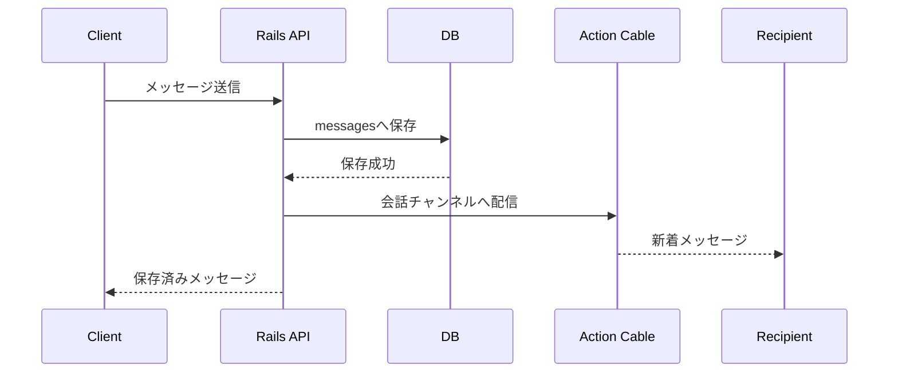

# リアルタイムチャット方針

## 構成

- リアルタイム配信にはRailsのAction Cableを使用する。
- 開発環境は `async`、本番環境はSolid Cableを使用する。
- メッセージの送信と履歴取得はREST APIで行う。
- メッセージ保存後、Action Cableで対象会話の参加者へ配信する。
- DBをメッセージの正本とし、WebSocketはリアルタイム通知経路として使用する。
- 接続切断や再接続時は、REST APIで未取得メッセージを再取得する。

## 認証・認可

- Action Cable接続時に `Account` を認証する。
- チャンネル購読時に `conversation_participants` を確認する。
- 会話参加者でないアカウントの購読、送信、履歴取得を拒否する。
- メッセージ送信時にもHTTP API側で参加者権限を再確認する。

## データモデル

会話、参加者、メッセージ、既読位置のデータ構造は [`../er/04-chat.md`](../er/04-chat.md) を参照する。
