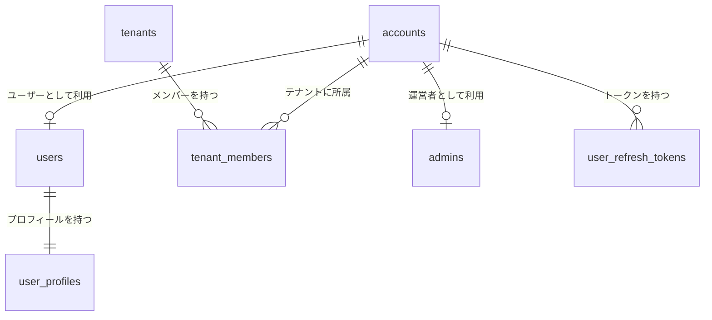
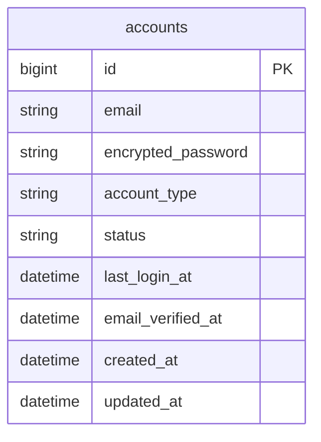
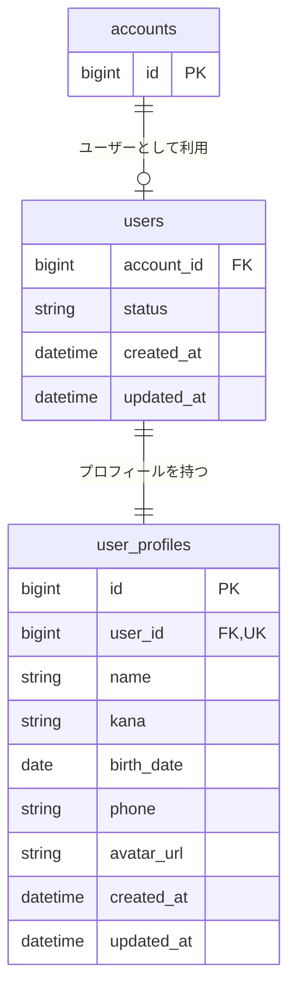
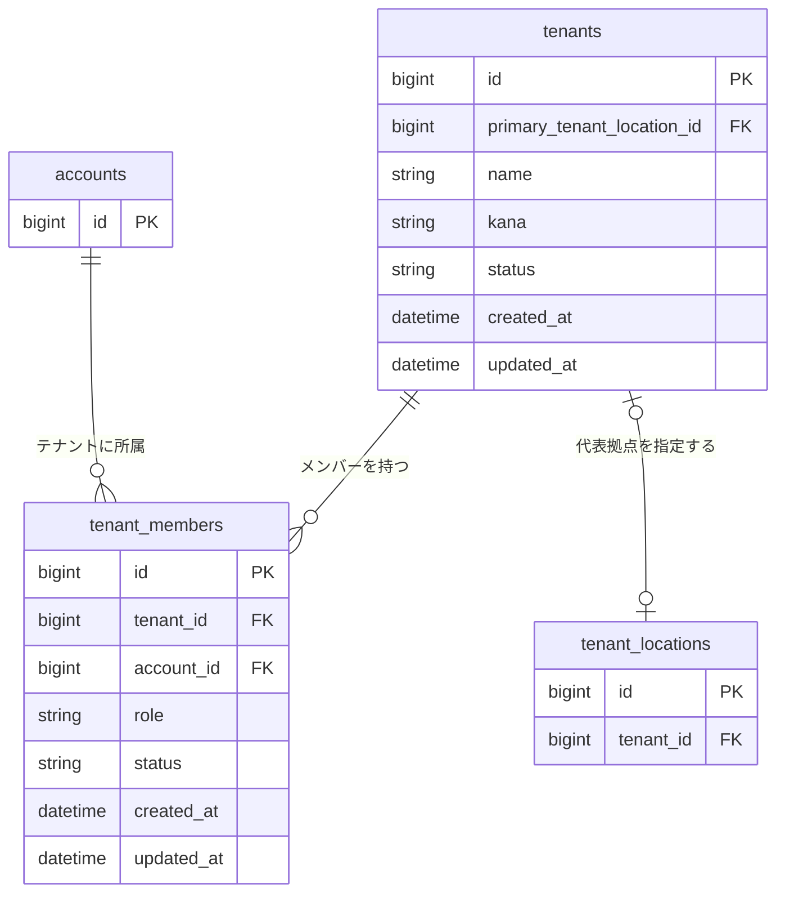
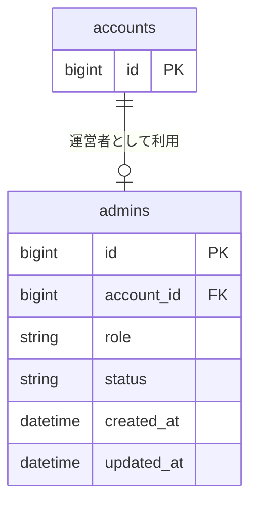
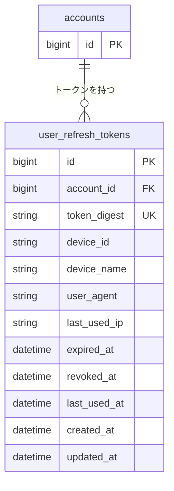
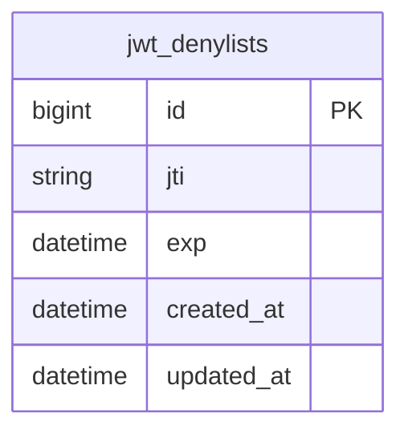
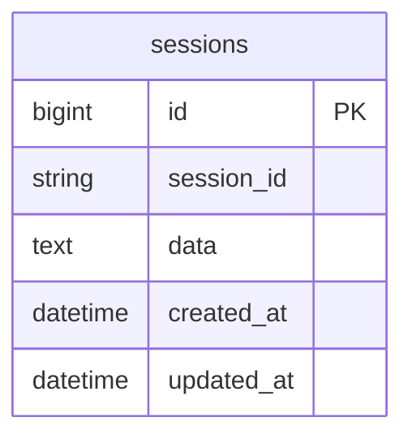

# アカウント関連 ER 図

アカウント、プロフィール、テナントメンバー、管理者、認証トークン、セッションのテーブル構造と関連を図示する。

## 全体関連図

テーブル間の関連だけを俯瞰する。詳細なカラムは後続の領域別 ER 図に記載する。

## 認証基盤

`accounts` は一般ユーザー、テナントメンバー、運営管理者で共通利用する認証情報を管理する。

`account_type` は `user`、`tenant`、`admin` のいずれかを取る。

## 一般ユーザー

一般ユーザーとしての状態は `users`、個人プロフィールは `user_profiles` で管理する。

`user_profiles.user_id` は一意であり、ユーザーとプロフィールは 1 対 1 で紐づく。

## テナント

テナントの組織情報は `tenants`、アカウントの所属・権限・在籍状態は `tenant_members` で管理する。

`tenants`は住所文字列を直接保持しない。住所・位置情報は`tenant_locations`で管理し、`primary_tenant_location_id`には同じテナントが所有する代表拠点を任意に設定する。拠点の詳細は[`01-listing.md`](./01-listing.md)を参照する。

## 運営管理者

運営管理者としての権限と状態は `admins` で管理する。

## ユーザー認証トークン

一般ユーザーの JWT リフレッシュトークンを、アカウントおよび端末単位で管理する。

`token_digest` は SHA-256 でハッシュ化し、一意制約を設ける。

## JWT 拒否リスト

ログアウト済みアクセストークンの JTI を管理する。ほかのテーブルへの外部キーを持たない。

## テナント・管理者セッション

テナントおよび運営管理者のサーバーセッションを管理する。ほかのテーブルへの外部キーを持たない。

