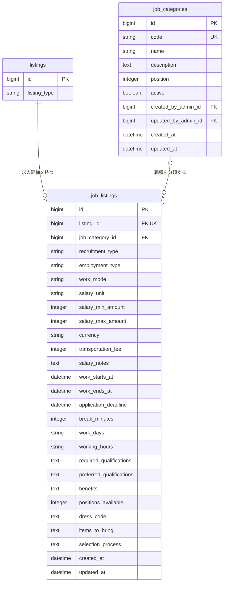

# 求人Listing関連 ER 図

求人固有の詳細と職種カテゴリーマスターのテーブル構造を定義する。Listing共通情報は [`01-listing.md`](./01-listing.md)、業務仕様は [`../architecture/02-listing-job.md`](../architecture/02-listing-job.md) を参照する。

## 関連図

## job_listings

| カラム | 型 | NULL | 初期値 | 制約・定義 |
| --- | --- | :---: | --- | --- |
| `id` | bigint | × | 自動採番 | 主キー |
| `listing_id` | bigint | × | なし | `listings.id`への外部キー、一意、対象は`listing_type = job` |
| `job_category_id` | bigint | ○ | NULL | `job_categories.id`への外部キー、公開時は有効なカテゴリーを必須とする |
| `recruitment_type` | string | ○ | NULL | `ongoing / spot`、公開時は必須 |
| `employment_type` | string | ○ | NULL | `regular_employee / contract_employee / part_time / temporary_staff / other`、公開時は必須 |
| `work_mode` | string | × | `onsite` | `onsite / remote / hybrid` |
| `salary_unit` | string | ○ | NULL | `hourly / daily / monthly / annual / per_shift` |
| `salary_min_amount` | integer | ○ | NULL | 公開時は必須、1以上、整数の円単位 |
| `salary_max_amount` | integer | ○ | NULL | NULLまたは`salary_min_amount`以上 |
| `currency` | string | × | `JPY` | 初期仕様では`JPY`のみ |
| `transportation_fee` | integer | × | `0` | 0以上、整数の円単位 |
| `salary_notes` | text | ○ | NULL | 最大1,000文字 |
| `work_starts_at` | datetime | ○ | NULL | `spot`の公開時は必須、`work_ends_at`より前 |
| `work_ends_at` | datetime | ○ | NULL | `spot`の公開時は必須、`work_starts_at`より後 |
| `application_deadline` | datetime | ○ | NULL | `spot`の公開時は必須、`work_starts_at`以前 |
| `break_minutes` | integer | × | `0` | 0以上、`spot`では勤務時間未満 |
| `work_days` | string | ○ | NULL | `ongoing`の公開時は必須、最大255文字 |
| `working_hours` | string | ○ | NULL | `ongoing`の公開時は必須、最大255文字 |
| `required_qualifications` | text | ○ | NULL | 最大2,000文字 |
| `preferred_qualifications` | text | ○ | NULL | 最大2,000文字 |
| `benefits` | text | ○ | NULL | 最大2,000文字 |
| `positions_available` | integer | ○ | NULL | NULLまたは1以上、`spot`の公開時は必須 |
| `dress_code` | text | ○ | NULL | `spot`で使用、最大2,000文字 |
| `items_to_bring` | text | ○ | NULL | `spot`で使用、最大2,000文字 |
| `selection_process` | text | ○ | NULL | `ongoing`で使用、最大2,000文字 |
| `created_at` | datetime | × | 自動設定 | 作成日時 |
| `updated_at` | datetime | × | 自動設定 | 更新日時 |

`listing_id` は一意とし、1つのListingに求人詳細を複数作成しない。

## job_categories

| カラム | 型 | NULL | 初期値 | 制約・定義 |
| --- | --- | :---: | --- | --- |
| `id` | bigint | × | 自動採番 | 主キー |
| `code` | string | × | なし | 一意、作成後変更不可 |
| `name` | string | × | なし | 画面に表示するカテゴリー名、最大100文字 |
| `description` | text | ○ | NULL | 運営向けの説明、最大1,000文字 |
| `position` | integer | × | なし | 0以上、同順位はID昇順 |
| `active` | boolean | × | `true` | 新規選択と公開に使用できるか |
| `created_by_admin_id` | bigint | ○ | 操作中の管理者 | `admins.id`への外部キー、管理者削除時はNULL |
| `updated_by_admin_id` | bigint | ○ | 操作中の管理者 | `admins.id`への外部キー、管理者削除時はNULL |
| `created_at` | datetime | × | 自動設定 | 作成日時 |
| `updated_at` | datetime | × | 自動設定 | 更新日時 |

## インデックス

| テーブル | カラム | 種別 |
| --- | --- | --- |
| `job_listings` | `listing_id` | unique index |
| `job_listings` | `job_category_id` | index |
| `job_categories` | `code` | unique index |
| `job_categories` | `active, position` | composite index |
| `job_categories` | `created_by_admin_id` | index |
| `job_categories` | `updated_by_admin_id` | index |
