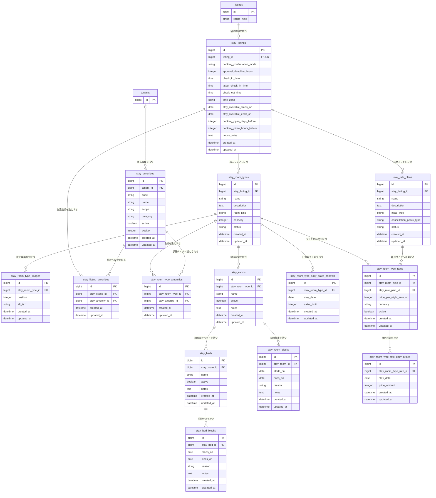

# 滞在Listing関連 ER 図

宿泊施設、部屋、Amenities、物理在庫、料金プランのテーブル構造を定義する。Listing共通情報は [`01-listing.md`](./01-listing.md)、業務仕様は [`../architecture/02-listing-stay.md`](../architecture/02-listing-stay.md) を参照する。

## 関連図

## stay_listings

| カラム | 型 | NULL | 初期値 | 制約・定義 |
| --- | --- | :---: | --- | --- |
| `id` | bigint | × | 自動採番 | 主キー |
| `listing_id` | bigint | × | なし | `listings.id`への外部キー、一意、対象は`listing_type = stay` |
| `booking_confirmation_mode` | string | × | `approval_required` | `instant / approval_required` |
| `approval_deadline_hours` | integer | × | `24` | 1〜72時間、`instant`では設定値を使用しない |
| `check_in_time` | time | ○ | NULL | チェックイン時刻、予約を受け付ける場合は必須 |
| `latest_check_in_time` | time | ○ | NULL | 到着予定として選択できる最終チェックイン時刻。予約を受け付ける場合は必須、`check_in_time`より後 |
| `check_out_time` | time | ○ | NULL | チェックアウト時刻 |
| `time_zone` | string | × | `Asia/Tokyo` | 施設のIANAタイムゾーン名 |
| `stay_available_starts_on` | date | ○ | NULL | 宿泊可能期間の開始日、対象に含む |
| `stay_available_ends_on` | date | ○ | NULL | 宿泊可能期間の終了日、対象に含めない最遅チェックアウト日 |
| `booking_open_days_before` | integer | × | `365` | チェックイン何日前に受付を開始するか、1〜365 |
| `booking_close_hours_before` | integer | × | `0` | チェックイン何時間前に受付を終了するか、0〜720 |
| `house_rules` | text | ○ | NULL | 施設共通の宿泊ルール |
| `created_at` | datetime | × | 自動設定 | 作成日時 |
| `updated_at` | datetime | × | 自動設定 | 更新日時 |

## stay_room_types

| カラム | 型 | NULL | 初期値 | 制約・定義 |
| --- | --- | :---: | --- | --- |
| `id` | bigint | × | 自動採番 | 主キー |
| `stay_listing_id` | bigint | × | なし | `stay_listings.id`への外部キー |
| `name` | string | × | なし | 利用者向け名称、最大100文字、施設内で一意 |
| `description` | text | ○ | NULL | Room Typeの説明、最大5,000文字 |
| `room_kind` | string | × | なし | `entire_place / private_room / shared_room` |
| `capacity` | integer | ○ | NULL | 1販売在庫単位の最大宿泊人数。公開時は必須かつ1以上、`shared_room`では1固定 |
| `status` | string | × | `draft` | `draft / published / inactive` |
| `created_at` | datetime | × | 自動設定 | 作成日時 |
| `updated_at` | datetime | × | 自動設定 | 更新日時 |

## stay_room_type_images

| カラム | 型 | NULL | 初期値 | 制約・定義 |
| --- | --- | :---: | --- | --- |
| `id` | bigint | × | 自動採番 | 主キー |
| `stay_room_type_id` | bigint | × | なし | `stay_room_types.id`への外部キー |
| `position` | integer | × | なし | 1以上、Room Type内で一意。最小値を代表画像とする |
| `alt_text` | string | ○ | NULL | 画像の代替テキスト、最大200文字 |
| `created_at` | datetime | × | 自動設定 | 作成日時 |
| `updated_at` | datetime | × | 自動設定 | 更新日時 |

画像本体はActive Storageの`has_one_attached :image`で保持する。Active Storage標準テーブルはフレームワーク管理のため、この業務ER図には展開しない。1つのRoom Typeにつき最大20件とし、Room Type削除時は添付ファイルを含めて連動削除する。

## stay_amenities

| カラム | 型 | NULL | 初期値 | 制約・定義 |
| --- | --- | :---: | --- | --- |
| `id` | bigint | × | 自動採番 | 主キー |
| `tenant_id` | bigint | ○ | NULL | `tenants.id`への外部キー。NULLはシステム共通、値ありはそのテナント固有 |
| `code` | string | × | システム生成 | 変更不可の識別子。共通内およびテナント内で一意、共通コードとの衝突不可 |
| `name` | string | × | なし | 利用者向け表示名、最大100文字 |
| `scope` | string | × | なし | `facility / room_type / both`、関連作成後は変更不可 |
| `category` | string | × | `other` | `connectivity / climate / bathroom / kitchen / bedding / accessibility / safety / parking / service / other` |
| `active` | boolean | × | `true` | 新規選択、現在の表示および検索に使用できるか |
| `position` | integer | × | なし | カテゴリ内の表示順、1以上 |
| `created_at` | datetime | × | 自動設定 | 作成日時 |
| `updated_at` | datetime | × | 自動設定 | 更新日時 |

## stay_listing_amenities

| カラム | 型 | NULL | 初期値 | 制約・定義 |
| --- | --- | :---: | --- | --- |
| `id` | bigint | × | 自動採番 | 主キー |
| `stay_listing_id` | bigint | × | なし | `stay_listings.id`への外部キー、`stay_amenity_id`との組み合わせで一意 |
| `stay_amenity_id` | bigint | × | なし | `stay_amenities.id`への外部キー、`scope = facility / both`かつ共通または所有テナント固有 |
| `created_at` | datetime | × | 自動設定 | 作成日時 |
| `updated_at` | datetime | × | 自動設定 | 更新日時 |

## stay_room_type_amenities

| カラム | 型 | NULL | 初期値 | 制約・定義 |
| --- | --- | :---: | --- | --- |
| `id` | bigint | × | 自動採番 | 主キー |
| `stay_room_type_id` | bigint | × | なし | `stay_room_types.id`への外部キー、`stay_amenity_id`との組み合わせで一意 |
| `stay_amenity_id` | bigint | × | なし | `stay_amenities.id`への外部キー、`scope = room_type / both`かつ共通または所有テナント固有 |
| `created_at` | datetime | × | 自動設定 | 作成日時 |
| `updated_at` | datetime | × | 自動設定 | 更新日時 |

## stay_rooms

| カラム | 型 | NULL | 初期値 | 制約・定義 |
| --- | --- | :---: | --- | --- |
| `id` | bigint | × | 自動採番 | 主キー |
| `stay_room_type_id` | bigint | × | なし | `stay_room_types.id`への外部キー |
| `name` | string | × | なし | 施設内の管理名、Room Type内で一意 |
| `active` | boolean | × | `true` | `false`の場合は新規予約へ割り当てない |
| `notes` | text | ○ | NULL | 一般ユーザーへ表示しない管理メモ |
| `created_at` | datetime | × | 自動設定 | 作成日時 |
| `updated_at` | datetime | × | 自動設定 | 更新日時 |

## stay_beds

| カラム | 型 | NULL | 初期値 | 制約・定義 |
| --- | --- | :---: | --- | --- |
| `id` | bigint | × | 自動採番 | 主キー |
| `stay_room_id` | bigint | × | なし | `stay_rooms.id`への外部キー、`shared_room`のRoomにのみ作成可能 |
| `name` | string | × | なし | Room内の管理名、Room内で一意 |
| `active` | boolean | × | `true` | `false`の場合は新規予約へ割り当てない |
| `notes` | text | ○ | NULL | 一般ユーザーへ表示しない管理メモ |
| `created_at` | datetime | × | 自動設定 | 作成日時 |
| `updated_at` | datetime | × | 自動設定 | 更新日時 |

## stay_room_blocks

| カラム | 型 | NULL | 初期値 | 制約・定義 |
| --- | --- | :---: | --- | --- |
| `id` | bigint | × | 自動採番 | 主キー |
| `stay_room_id` | bigint | × | なし | `stay_rooms.id`への外部キー |
| `starts_on` | date | × | なし | 停止する最初の宿泊日 |
| `ends_on` | date | × | なし | 停止終了日、対象期間には含めず`starts_on`より後 |
| `reason` | string | × | なし | `maintenance / cleaning / operator_block / other` |
| `notes` | text | ○ | NULL | 一般ユーザーへ表示しない管理メモ |
| `created_at` | datetime | × | 自動設定 | 作成日時 |
| `updated_at` | datetime | × | 自動設定 | 更新日時 |

## stay_bed_blocks

| カラム | 型 | NULL | 初期値 | 制約・定義 |
| --- | --- | :---: | --- | --- |
| `id` | bigint | × | 自動採番 | 主キー |
| `stay_bed_id` | bigint | × | なし | `stay_beds.id`への外部キー |
| `starts_on` | date | × | なし | 停止する最初の宿泊日 |
| `ends_on` | date | × | なし | 停止終了日、対象期間には含めず`starts_on`より後 |
| `reason` | string | × | なし | `maintenance / cleaning / operator_block / other` |
| `notes` | text | ○ | NULL | 一般ユーザーへ表示しない管理メモ |
| `created_at` | datetime | × | 自動設定 | 作成日時 |
| `updated_at` | datetime | × | 自動設定 | 更新日時 |

## stay_room_type_daily_sales_controls

| カラム | 型 | NULL | 初期値 | 制約・定義 |
| --- | --- | :---: | --- | --- |
| `id` | bigint | × | 自動採番 | 主キー |
| `stay_room_type_id` | bigint | × | なし | `stay_room_types.id`への外部キー、`stay_date`との組み合わせで一意 |
| `stay_date` | date | × | なし | 販売上限を適用する宿泊日 |
| `sales_limit` | integer | × | なし | その日の販売総数上限、0以上。0は販売停止 |
| `created_at` | datetime | × | 自動設定 | 作成日時 |
| `updated_at` | datetime | × | 自動設定 | 更新日時 |

レコードがない日は物理在庫数まで販売できる。レコード削除は販売制限の解除を意味する。`sales_limit`は貸切・個室ではRoom数、相部屋ではBed数を表す。

## stay_rate_plans

| カラム | 型 | NULL | 初期値 | 制約・定義 |
| --- | --- | :---: | --- | --- |
| `id` | bigint | × | 自動採番 | 主キー |
| `stay_listing_id` | bigint | × | なし | `stay_listings.id`への外部キー |
| `name` | string | × | なし | テナントが設定する利用者向けプラン名、最大100文字、施設内で一意 |
| `description` | text | ○ | NULL | プランの説明、最大2,000文字 |
| `meal_type` | string | × | `room_only` | `room_only / breakfast / dinner / breakfast_and_dinner / other` |
| `cancellation_policy_type` | string | × | `standard` | `standard / non_refundable` |
| `status` | string | × | `draft` | `draft / published / inactive` |
| `created_at` | datetime | × | 自動設定 | 作成日時 |
| `updated_at` | datetime | × | 自動設定 | 更新日時 |

初期仕様ではRate Plan固有の最低・最大宿泊数、販売期間、宿泊対象期間および早期予約期限を持たない。これらに対応するカラムは追加せず、施設共通の宿泊可能期間と予約受付期間を適用する。

## stay_room_type_rates

| カラム | 型 | NULL | 初期値 | 制約・定義 |
| --- | --- | :---: | --- | --- |
| `id` | bigint | × | 自動採番 | 主キー |
| `stay_room_type_id` | bigint | × | なし | `stay_room_types.id`への外部キー |
| `stay_rate_plan_id` | bigint | × | なし | `stay_rate_plans.id`への外部キー、`stay_room_type_id`との組み合わせで一意 |
| `price_per_night_amount` | integer | × | なし | 1在庫単位・1泊の料金、1以上 |
| `currency` | string | × | `JPY` | 初期仕様では`JPY`のみ |
| `active` | boolean | × | `true` | このRoom TypeとRate Planの組み合わせを選択できるか |
| `created_at` | datetime | × | 自動設定 | 作成日時 |
| `updated_at` | datetime | × | 自動設定 | 更新日時 |

## stay_room_type_rate_daily_prices

| カラム | 型 | NULL | 初期値 | 制約・定義 |
| --- | --- | :---: | --- | --- |
| `id` | bigint | × | 自動採番 | 主キー |
| `stay_room_type_rate_id` | bigint | × | なし | `stay_room_type_rates.id`への外部キー、`stay_date`との組み合わせで一意 |
| `stay_date` | date | × | なし | 上書き料金を適用する宿泊日 |
| `price_amount` | integer | × | なし | 1在庫単位・1泊の上書き料金、1以上。通貨は親のRoom Type別料金を継承 |
| `created_at` | datetime | × | 自動設定 | 作成日時 |
| `updated_at` | datetime | × | 自動設定 | 更新日時 |

対象宿泊日に日別料金が存在する場合は`price_amount`を使用し、存在しない場合は親の`price_per_night_amount`を使用する。日別料金の削除は基本料金への復帰を意味し、販売停止を意味しない。

## 整合条件

`stay_listings.listing_id` は一意とし、1つのListingに宿泊詳細を複数作成しない。

宿泊可能期間は`[stay_available_starts_on, stay_available_ends_on)`として扱う。両方を設定する場合は`stay_available_starts_on < stay_available_ends_on`とする。予約受付期間は`booking_open_days_before × 24 > booking_close_hours_before`とする。

`stay_room_type_images`、`stay_listing_amenities`、`stay_room_type_amenities`、`stay_rooms`、`stay_beds`、`stay_room_blocks`、`stay_bed_blocks`、`stay_room_type_daily_sales_controls`、`stay_rate_plans`、`stay_room_type_rates`、`stay_room_type_rate_daily_prices`は、関連をたどった`stay_listing_id`または`tenant_id`が一致しなければならない。異なるテナントの固有Amenitiesや異なる施設のレコード同士を紐づけない。

`stay_room_types.capacity` は `entire_place / private_room` では1 Roomあたりの最大宿泊人数とし、`shared_room` では1 Bedあたり1人を表すため1とする。相部屋の物理Room全体の収容人数は、そのRoomに属する有効なBed数から算出する。

Room TypeとRate Planは`status = published`の場合だけ新規予約の候補となる。`stay_room_type_rates.active = true`だけでは選択可能にならず、関連するRoom TypeとRate Planの両方が公開中でなければならない。既存予約から参照されるRoom Type、Rate PlanおよびRoom Type別料金は物理削除しない。

Room Typeを`published`へ変更するには、`stay_room_type_images`が1件以上必要とする。公開後に画像を0件へ減らす操作は許可しない。

停止期間は `[starts_on, ends_on)` の半開区間として扱う。同じRoomまたはBedに対する停止期間同士の重複は許可するが、予約割り当て期間と重複する停止は作成できない。

## インデックス

| テーブル | カラム | 種別 |
| --- | --- | --- |
| `stay_listings` | `listing_id` | unique index |
| `stay_room_types` | `stay_listing_id, status` | composite index |
| `stay_room_types` | `stay_listing_id, name` | unique index |
| `stay_room_type_images` | `stay_room_type_id, position` | unique index |
| `stay_amenities` | `code WHERE tenant_id IS NULL` | partial unique index |
| `stay_amenities` | `tenant_id, code WHERE tenant_id IS NOT NULL` | partial unique index |
| `stay_amenities` | `active, scope, category` | composite index |
| `stay_listing_amenities` | `stay_listing_id, stay_amenity_id` | unique index |
| `stay_room_type_amenities` | `stay_room_type_id, stay_amenity_id` | unique index |
| `stay_rooms` | `stay_room_type_id, name` | unique index |
| `stay_beds` | `stay_room_id, name` | unique index |
| `stay_room_blocks` | `stay_room_id, starts_on, ends_on` | composite index |
| `stay_bed_blocks` | `stay_bed_id, starts_on, ends_on` | composite index |
| `stay_room_type_daily_sales_controls` | `stay_room_type_id, stay_date` | unique index |
| `stay_rate_plans` | `stay_listing_id, status` | composite index |
| `stay_rate_plans` | `stay_listing_id, name` | unique index |
| `stay_room_type_rates` | `stay_room_type_id, stay_rate_plan_id` | unique index |
| `stay_room_type_rate_daily_prices` | `stay_room_type_rate_id, stay_date` | unique index |
