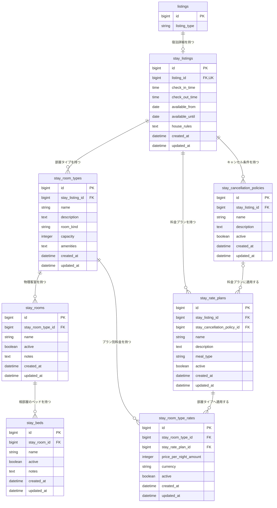

# 滞在Listing関連 ER 図

宿泊施設、部屋、物理在庫、料金プランのテーブル構造を定義する。Listing共通情報は [`01-listing.md`](./01-listing.md)、業務仕様は [`../architecture/02-listing-stay.md`](../architecture/02-listing-stay.md) を参照する。

## 関連図

## stay_listings

| カラム | 型 | NULL | 初期値 | 制約・定義 |
| --- | --- | :---: | --- | --- |
| `id` | bigint | × | 自動採番 | 主キー |
| `listing_id` | bigint | × | なし | `listings.id`への外部キー、一意、対象は`listing_type = stay` |
| `check_in_time` | time | ○ | NULL | チェックイン時刻 |
| `check_out_time` | time | ○ | NULL | チェックアウト時刻 |
| `available_from` | date | ○ | NULL | 予約可能期間の開始日、設定時は`available_until`以前 |
| `available_until` | date | ○ | NULL | 予約可能期間の終了日、設定時は`available_from`以後 |
| `house_rules` | text | ○ | NULL | 施設共通の宿泊ルール |
| `created_at` | datetime | × | 自動設定 | 作成日時 |
| `updated_at` | datetime | × | 自動設定 | 更新日時 |

## stay_room_types

| カラム | 型 | NULL | 初期値 | 制約・定義 |
| --- | --- | :---: | --- | --- |
| `id` | bigint | × | 自動採番 | 主キー |
| `stay_listing_id` | bigint | × | なし | `stay_listings.id`への外部キー |
| `name` | string | × | なし | 利用者向け名称、施設内の一意性は要定義 |
| `description` | text | ○ | NULL | Room Typeの説明 |
| `room_kind` | string | × | なし | `entire_place / private_room / shared_room` |
| `capacity` | integer | ○ | NULL | 公開時は必須、1以上、上限と`shared_room`での扱いは要定義 |
| `amenities` | text | ○ | NULL | 入力形式と検索方法は要定義 |
| `created_at` | datetime | × | 自動設定 | 作成日時 |
| `updated_at` | datetime | × | 自動設定 | 更新日時 |

## stay_rooms

| カラム | 型 | NULL | 初期値 | 制約・定義 |
| --- | --- | :---: | --- | --- |
| `id` | bigint | × | 自動採番 | 主キー |
| `stay_room_type_id` | bigint | × | なし | `stay_room_types.id`への外部キー |
| `name` | string | × | なし | 施設内の管理名、Room Type内で一意 |
| `active` | boolean | × | `true` | `false`の場合は新規予約へ割り当てない |
| `notes` | text | ○ | NULL | 一般ユーザーへ表示しない管理メモ |
| `created_at` | datetime | × | 自動設定 | 作成日時 |
| `updated_at` | datetime | × | 自動設定 | 更新日時 |

## stay_beds

| カラム | 型 | NULL | 初期値 | 制約・定義 |
| --- | --- | :---: | --- | --- |
| `id` | bigint | × | 自動採番 | 主キー |
| `stay_room_id` | bigint | × | なし | `stay_rooms.id`への外部キー、`shared_room`のRoomにのみ作成可能 |
| `name` | string | × | なし | Room内の管理名、Room内で一意 |
| `active` | boolean | × | `true` | `false`の場合は新規予約へ割り当てない |
| `notes` | text | ○ | NULL | 一般ユーザーへ表示しない管理メモ |
| `created_at` | datetime | × | 自動設定 | 作成日時 |
| `updated_at` | datetime | × | 自動設定 | 更新日時 |

## stay_cancellation_policies

| カラム | 型 | NULL | 初期値 | 制約・定義 |
| --- | --- | :---: | --- | --- |
| `id` | bigint | × | 自動採番 | 主キー |
| `stay_listing_id` | bigint | × | なし | `stay_listings.id`への外部キー |
| `name` | string | × | なし | テナントが設定する管理・表示名称 |
| `description` | text | ○ | NULL | 利用者へ表示するキャンセル条件、構造化方法は要定義 |
| `active` | boolean | × | `true` | 新しいRate Planへ設定できるか |
| `created_at` | datetime | × | 自動設定 | 作成日時 |
| `updated_at` | datetime | × | 自動設定 | 更新日時 |

## stay_rate_plans

| カラム | 型 | NULL | 初期値 | 制約・定義 |
| --- | --- | :---: | --- | --- |
| `id` | bigint | × | 自動採番 | 主キー |
| `stay_listing_id` | bigint | × | なし | `stay_listings.id`への外部キー |
| `stay_cancellation_policy_id` | bigint | ○ | NULL | `stay_cancellation_policies.id`への外部キー、選択可能にする場合は必須 |
| `name` | string | × | なし | テナントが設定する利用者向けプラン名 |
| `description` | text | ○ | NULL | プランの説明 |
| `meal_type` | string | × | `room_only` | `room_only / breakfast / dinner / breakfast_and_dinner / other` |
| `active` | boolean | × | `true` | 新規予約で選択できるか |
| `created_at` | datetime | × | 自動設定 | 作成日時 |
| `updated_at` | datetime | × | 自動設定 | 更新日時 |

## stay_room_type_rates

| カラム | 型 | NULL | 初期値 | 制約・定義 |
| --- | --- | :---: | --- | --- |
| `id` | bigint | × | 自動採番 | 主キー |
| `stay_room_type_id` | bigint | × | なし | `stay_room_types.id`への外部キー |
| `stay_rate_plan_id` | bigint | × | なし | `stay_rate_plans.id`への外部キー、`stay_room_type_id`との組み合わせで一意 |
| `price_per_night_amount` | integer | × | なし | 1在庫単位・1泊の料金、1以上 |
| `currency` | string | × | `JPY` | 初期仕様では`JPY`のみ |
| `active` | boolean | × | `true` | このRoom TypeとRate Planの組み合わせを選択できるか |
| `created_at` | datetime | × | 自動設定 | 作成日時 |
| `updated_at` | datetime | × | 自動設定 | 更新日時 |

## 整合条件

`stay_listings.listing_id` は一意とし、1つのListingに宿泊詳細を複数作成しない。

`stay_rooms`、`stay_beds`、`stay_rate_plans`、`stay_cancellation_policies`、`stay_room_type_rates` は、関連をたどった `stay_listing_id` が一致しなければならない。異なる施設に属するレコード同士を紐づけない。

## インデックス

| テーブル | カラム | 種別 |
| --- | --- | --- |
| `stay_listings` | `listing_id` | unique index |
| `stay_room_types` | `stay_listing_id` | index |
| `stay_rooms` | `stay_room_type_id, name` | unique index |
| `stay_beds` | `stay_room_id, name` | unique index |
| `stay_cancellation_policies` | `stay_listing_id` | index |
| `stay_rate_plans` | `stay_listing_id` | index |
| `stay_rate_plans` | `stay_cancellation_policy_id` | index |
| `stay_room_type_rates` | `stay_room_type_id, stay_rate_plan_id` | unique index |
