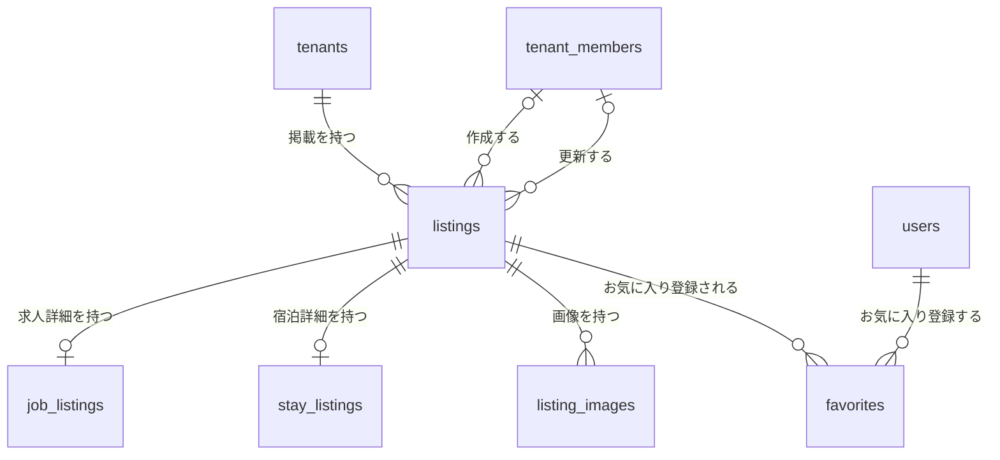
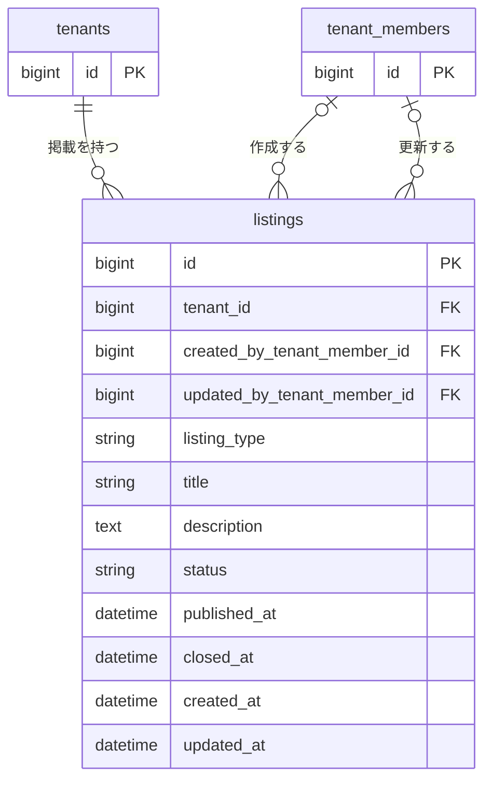
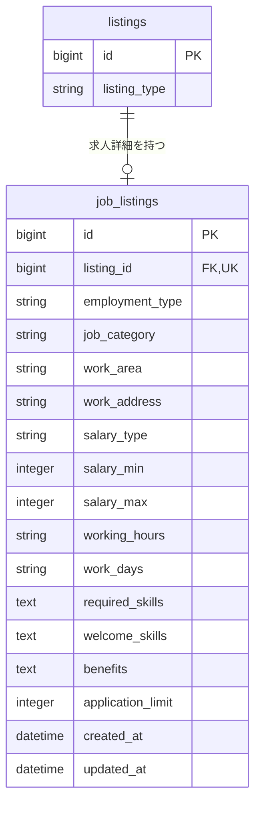
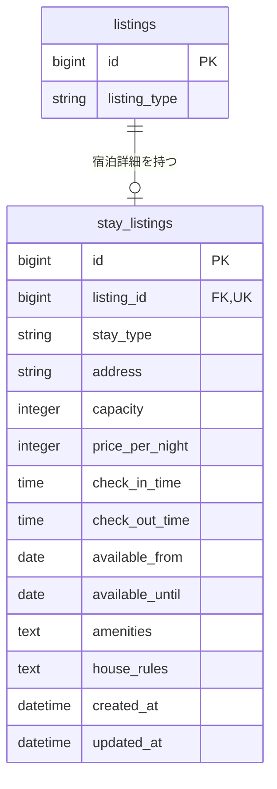
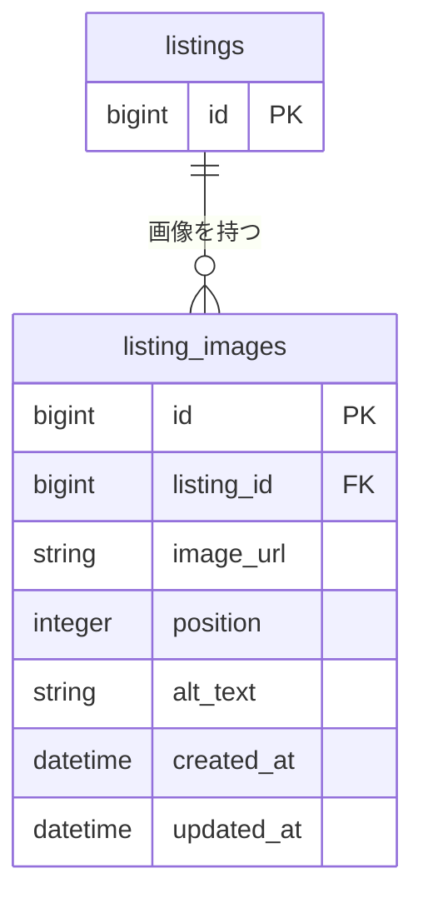
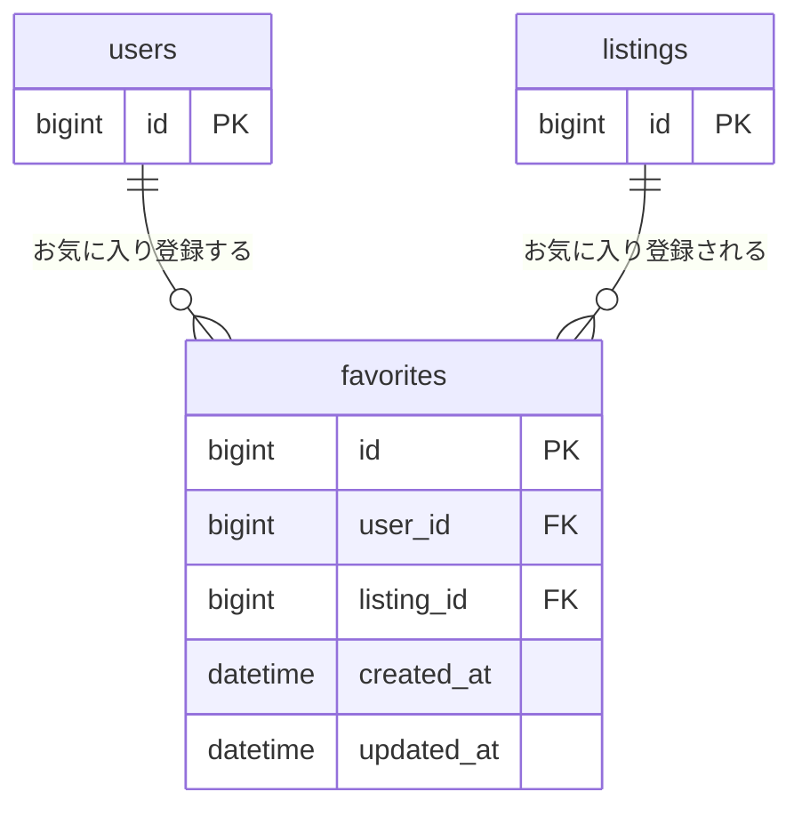

# Listing 関連 ER 図

求人と宿泊情報の共通ルートを `listings` とし、種別固有の詳細、画像、お気に入りとの関連を図示する。

## 全体関連図

テーブル間の関連だけを俯瞰する。詳細なカラムは後続の領域別 ER 図に記載する。

## Listing 共通情報

`listings` は求人と宿泊に共通するタイトル、説明、公開状態、所属テナント、作成者、更新者を管理する。

`tenant_id`、`listing_type`、`title`、`status` は必須とする。`created_by_tenant_member_id` と `updated_by_tenant_member_id` は、メンバー削除時にNULLを許容する。

`listing_type` は次の値を取る。

| 値 | 種別 |
| --- | --- |
| `job` | 求人 |
| `stay` | 宿泊 |

`status` は次の値を取る。

| 値 | 状態 |
| --- | --- |
| `draft` | 下書き |
| `published` | 公開中 |
| `closed` | 募集・予約受付終了 |
| `archived` | 非表示アーカイブ |

## 求人詳細

`job_listings` は `listing_type = job` のListingに対応する求人固有情報を管理する。

`job_listings.listing_id` は必須かつ一意とし、1つのListingに求人詳細を複数作成しない。

`employment_type` は `full_time`、`part_time`、`contract`、`temporary`、`other` のいずれかを取る。`salary_type` は `hourly`、`daily`、`monthly`、`yearly`、`other` のいずれかを取る。

## 宿泊詳細

`stay_listings` は `listing_type = stay` のListingに対応する宿泊固有情報を管理する。

`stay_listings.listing_id` は必須かつ一意とし、1つのListingに宿泊詳細を複数作成しない。

`stay_type` は `private_room`、`shared_room`、`entire_place`、`other` のいずれかを取る。`capacity` は宿泊可能人数、`available_from` と `available_until` は予約可能期間を表す。

## Listing 画像

求人と宿泊で共通の画像を `listing_images` で管理する。

`listing_id`、`image_url`、`position` は必須とする。`listing_id` と `position` の組み合わせを一意にし、`position` は1から始まる表示順とする。

## お気に入り

一般ユーザーとListingの多対多関係を `favorites` で管理する。

`user_id` と `listing_id` は必須とし、その組み合わせを一意にする。同じユーザーが同じListingを重複登録することはできない。

## 主なインデックス

| テーブル | カラム | 種別 |
| --- | --- | --- |
| `listings` | `tenant_id` | index |
| `listings` | `listing_type, status` | composite index |
| `listings` | `status, published_at` | composite index |
| `listings` | `created_by_tenant_member_id` | index |
| `listings` | `updated_by_tenant_member_id` | index |
| `job_listings` | `listing_id` | unique index |
| `stay_listings` | `listing_id` | unique index |
| `listing_images` | `listing_id, position` | unique index |
| `favorites` | `user_id, listing_id` | unique index |
