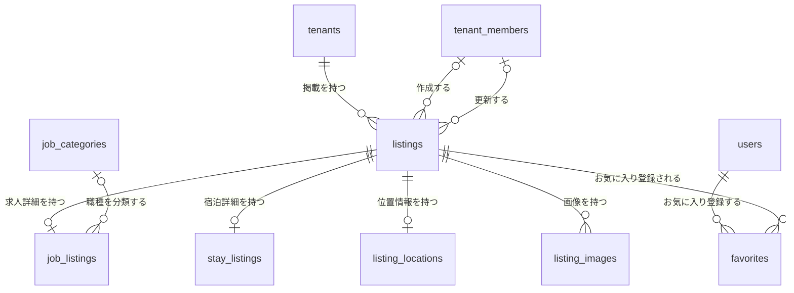
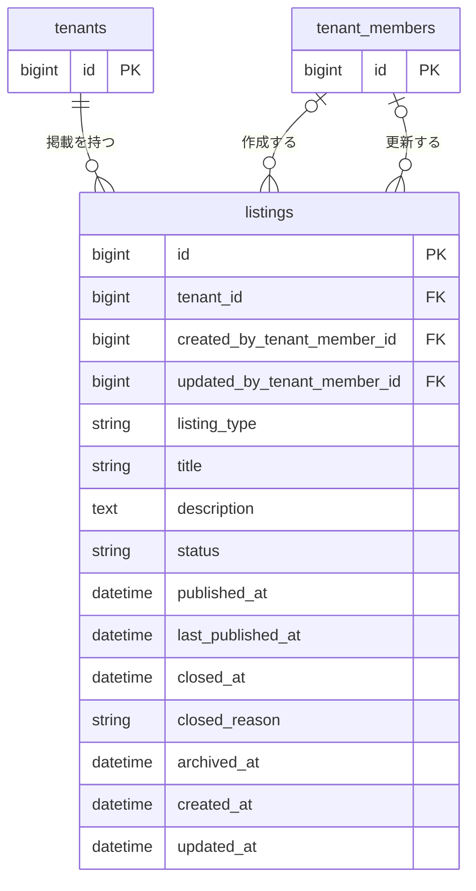
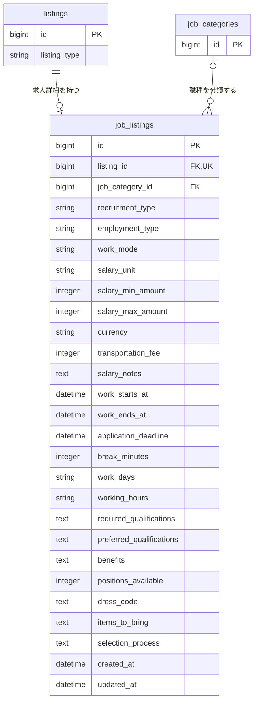
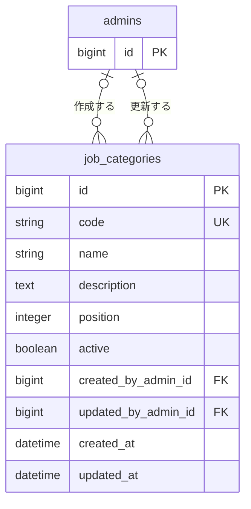
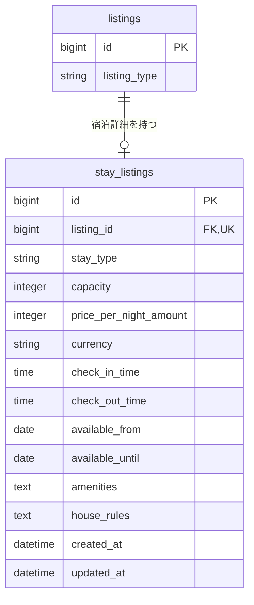
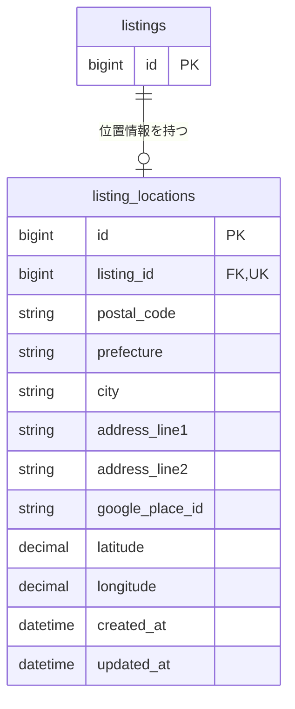
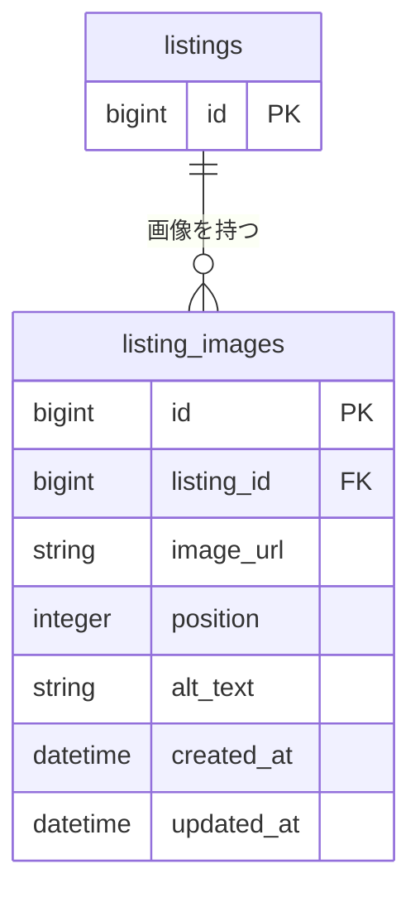
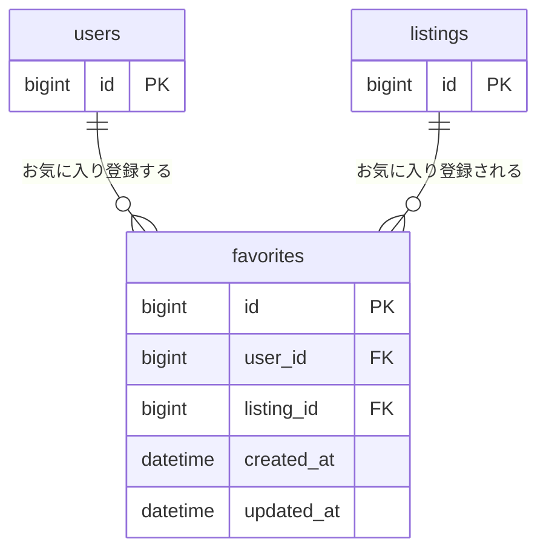

# Listing 関連 ER 図

求人と宿泊情報の共通ルートを `listings` とし、種別固有の詳細、画像、お気に入りとの関連を図示する。

## 全体関連図

テーブル間の関連だけを俯瞰する。詳細なカラムは後続の領域別 ER 図に記載する。

## Listing 共通情報

`listings` は求人と宿泊に共通するタイトル、説明、公開状態、所属テナント、作成者、更新者を管理する。

`tenant_id`、`listing_type`、`title`、`status` は必須とする。`created_by_tenant_member_id` と `updated_by_tenant_member_id` は、メンバー削除時にNULLを許容する。

`listing_type` は次の値を取る。

| 値 | 種別 |
| --- | --- |
| `job` | 求人 |
| `stay` | 宿泊 |

`status` は次の値を取る。

| 値 | 状態 |
| --- | --- |
| `draft` | 下書き |
| `published` | 公開中 |
| `closed` | 募集・予約受付終了 |
| `archived` | 非表示アーカイブ |

`published_at` は初回公開日時、`last_published_at` は最新公開日時を表す。`closed_at` と `closed_reason` は現在 `closed` の場合に設定し、再公開時にNULLへ戻す。`archived_at` は現在 `archived` の場合に設定する。

## 求人詳細

`job_listings` は `listing_type = job` のListingに対応する求人固有情報を管理する。

`job_listings.listing_id` は必須かつ一意とし、1つのListingに求人詳細を複数作成しない。

`recruitment_type` は `ongoing`、`spot` のいずれかを取る。`employment_type` は `regular_employee`、`contract_employee`、`part_time`、`temporary_staff`、`other` のいずれかを取る。`work_mode` は `onsite`、`remote`、`hybrid` のいずれかを取る。`salary_unit` は `hourly`、`daily`、`monthly`、`annual`、`per_shift` のいずれかを取る。

`recruitment_type = spot` の公開時は、`work_starts_at`、`work_ends_at`、`application_deadline` を必須とする。`work_starts_at < work_ends_at`、`application_deadline <= work_starts_at` を満たさなければならない。

公開時は `salary_unit`、`salary_min_amount`、`currency` を必須とする。金額は日本円の整数で保持し、`salary_max_amount` を設定する場合は `salary_min_amount` 以上とする。`per_shift` は1回の勤務に対する報酬を表し、`recruitment_type = spot` でのみ使用できる。

`recruitment_type = ongoing` の公開時は `work_days` と `working_hours` を必須とし、募集要項に表示する。勤務日時による検索やシフト管理には使用しない。

`work_mode = onsite` または `hybrid` の公開時は `listing_location` を必須とし、`remote` では任意とする。

`positions_available` は募集人数を表し、`spot` の公開時は1以上を必須とする。`ongoing` はNULLを許容する。採用済みの応募数が募集人数に達した場合は、新規応募を停止する。

`required_qualifications`、`preferred_qualifications`、`benefits` は募集形態を問わず任意とする。`dress_code` と `items_to_bring` は `spot`、`selection_process` は `ongoing` でのみ使用し、募集形態変更時に使用しなくなるカラムをNULLへ戻す。

## 職種カテゴリーマスター

職種カテゴリーは `job_categories` で管理し、運営管理画面から更新する。

`code`、`name`、`position`、`active` は必須とする。`code` は一意かつ作成後変更不可とする。カテゴリーは物理削除せず、`active` で選択可否を管理する。同じ `position` のカテゴリーはID昇順で表示する。

`created_by_admin_id` と `updated_by_admin_id` は管理者削除時にNULLを許容する。管理画面の更新権限は `super_admin` のみに付与し、`operator` は閲覧のみ許可する。

## 宿泊詳細

`stay_listings` は `listing_type = stay` のListingに対応する宿泊固有情報を管理する。

`stay_listings.listing_id` は必須かつ一意とし、1つのListingに宿泊詳細を複数作成しない。

`stay_type` は `private_room`、`shared_room`、`entire_place`、`other` のいずれかを取る。`capacity` は宿泊可能人数、`available_from` と `available_until` は予約可能期間を表す。

`price_per_night_amount` はテナントが入力する利用者向け1泊料金、`currency` はISO 4217の通貨コードを表す。初期仕様では日本円の整数で料金を保持し、`currency = JPY` のみを許可する。システムは入力額へ消費税を自動加算しない。

## 住所・位置情報

求人と宿泊で共通の住所・位置情報を `listing_locations` で管理する。

`listing_id`、`latitude`、`longitude` は必須とする。`listing_id` は一意とし、1つのListingに位置情報を複数作成しない。Listing削除時は対応する `listing_location` を連動削除する。

表示用住所は構造化住所の各カラムから組み立てる。Google Maps登録済みの地点では `google_place_id` を保存する。住所・位置情報とGoogle Maps表示の仕様は [`../architecture/03-location.md`](../architecture/03-location.md) を参照する。

## Listing 画像

求人と宿泊で共通の画像を `listing_images` で管理する。

`listing_id`、`image_url`、`position` は必須とする。`listing_id` と `position` の組み合わせを一意にし、`position` は1から始まる表示順とする。

## お気に入り

一般ユーザーとListingの多対多関係を `favorites` で管理する。

`user_id` と `listing_id` は必須とし、その組み合わせを一意にする。同じユーザーが同じListingを重複登録することはできない。

## 主なインデックス

| テーブル | カラム | 種別 |
| --- | --- | --- |
| `listings` | `tenant_id` | index |
| `listings` | `listing_type, status` | composite index |
| `listings` | `status, published_at` | composite index |
| `listings` | `created_by_tenant_member_id` | index |
| `listings` | `updated_by_tenant_member_id` | index |
| `job_listings` | `listing_id` | unique index |
| `job_listings` | `job_category_id` | index |
| `job_categories` | `code` | unique index |
| `job_categories` | `active, position` | composite index |
| `job_categories` | `created_by_admin_id` | index |
| `job_categories` | `updated_by_admin_id` | index |
| `stay_listings` | `listing_id` | unique index |
| `listing_locations` | `listing_id` | unique index |
| `listing_images` | `listing_id, position` | unique index |
| `favorites` | `user_id, listing_id` | unique index |
