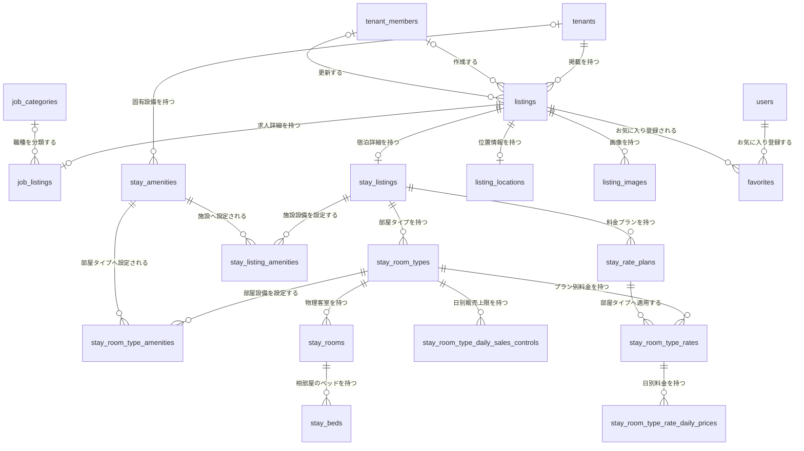
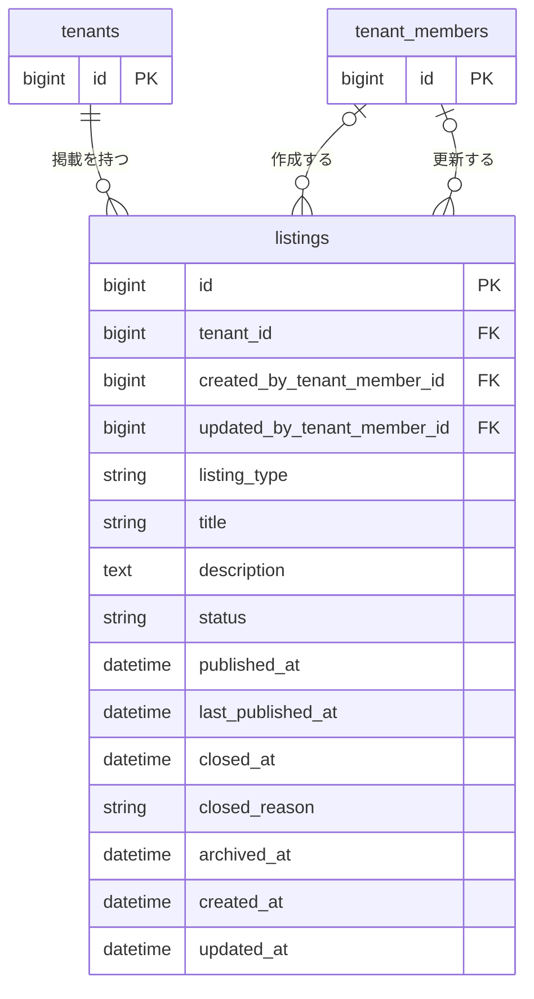
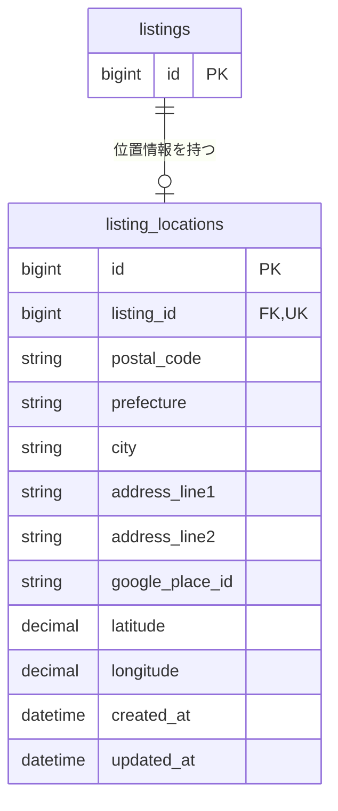
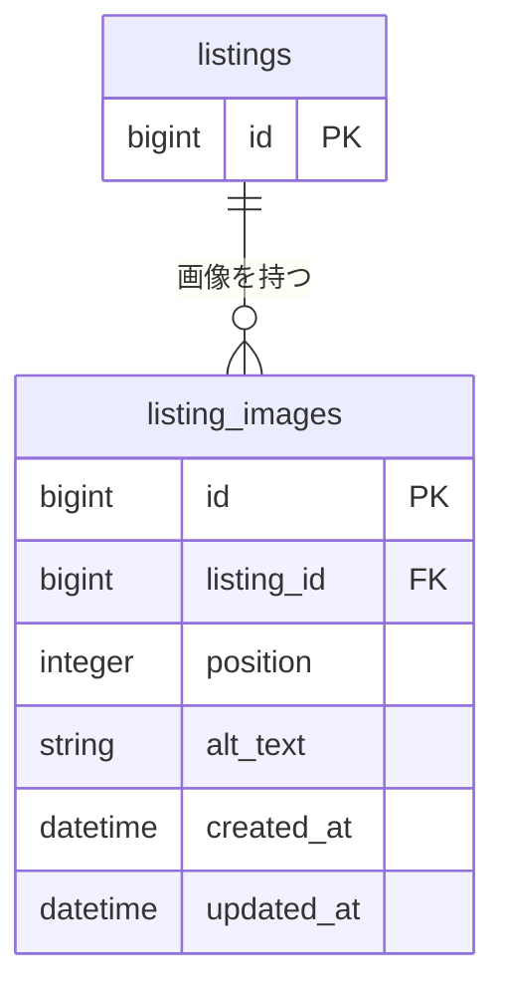
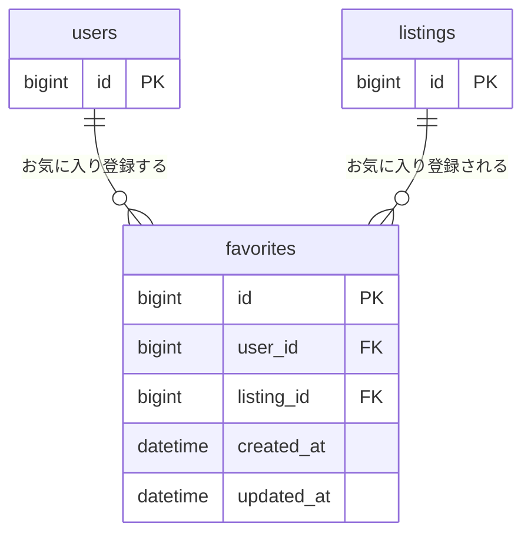

# Listing共通 ER 図

求人と宿泊情報の共通ルートである `listings` と、位置情報、画像、お気に入りのテーブル構造を定義する。

- 求人固有ER: [`01-listing-job.md`](./01-listing-job.md)
- 滞在固有ER: [`01-listing-stay.md`](./01-listing-stay.md)
- Listing共通仕様: [`../architecture/02-listing.md`](../architecture/02-listing.md)

## 全体関連図

種別固有テーブルは関連だけを示し、カラムと制約は領域別ERに記載する。

## listings

| カラム | 型 | NULL | 初期値 | 制約・定義 |
| --- | --- | :---: | --- | --- |
| `id` | bigint | × | 自動採番 | 主キー |
| `tenant_id` | bigint | × | なし | `tenants.id`への外部キー、作成後変更不可 |
| `created_by_tenant_member_id` | bigint | ○ | 操作中のメンバー | `tenant_members.id`への外部キー、メンバー削除時はNULL |
| `updated_by_tenant_member_id` | bigint | ○ | 操作中のメンバー | `tenant_members.id`への外部キー、メンバー削除時はNULL |
| `listing_type` | string | × | なし | `job / stay`、作成後変更不可 |
| `title` | string | × | なし | 最大120文字 |
| `description` | text | ○ | NULL | プレーンテキスト、最大10,000文字、公開時必須 |
| `status` | string | × | `draft` | `draft / published / closed / archived` |
| `published_at` | datetime | ○ | NULL | 初回公開日時 |
| `last_published_at` | datetime | ○ | NULL | 最新公開日時 |
| `closed_at` | datetime | ○ | NULL | 現在の受付終了日時 |
| `closed_reason` | string | ○ | NULL | 受付終了理由 |
| `archived_at` | datetime | ○ | NULL | 現在のアーカイブ日時 |
| `created_at` | datetime | × | 自動設定 | 作成日時 |
| `updated_at` | datetime | × | 自動設定 | 更新日時 |

`listing_type` に対応する種別固有詳細を1件だけ持つ。`job` は `job_listings`、`stay` は `stay_listings` を参照する。

状態遷移と日時カラムの更新条件は [`../architecture/02-listing.md`](../architecture/02-listing.md) を参照する。

## listing_locations

| カラム | 型 | NULL | 初期値 | 制約・定義 |
| --- | --- | :---: | --- | --- |
| `id` | bigint | × | 自動採番 | 主キー |
| `listing_id` | bigint | × | なし | `listings.id`への外部キー、一意 |
| `postal_code` | string | ○ | NULL | 郵便番号 |
| `prefecture` | string | ○ | NULL | 都道府県 |
| `city` | string | ○ | NULL | 市区町村 |
| `address_line1` | string | ○ | NULL | 町名・番地 |
| `address_line2` | string | ○ | NULL | 建物名・部屋番号 |
| `google_place_id` | string | ○ | NULL | Google Place ID |
| `latitude` | decimal | × | なし | 緯度 |
| `longitude` | decimal | × | なし | 経度 |
| `created_at` | datetime | × | 自動設定 | 作成日時 |
| `updated_at` | datetime | × | 自動設定 | 更新日時 |

Listing削除時は対応する位置情報を連動削除する。住所・位置情報の業務仕様は [`../architecture/03-location.md`](../architecture/03-location.md) を参照する。

## listing_images

| カラム | 型 | NULL | 初期値 | 制約・定義 |
| --- | --- | :---: | --- | --- |
| `id` | bigint | × | 自動採番 | 主キー |
| `listing_id` | bigint | × | なし | `listings.id`への外部キー |
| `position` | integer | × | なし | 1以上、Listing内で一意 |
| `alt_text` | string | ○ | NULL | 最大200文字 |
| `created_at` | datetime | × | 自動設定 | 作成日時 |
| `updated_at` | datetime | × | 自動設定 | 更新日時 |

画像本体はActive Storageの`has_one_attached :image`で保持する。Active Storage標準テーブルはフレームワーク管理のため、この業務ER図には展開しない。

## favorites

| カラム | 型 | NULL | 初期値 | 制約・定義 |
| --- | --- | :---: | --- | --- |
| `id` | bigint | × | 自動採番 | 主キー |
| `user_id` | bigint | × | なし | `users.id`への外部キー、`listing_id`との組み合わせで一意 |
| `listing_id` | bigint | × | なし | `listings.id`への外部キー、`user_id`との組み合わせで一意 |
| `created_at` | datetime | × | 自動設定 | 作成日時 |
| `updated_at` | datetime | × | 自動設定 | 更新日時 |

## インデックス

| テーブル | カラム | 種別 |
| --- | --- | --- |
| `listings` | `tenant_id` | index |
| `listings` | `listing_type, status` | composite index |
| `listings` | `status, published_at` | composite index |
| `listings` | `created_by_tenant_member_id` | index |
| `listings` | `updated_by_tenant_member_id` | index |
| `listing_locations` | `listing_id` | unique index |
| `listing_images` | `listing_id, position` | unique index |
| `favorites` | `user_id, listing_id` | unique index |
