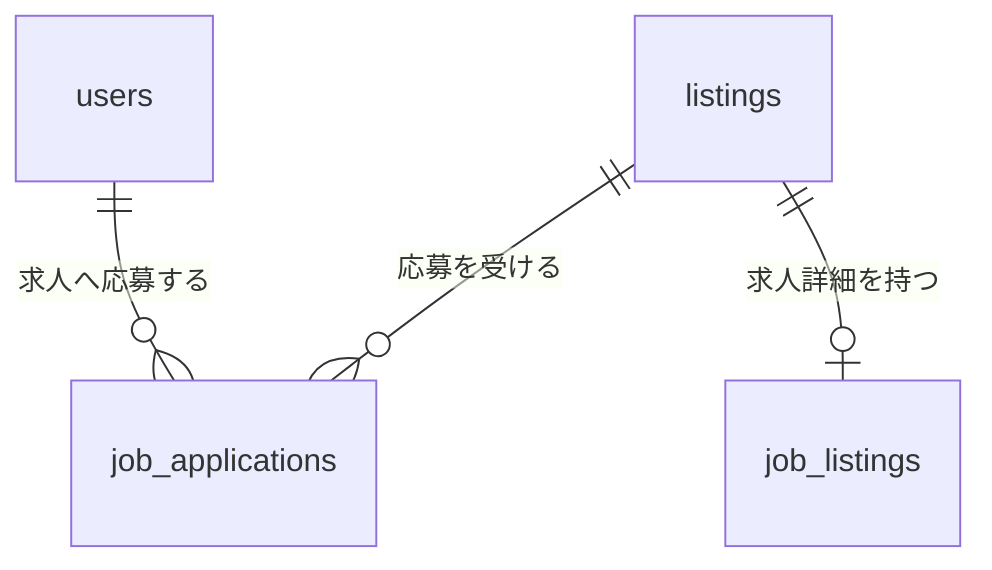
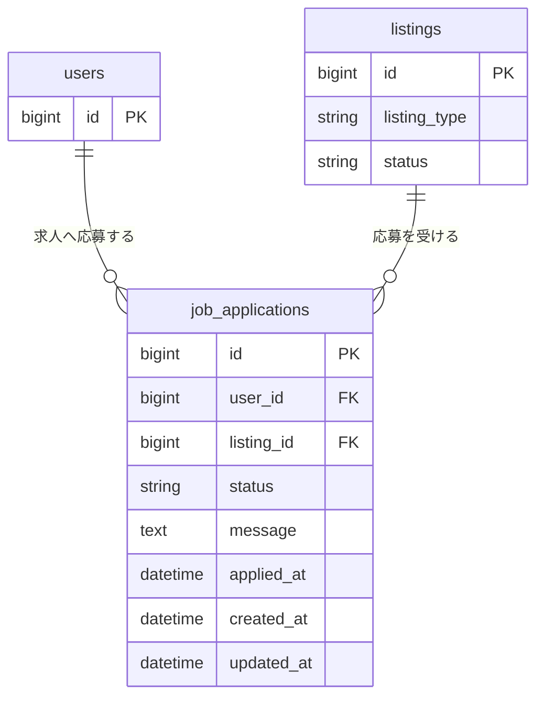

# 求人応募関連 ER 図

一般ユーザーによる求人Listingへの応募を `job_applications` で管理する。

Listing本体と求人詳細については [`01-listing.md`](./01-listing.md) を参照する。

## 全体関連図

## 求人応募

`user_id`、`listing_id`、`status` は必須とする。応募先は `listing_type = job` のListingに限定する。

`user_id` と `listing_id` の組み合わせを一意にし、同じユーザーが同じ求人へ重複応募することを防ぐ。

## 応募ステータス

| 値 | 状態 |
| --- | --- |
| `submitted` | 応募済み |
| `reviewing` | 選考中 |
| `accepted` | 採用 |
| `rejected` | 不採用 |
| `withdrawn` | 応募辞退 |

## 主な制約・インデックス

| カラム | 制約・インデックス |
| --- | --- |
| `user_id` | NOT NULL、usersへの外部キー |
| `listing_id` | NOT NULL、listingsへの外部キー |
| `status` | NOT NULL |
| `user_id, listing_id` | unique index |
