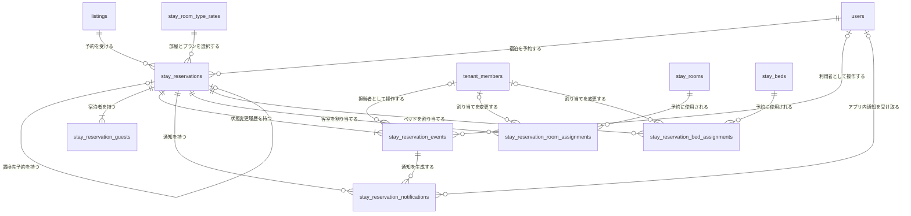
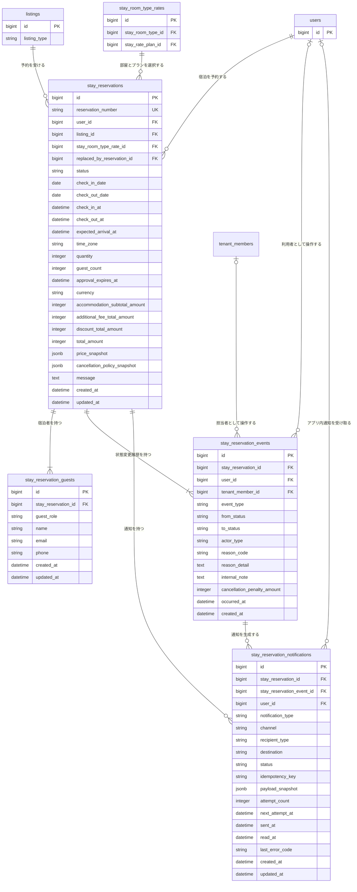

# 宿泊予約関連 ER 図

一般ユーザーによる宿泊予約と、予約へ自動割り当てする物理Room・Bedを管理する。

Listing本体は [`01-listing.md`](./01-listing.md)、宿泊施設、Room Type、物理在庫、料金プランは [`01-listing-stay.md`](./01-listing-stay.md)、予約の業務仕様は [`../architecture/04-stay-reservation.md`](../architecture/04-stay-reservation.md) を参照する。

## 全体関連図

## stay_reservations

| カラム | 型 | NULL | 初期値 | 制約・定義 |
| --- | --- | :---: | --- | --- |
| `id` | bigint | × | 自動採番 | 主キー |
| `reservation_number` | string | × | 安全な乱数から生成 | 公開予約番号、`ST-XXXX-XXXX-XXXX`形式、一意、変更不可 |
| `user_id` | bigint | × | なし | `users.id`への外部キー |
| `listing_id` | bigint | × | なし | `listings.id`への外部キー、対象は`listing_type = stay` |
| `stay_room_type_rate_id` | bigint | × | なし | `stay_room_type_rates.id`への外部キー、`listing_id`と同じ宿泊施設に所属すること |
| `replaced_by_reservation_id` | bigint | ○ | NULL | 予約置換で作成した新しい`stay_reservations.id`への自己外部キー、一意 |
| `status` | string | × | なし | `requested / confirmed / rejected / canceled / expired / completed / no_show` |
| `check_in_date` | date | × | なし | 宿泊開始日 |
| `check_out_date` | date | × | なし | 宿泊終了日、対象期間には含めず`check_in_date`より後 |
| `check_in_at` | datetime | × | なし | 予約作成時の施設タイムゾーンとチェックイン日・時刻から算出した変更不可のチェックイン開始日時 |
| `check_out_at` | datetime | × | なし | 予約作成時の施設タイムゾーンとチェックアウト日・時刻から算出した変更不可のチェックアウト日時 |
| `expected_arrival_at` | datetime | ○ | NULL | 宿泊者が申告した到着予定日時。予約時点のチェックイン受付時間から生成した1時間間隔の選択肢またはNULL。チェックイン受付開始日時とは別に扱う |
| `time_zone` | string | × | なし | 予約作成時の施設IANAタイムゾーン名を複製した変更不可の値 |
| `quantity` | integer | × | `1` | 確保するRoom数またはBed数、1以上 |
| `guest_count` | integer | × | なし | 宿泊人数、1以上。初期仕様では年齢区分を持たず宿泊者全員を数える |
| `approval_expires_at` | datetime | ○ | NULL | 承認制では申請時に必須、即時確定ではNULL。申請日時に承認期限時間を加えた日時とチェックイン開始日時の早い方 |
| `currency` | string | × | `JPY` | 予約時の通貨、初期仕様では`JPY`のみ |
| `accommodation_subtotal_amount` | integer | × | なし | 日別の1在庫単位料金×`quantity`の合計、0以上 |
| `additional_fee_total_amount` | integer | × | `0` | 追加料金の合計、0以上。初期仕様では0固定 |
| `discount_total_amount` | integer | × | `0` | 割引の合計、0以上。初期仕様では0固定 |
| `total_amount` | integer | × | なし | 宿泊料金小計＋追加料金－割引、0以上 |
| `price_snapshot` | jsonb | × | なし | 予約作成時のRoom Type、Rate Plan、施設・Room TypeのAmenities、料金単位、数量、日別料金明細および合計を複製した変更不可のJSON。ルートの`version`必須 |
| `cancellation_policy_snapshot` | jsonb | × | なし | 予約作成時のキャンセル種別、計算対象、固定料率、無断不泊料率を複製した変更不可のJSON。ルートの`version`必須 |
| `message` | text | ○ | NULL | 予約時の利用者メッセージ |
| `created_at` | datetime | × | 自動設定 | 作成日時 |
| `updated_at` | datetime | × | 自動設定 | 更新日時 |

`stay_room_type_rate_id` は予約元のRoom Type別料金を示すが、予約金額の判定には現在のレコードを使用せず、予約作成時に固定した料金カラムと `price_snapshot` を使用する。承認制でも申請時に料金を固定し、承認時には再計算しない。

`reservation_number`はCrockford Base32の許可文字から生成した大文字12文字を4文字ずつ区切り、`ST-`を付ける。英字の大小、ハイフンおよび空白を正規化した完全一致検索だけを提供する。予約番号を知っていることを認可の代わりにせず、User・Tenant・Adminの参照権限を別途検証する。

`price_snapshot`の日別明細は `[check_in_date, check_out_date)` の各宿泊日を過不足なく1件ずつ持ち、各明細の `quantity` は予約の `quantity` と一致しなければならない。`entire_place / private_room` の料金単位は `room`、`shared_room` は `bed` とする。料金カラム、スナップショット内の合計および日別明細の計算結果は一致しなければならない。

予約受付時の宿泊人数は、`entire_place / private_room` では `guest_count <= stay_room_types.capacity × quantity`、`shared_room` では `guest_count = quantity` を満たさなければならない。検証に使用したRoom Typeの `capacity` も `price_snapshot.room_type.capacity` へ複製し、元の定員が変更されても既存予約の判定根拠を保持する。

キャンセル料の判定には現在のRate Planを参照せず、`cancellation_policy_snapshot`だけを使用し、計算基準額には `accommodation_subtotal_amount`、期限の基準日時には予約の`check_in_at`を使用する。

各スナップショットの`version`は1以上の整数とし、アプリケーションが種類・バージョン別のスキーマを検証する。新バージョン導入時も既存スナップショットは書き換えない。検索・集計に必要な値は通常カラムを正とし、初期仕様ではJSONB用のGINインデックスを設けない。詳細は予約アーキテクチャの「スナップショットのスキーマバージョンと検証」に従う。

`replaced_by_reservation_id`は予約置換が完了した旧予約だけに設定し、置換先は同じ`user_id`および`listing_id`を持つ別予約とする。自己参照、循環参照および複数の旧予約から同じ新予約を参照することを禁止する。値を持つ旧予約は`status = canceled`でなければならず、再度置換元にできない。

## stay_reservation_guests

予約時点の代表宿泊者と、任意登録された同行者を保持する。

| カラム | 型 | NULL | 初期値 | 制約・定義 |
| --- | --- | :---: | --- | --- |
| `id` | bigint | × | 自動採番 | 主キー |
| `stay_reservation_id` | bigint | × | なし | `stay_reservations.id`への外部キー |
| `guest_role` | string | × | なし | `primary / companion` |
| `name` | string | × | なし | 宿泊者氏名 |
| `email` | string | ○ | NULL | 代表宿泊者では必須、同行者ではNULL |
| `phone` | string | ○ | NULL | 代表宿泊者では必須、同行者ではNULL |
| `created_at` | datetime | × | 自動設定 | 作成日時 |
| `updated_at` | datetime | × | 自動設定 | 更新日時 |

予約作成時に `guest_role = primary` のレコードを必ず1件作成し、予約単位の部分一意インデックスで複数登録を防ぐ。代表宿泊者は削除できず、別の人物へ変更する場合は同じレコードの氏名と連絡先を更新する。

`guest_role = companion` では `email` と `phone` をNULLとする。代表宿泊者を含む宿泊者レコード数は予約の `guest_count` 以下とし、同行者が未登録でもよい。

宿泊者情報は予約状態が`requested / confirmed`かつ操作日時が`check_in_at`未満の場合だけ変更できる。予約者本人または対象Listingを所有するテナントの有効なTenant Memberに限定し、変更と`guest_updated`イベント作成を同一トランザクションで行う。代表宿泊者のメール変更時は変更前後の宛先に対する通知も同じトランザクションで作成する。

## stay_reservation_events

予約作成および状態変更を追記専用で保持する。現在状態は`stay_reservations.status`を正とし、このテーブルは変更経緯と操作監査に使用する。

| カラム | 型 | NULL | 初期値 | 制約・定義 |
| --- | --- | :---: | --- | --- |
| `id` | bigint | × | 自動採番 | 主キー |
| `stay_reservation_id` | bigint | × | なし | `stay_reservations.id`への外部キー |
| `user_id` | bigint | ○ | NULL | `actor_type = user`の場合に操作した`users.id` |
| `tenant_member_id` | bigint | ○ | NULL | `actor_type = tenant_member`の場合に担当した`tenant_members.id` |
| `event_type` | string | × | なし | `created / approved / rejected / canceled_by_user / canceled_by_tenant / expired / replaced / completed / no_show / guest_updated / arrival_time_updated` |
| `from_status` | string | ○ | NULL | 変更前状態。`created`だけNULL |
| `to_status` | string | × | なし | 変更後状態 |
| `actor_type` | string | × | なし | `user / tenant_member / system` |
| `reason_code` | string | ○ | NULL | 操作理由コード。拒否・テナント都合取消では必須 |
| `reason_detail` | text | ○ | NULL | 相手方へ表示可能な理由説明、最大1,000文字。`reason_code = other`では必須 |
| `internal_note` | text | ○ | NULL | テナント内部だけで表示するメモ、最大2,000文字 |
| `cancellation_penalty_amount` | integer | ○ | NULL | 取消時の記録金額、0以上。取消以外はNULL |
| `occurred_at` | datetime | × | 現在日時 | 状態変更が成立した日時 |
| `created_at` | datetime | × | 自動設定 | 作成日時 |

`actor_type = user`では`user_id`だけ、`tenant_member`では`tenant_member_id`だけを必須とする。`system`では両方をNULLとする。Tenant Memberは予約のListingを所有するテナントに所属し、操作時点で有効でなければならない。`internal_note`は`actor_type = tenant_member`の場合だけ設定できる。

`from_status / to_status`は`event_type`に対応する許可済み状態遷移と一致しなければならない。イベントは更新・削除せず、予約削除時にも保持するため予約自体を物理削除しない。

確定予約の`canceled_by_user`と`no_show`では`cancellation_penalty_amount`を必須とする。申請中の利用者取消、`canceled_by_tenant`および`replaced`では0、それ以外ではNULLとする。

`guest_updated`では`from_status = to_status`とし、操作時点の`requested`または`confirmed`を保存する。宿泊者の氏名、メールアドレスおよび電話番号の変更前後値はイベントへ複製しない。

`arrival_time_updated`も`from_status = to_status`とし、変更後の到着予定日時は予約本体を正とする。イベントへ到着予定日時の変更前後値は複製しない。

## stay_reservation_notifications

予約イベントを契機とするアプリ内・メール通知の送信予定、結果および本文スナップショットを保持する。初期仕様の`notification_type`は`canceled_by_tenant / primary_guest_email_changed / no_show_recorded`とする。

| カラム | 型 | NULL | 初期値 | 制約・定義 |
| --- | --- | :---: | --- | --- |
| `id` | bigint | × | 自動採番 | 主キー |
| `stay_reservation_id` | bigint | × | なし | `stay_reservations.id`への外部キー |
| `stay_reservation_event_id` | bigint | × | なし | 通知元の`stay_reservation_events.id`への外部キー |
| `user_id` | bigint | ○ | NULL | アプリ内通知を受け取る`users.id`。メール通知ではNULL |
| `notification_type` | string | × | なし | `canceled_by_tenant / primary_guest_email_changed / no_show_recorded` |
| `channel` | string | × | なし | `in_app / email` |
| `recipient_type` | string | × | なし | `booking_user / primary_guest / previous_primary_guest` |
| `destination` | string | ○ | NULL | メール通知の宛先を作成時に固定。アプリ内通知ではNULL |
| `status` | string | × | なし | `in_app`は`sent`、`email`は`pending`で作成。`pending / processing / sent / failed` |
| `idempotency_key` | string | × | なし | イベント・通知種別・経路・宛先から生成する一意キー |
| `payload_snapshot` | jsonb | × | なし | 通知表示に必要な施設名、予約識別情報、日程、Room Type、Rate Plan、理由、金額を固定。ルートの`version`必須 |
| `attempt_count` | integer | × | `0` | 外部送信の試行回数、0以上5以下 |
| `next_attempt_at` | datetime | ○ | NULL | 次回再試行予定日時 |
| `sent_at` | datetime | ○ | NULL | 送信完了日時。アプリ内通知では作成時に設定 |
| `read_at` | datetime | ○ | NULL | アプリ内通知の既読日時。メール通知ではNULL |
| `last_error_code` | string | ○ | NULL | 最後の送信失敗を分類する内部コード。外部サービスの本文は保存しない |
| `created_at` | datetime | × | 自動設定 | 作成日時 |
| `updated_at` | datetime | × | 自動設定 | 更新日時 |

`channel = in_app`では`user_id`を必須、`destination`をNULLとし、`channel = email`では`user_id`をNULL、`destination`を必須とする。通知元イベントと予約の`stay_reservation_id`は一致しなければならない。

テナント都合取消と`no_show`では、予約者への`in_app`と代表宿泊者への`email`を各1件作成する。`payload_snapshot`に`internal_note`を含めない。通知レコードは予約状態変更と同一トランザクションで作成し、外部送信はコミット後に行う。

## stay_reservation_room_assignments

貸切・個室の予約に自動割り当てした物理Roomを保持する。

| カラム | 型 | NULL | 初期値 | 制約・定義 |
| --- | --- | :---: | --- | --- |
| `id` | bigint | × | 自動採番 | 主キー |
| `stay_reservation_id` | bigint | × | なし | `stay_reservations.id`への外部キー |
| `stay_room_id` | bigint | × | なし | `stay_rooms.id`への外部キー |
| `assigned_by_tenant_member_id` | bigint | ○ | NULL | 手動変更した`tenant_members.id`、自動割り当て時はNULL |
| `assigned_at` | datetime | × | 現在日時 | 現在のRoomを割り当てた日時 |
| `created_at` | datetime | × | 自動設定 | 作成日時 |
| `updated_at` | datetime | × | 自動設定 | 更新日時 |

`stay_reservation_id` と `stay_room_id` の組み合わせを一意とする。割り当てるRoomは予約されたRoom Typeに所属し、予約期間全体で有効かつ予約・施設停止と重複してはならない。

## stay_reservation_bed_assignments

相部屋の予約に自動割り当てした物理Bedを保持する。

| カラム | 型 | NULL | 初期値 | 制約・定義 |
| --- | --- | :---: | --- | --- |
| `id` | bigint | × | 自動採番 | 主キー |
| `stay_reservation_id` | bigint | × | なし | `stay_reservations.id`への外部キー |
| `stay_bed_id` | bigint | × | なし | `stay_beds.id`への外部キー |
| `assigned_by_tenant_member_id` | bigint | ○ | NULL | 手動変更した`tenant_members.id`、自動割り当て時はNULL |
| `assigned_at` | datetime | × | 現在日時 | 現在のBedを割り当てた日時 |
| `created_at` | datetime | × | 自動設定 | 作成日時 |
| `updated_at` | datetime | × | 自動設定 | 更新日時 |

`stay_reservation_id` と `stay_bed_id` の組み合わせを一意とする。割り当てるBedは予約されたRoom Typeに所属し、予約期間全体で有効かつ予約・施設停止と重複してはならない。

## 予約確定と割り当ての整合条件

| Room Type | 確定時の割り当て |
| --- | --- |
| `entire_place / private_room` | `quantity`件のRoom割り当てを持ち、Bed割り当てを持たない |
| `shared_room` | `quantity`件のBed割り当てを持ち、Room割り当てを持たない |

即時確定では、必要数の物理在庫を自動割り当てして `confirmed` で作成する。必要数を確保できない場合は予約処理全体をロールバックする。

承認制では、必要数の物理在庫を自動割り当てして `requested` で作成する。`requested` は `approval_expires_at` まで在庫を仮確保し、承認時は割り当てを維持したまま `confirmed` へ遷移する。

承認期限を過ぎた `requested` は `expired` へ遷移させる。在庫判定では、期限切れ処理の実行前でも `approval_expires_at <= 現在日時` の申請を在庫確保中として扱わない。

有効期限内の `requested` と `confirmed` の割り当て期間を在庫使用期間として扱う。`rejected`、`canceled`、`expired`、`completed`、`no_show` は在庫を消費しない。割り当てレコードは過去の予約内容を参照できるよう保持する。

テナントによる割り当て変更は同じRoom Type内に限定する。変更先の物理在庫のロック、期間重複の再確認、割り当て先の更新を同一トランザクションで行う。

予約置換では、置換元予約をロックし、その予約が確保している在庫だけを使用数から除外して新予約の可否を判定する。新予約、スナップショット、割り当て、旧予約の`canceled`への遷移および`replaced_by_reservation_id`の設定を同一トランザクションで行う。

## 予約ステータス

| 値 | 状態 |
| --- | --- |
| `requested` | テナント承認待ち、承認期限まで物理在庫を仮確保 |
| `confirmed` | 予約確定、物理在庫を確保済み |
| `rejected` | 予約拒否 |
| `canceled` | キャンセル |
| `expired` | 承認期限切れ |
| `completed` | 宿泊完了 |
| `no_show` | 無断不泊、キャンセル条件スナップショットの無断不泊料率を適用済み |

`completed`は`confirmed`かつ現在日時が`check_out_at`以降、`no_show`は`confirmed`かつ現在日時が`check_in_at`以降の場合だけ、対象Listingの有効なTenant Memberが設定できる。どちらも終端状態とし、以後の状態変更を許可しない。

## インデックス

| テーブル | カラム | 種別 |
| --- | --- | --- |
| `stay_reservations` | `user_id` | index |
| `stay_reservations` | `reservation_number` | unique index |
| `stay_reservations` | `listing_id, check_in_date, check_out_date` | composite index |
| `stay_reservations` | `stay_room_type_rate_id, status, check_in_date, check_out_date` | composite index |
| `stay_reservations` | `status, approval_expires_at` | composite index |
| `stay_reservations` | `replaced_by_reservation_id` | unique index |
| `stay_reservation_guests` | `stay_reservation_id` | index |
| `stay_reservation_guests` | `stay_reservation_id WHERE guest_role = 'primary'` | partial unique index |
| `stay_reservation_events` | `stay_reservation_id, occurred_at, id` | composite index |
| `stay_reservation_events` | `tenant_member_id, occurred_at` | composite index |
| `stay_reservation_events` | `user_id, occurred_at` | composite index |
| `stay_reservation_events` | `event_type, occurred_at` | composite index |
| `stay_reservation_notifications` | `idempotency_key` | unique index |
| `stay_reservation_notifications` | `status, next_attempt_at` | composite index |
| `stay_reservation_notifications` | `user_id, read_at, created_at` | composite index |
| `stay_reservation_notifications` | `stay_reservation_id, created_at` | composite index |
| `stay_reservation_room_assignments` | `stay_reservation_id, stay_room_id` | unique index |
| `stay_reservation_room_assignments` | `stay_room_id` | index |
| `stay_reservation_room_assignments` | `assigned_by_tenant_member_id` | index |
| `stay_reservation_bed_assignments` | `stay_reservation_id, stay_bed_id` | unique index |
| `stay_reservation_bed_assignments` | `stay_bed_id` | index |
| `stay_reservation_bed_assignments` | `assigned_by_tenant_member_id` | index |
