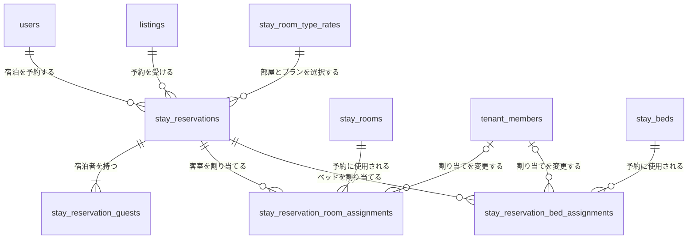
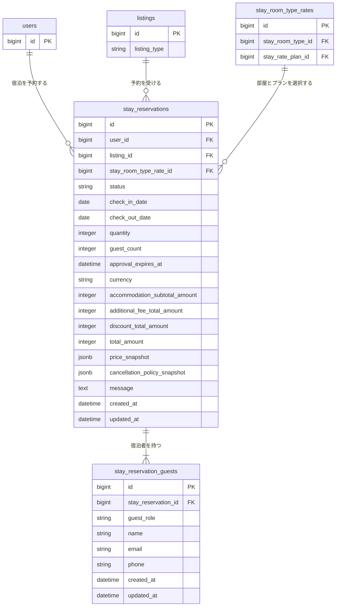

# 宿泊予約関連 ER 図

一般ユーザーによる宿泊予約と、予約へ自動割り当てする物理Room・Bedを管理する。

Listing本体は [`01-listing.md`](./01-listing.md)、宿泊施設、Room Type、物理在庫、料金プランは [`01-listing-stay.md`](./01-listing-stay.md)、予約の業務仕様は [`../architecture/02-stay-reservation.md`](../architecture/02-stay-reservation.md) を参照する。

## 全体関連図

## stay_reservations

| カラム | 型 | NULL | 初期値 | 制約・定義 |
| --- | --- | :---: | --- | --- |
| `id` | bigint | × | 自動採番 | 主キー |
| `user_id` | bigint | × | なし | `users.id`への外部キー |
| `listing_id` | bigint | × | なし | `listings.id`への外部キー、対象は`listing_type = stay` |
| `stay_room_type_rate_id` | bigint | × | なし | `stay_room_type_rates.id`への外部キー、`listing_id`と同じ宿泊施設に所属すること |
| `status` | string | × | なし | `requested / confirmed / rejected / canceled / expired / completed` |
| `check_in_date` | date | × | なし | 宿泊開始日 |
| `check_out_date` | date | × | なし | 宿泊終了日、対象期間には含めず`check_in_date`より後 |
| `quantity` | integer | × | `1` | 確保するRoom数またはBed数、1以上 |
| `guest_count` | integer | × | なし | 宿泊人数、1以上。初期仕様では年齢区分を持たず宿泊者全員を数える |
| `approval_expires_at` | datetime | ○ | NULL | 承認制では申請時に必須、即時確定ではNULL。申請日時に承認期限時間を加えた日時とチェックイン開始日時の早い方 |
| `currency` | string | × | `JPY` | 予約時の通貨、初期仕様では`JPY`のみ |
| `accommodation_subtotal_amount` | integer | × | なし | 日別の1在庫単位料金×`quantity`の合計、0以上 |
| `additional_fee_total_amount` | integer | × | `0` | 追加料金の合計、0以上。初期仕様では0固定 |
| `discount_total_amount` | integer | × | `0` | 割引の合計、0以上。初期仕様では0固定 |
| `total_amount` | integer | × | なし | 宿泊料金小計＋追加料金－割引、0以上 |
| `price_snapshot` | jsonb | × | なし | 予約作成時のRoom Type、Rate Plan、料金単位、数量、日別料金明細および合計を複製した変更不可のJSON |
| `cancellation_policy_snapshot` | jsonb | × | なし | 予約作成時のキャンセル種別、計算対象、固定料率、無断不泊料率を複製した変更不可のJSON |
| `message` | text | ○ | NULL | 予約時の利用者メッセージ |
| `created_at` | datetime | × | 自動設定 | 作成日時 |
| `updated_at` | datetime | × | 自動設定 | 更新日時 |

`stay_room_type_rate_id` は予約元のRoom Type別料金を示すが、予約金額の判定には現在のレコードを使用せず、予約作成時に固定した料金カラムと `price_snapshot` を使用する。承認制でも申請時に料金を固定し、承認時には再計算しない。

`price_snapshot`の日別明細は `[check_in_date, check_out_date)` の各宿泊日を過不足なく1件ずつ持ち、各明細の `quantity` は予約の `quantity` と一致しなければならない。`entire_place / private_room` の料金単位は `room`、`shared_room` は `bed` とする。料金カラム、スナップショット内の合計および日別明細の計算結果は一致しなければならない。

予約受付時の宿泊人数は、`entire_place / private_room` では `guest_count <= stay_room_types.capacity × quantity`、`shared_room` では `guest_count = quantity` を満たさなければならない。検証に使用したRoom Typeの `capacity` も `price_snapshot.room_type.capacity` へ複製し、元の定員が変更されても既存予約の判定根拠を保持する。

キャンセル料の判定には現在のRate Planを参照せず、`cancellation_policy_snapshot`だけを使用し、計算基準額には `accommodation_subtotal_amount` を使用する。

## stay_reservation_guests

予約時点の代表宿泊者と、任意登録された同行者を保持する。

| カラム | 型 | NULL | 初期値 | 制約・定義 |
| --- | --- | :---: | --- | --- |
| `id` | bigint | × | 自動採番 | 主キー |
| `stay_reservation_id` | bigint | × | なし | `stay_reservations.id`への外部キー |
| `guest_role` | string | × | なし | `primary / companion` |
| `name` | string | × | なし | 宿泊者氏名 |
| `email` | string | ○ | NULL | 代表宿泊者では必須、同行者ではNULL |
| `phone` | string | ○ | NULL | 代表宿泊者では必須、同行者ではNULL |
| `created_at` | datetime | × | 自動設定 | 作成日時 |
| `updated_at` | datetime | × | 自動設定 | 更新日時 |

予約作成時に `guest_role = primary` のレコードを必ず1件作成し、予約単位の部分一意インデックスで複数登録を防ぐ。代表宿泊者は削除できず、別の人物へ変更する場合は同じレコードの氏名と連絡先を更新する。

`guest_role = companion` では `email` と `phone` をNULLとする。代表宿泊者を含む宿泊者レコード数は予約の `guest_count` 以下とし、同行者が未登録でもよい。

## stay_reservation_room_assignments

貸切・個室の予約に自動割り当てした物理Roomを保持する。

| カラム | 型 | NULL | 初期値 | 制約・定義 |
| --- | --- | :---: | --- | --- |
| `id` | bigint | × | 自動採番 | 主キー |
| `stay_reservation_id` | bigint | × | なし | `stay_reservations.id`への外部キー |
| `stay_room_id` | bigint | × | なし | `stay_rooms.id`への外部キー |
| `assigned_by_tenant_member_id` | bigint | ○ | NULL | 手動変更した`tenant_members.id`、自動割り当て時はNULL |
| `assigned_at` | datetime | × | 現在日時 | 現在のRoomを割り当てた日時 |
| `created_at` | datetime | × | 自動設定 | 作成日時 |
| `updated_at` | datetime | × | 自動設定 | 更新日時 |

`stay_reservation_id` と `stay_room_id` の組み合わせを一意とする。割り当てるRoomは予約されたRoom Typeに所属し、予約期間全体で有効かつ予約・施設停止と重複してはならない。

## stay_reservation_bed_assignments

相部屋の予約に自動割り当てした物理Bedを保持する。

| カラム | 型 | NULL | 初期値 | 制約・定義 |
| --- | --- | :---: | --- | --- |
| `id` | bigint | × | 自動採番 | 主キー |
| `stay_reservation_id` | bigint | × | なし | `stay_reservations.id`への外部キー |
| `stay_bed_id` | bigint | × | なし | `stay_beds.id`への外部キー |
| `assigned_by_tenant_member_id` | bigint | ○ | NULL | 手動変更した`tenant_members.id`、自動割り当て時はNULL |
| `assigned_at` | datetime | × | 現在日時 | 現在のBedを割り当てた日時 |
| `created_at` | datetime | × | 自動設定 | 作成日時 |
| `updated_at` | datetime | × | 自動設定 | 更新日時 |

`stay_reservation_id` と `stay_bed_id` の組み合わせを一意とする。割り当てるBedは予約されたRoom Typeに所属し、予約期間全体で有効かつ予約・施設停止と重複してはならない。

## 予約確定と割り当ての整合条件

| Room Type | 確定時の割り当て |
| --- | --- |
| `entire_place / private_room` | `quantity`件のRoom割り当てを持ち、Bed割り当てを持たない |
| `shared_room` | `quantity`件のBed割り当てを持ち、Room割り当てを持たない |

即時確定では、必要数の物理在庫を自動割り当てして `confirmed` で作成する。必要数を確保できない場合は予約処理全体をロールバックする。

承認制では、必要数の物理在庫を自動割り当てして `requested` で作成する。`requested` は `approval_expires_at` まで在庫を仮確保し、承認時は割り当てを維持したまま `confirmed` へ遷移する。

承認期限を過ぎた `requested` は `expired` へ遷移させる。在庫判定では、期限切れ処理の実行前でも `approval_expires_at <= 現在日時` の申請を在庫確保中として扱わない。

有効期限内の `requested` と `confirmed` の割り当て期間を在庫使用期間として扱う。`rejected`、`canceled`、`expired`、`completed` は在庫を消費しない。割り当てレコードは過去の予約内容を参照できるよう保持する。

テナントによる割り当て変更は同じRoom Type内に限定する。変更先の物理在庫のロック、期間重複の再確認、割り当て先の更新を同一トランザクションで行う。

## 予約ステータス

| 値 | 状態 |
| --- | --- |
| `requested` | テナント承認待ち、承認期限まで物理在庫を仮確保 |
| `confirmed` | 予約確定、物理在庫を確保済み |
| `rejected` | 予約拒否 |
| `canceled` | キャンセル |
| `expired` | 承認期限切れ |
| `completed` | 宿泊完了 |

## インデックス

| テーブル | カラム | 種別 |
| --- | --- | --- |
| `stay_reservations` | `user_id` | index |
| `stay_reservations` | `listing_id, check_in_date, check_out_date` | composite index |
| `stay_reservations` | `stay_room_type_rate_id, status, check_in_date, check_out_date` | composite index |
| `stay_reservations` | `status, approval_expires_at` | composite index |
| `stay_reservation_guests` | `stay_reservation_id` | index |
| `stay_reservation_guests` | `stay_reservation_id WHERE guest_role = 'primary'` | partial unique index |
| `stay_reservation_room_assignments` | `stay_reservation_id, stay_room_id` | unique index |
| `stay_reservation_room_assignments` | `stay_room_id` | index |
| `stay_reservation_room_assignments` | `assigned_by_tenant_member_id` | index |
| `stay_reservation_bed_assignments` | `stay_reservation_id, stay_bed_id` | unique index |
| `stay_reservation_bed_assignments` | `stay_bed_id` | index |
| `stay_reservation_bed_assignments` | `assigned_by_tenant_member_id` | index |
