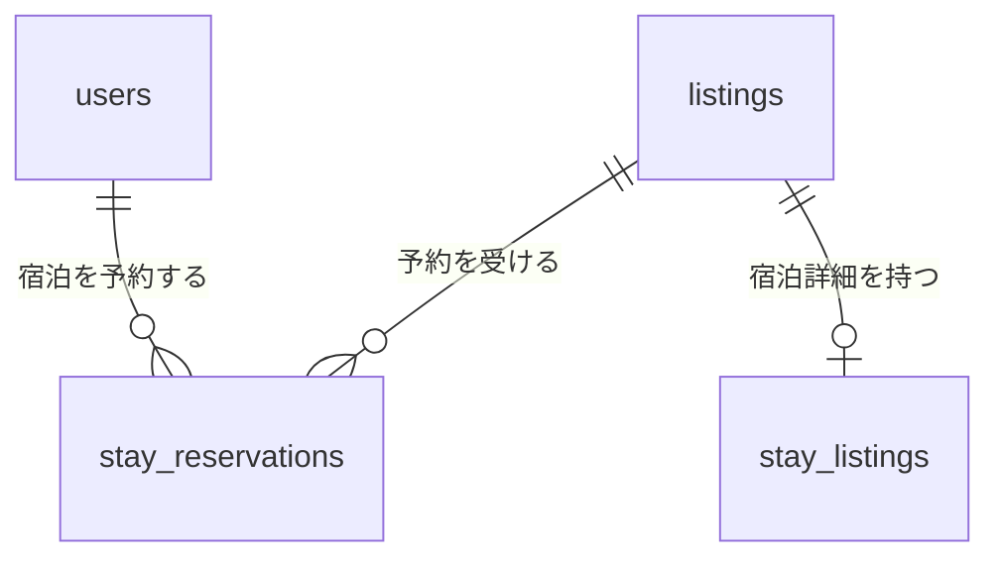
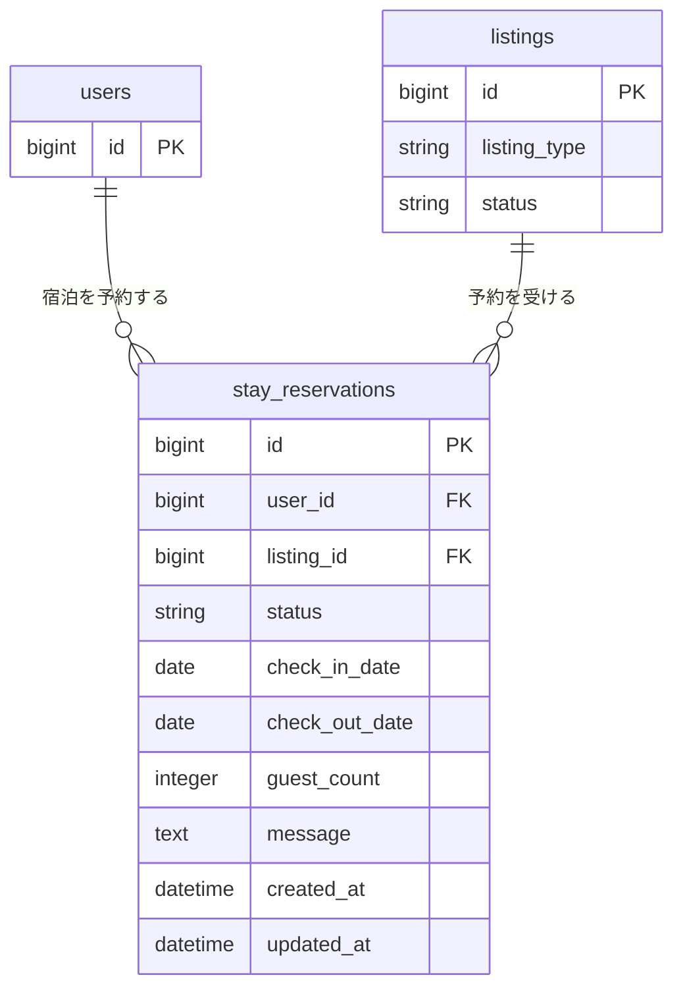

# 宿泊予約関連 ER 図

一般ユーザーによる宿泊Listingの予約を `stay_reservations` で管理する。

Listing本体と宿泊詳細については [`01-listing.md`](./01-listing.md) を参照する。

## 全体関連図

## 宿泊予約

`user_id`、`listing_id`、`status`、`check_in_date`、`check_out_date` は必須とする。予約先は `listing_type = stay` のListingに限定する。

`check_out_date` は `check_in_date` より後の日付とする。同じ宿泊Listingに対する予約期間の重複を許可しない。

## 予約ステータス

| 値 | 状態 |
| --- | --- |
| `requested` | 予約リクエスト済み |
| `confirmed` | 予約確定 |
| `rejected` | 予約拒否 |
| `canceled` | キャンセル |
| `completed` | 宿泊完了 |

## 主な制約・インデックス

| カラム | 制約・インデックス |
| --- | --- |
| `user_id` | NOT NULL、usersへの外部キー |
| `listing_id` | NOT NULL、listingsへの外部キー |
| `status` | NOT NULL |
| `check_in_date` | NOT NULL |
| `check_out_date` | NOT NULL、`check_in_date`より後 |
| `listing_id, check_in_date, check_out_date` | composite index |
