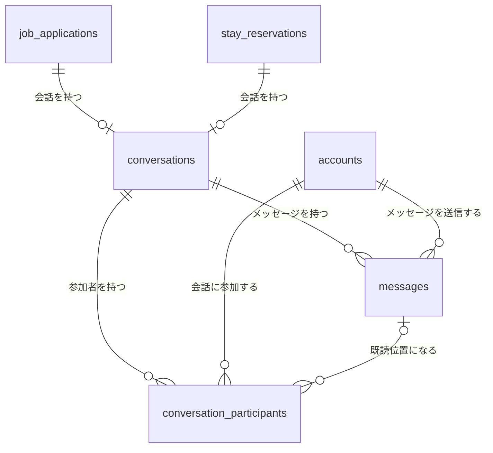
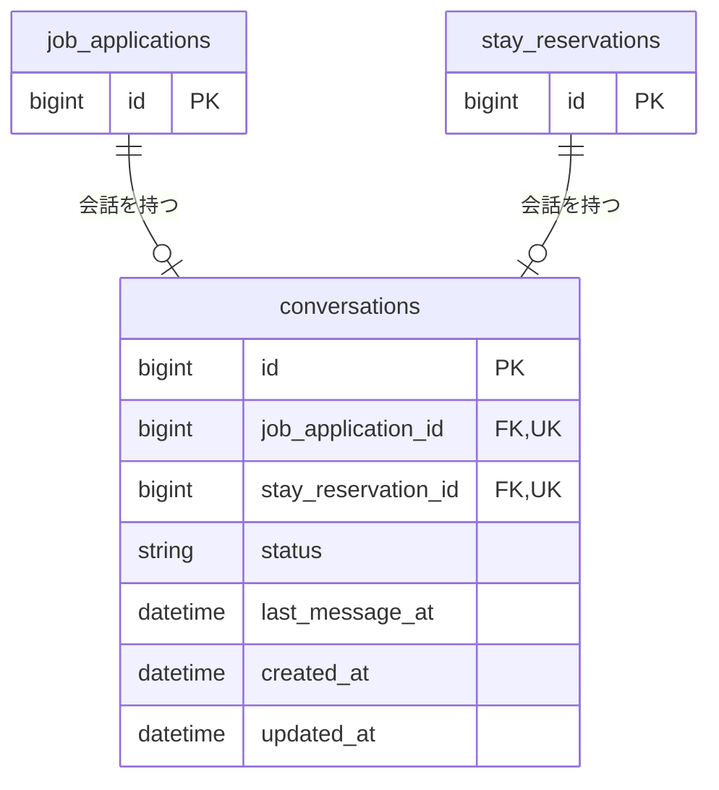
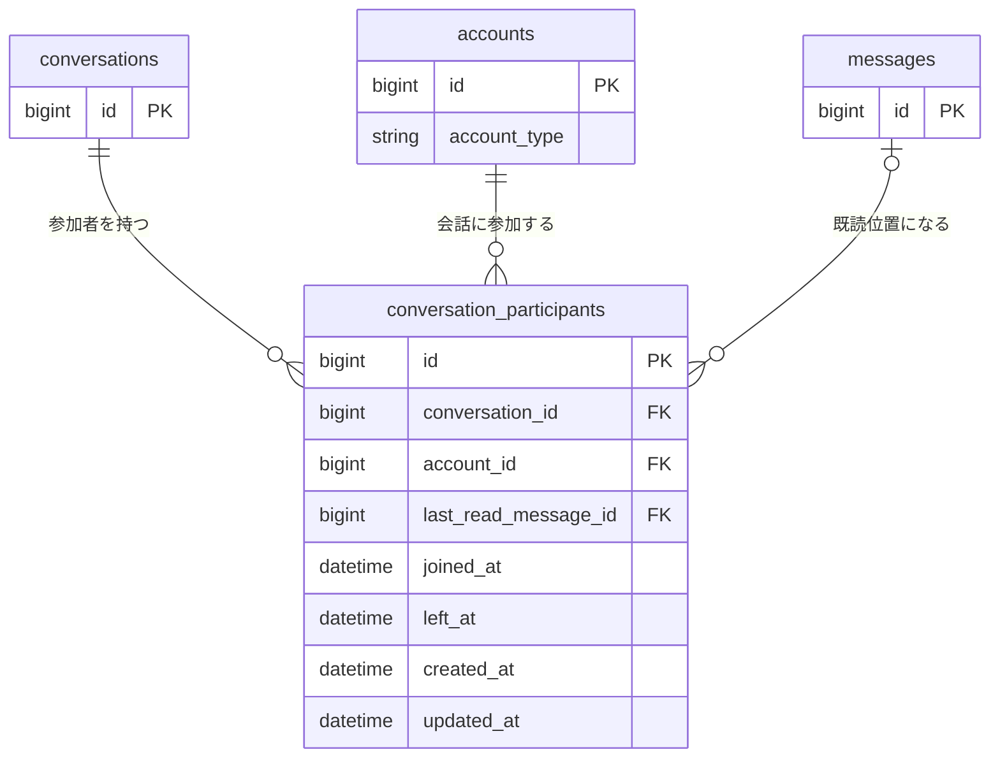
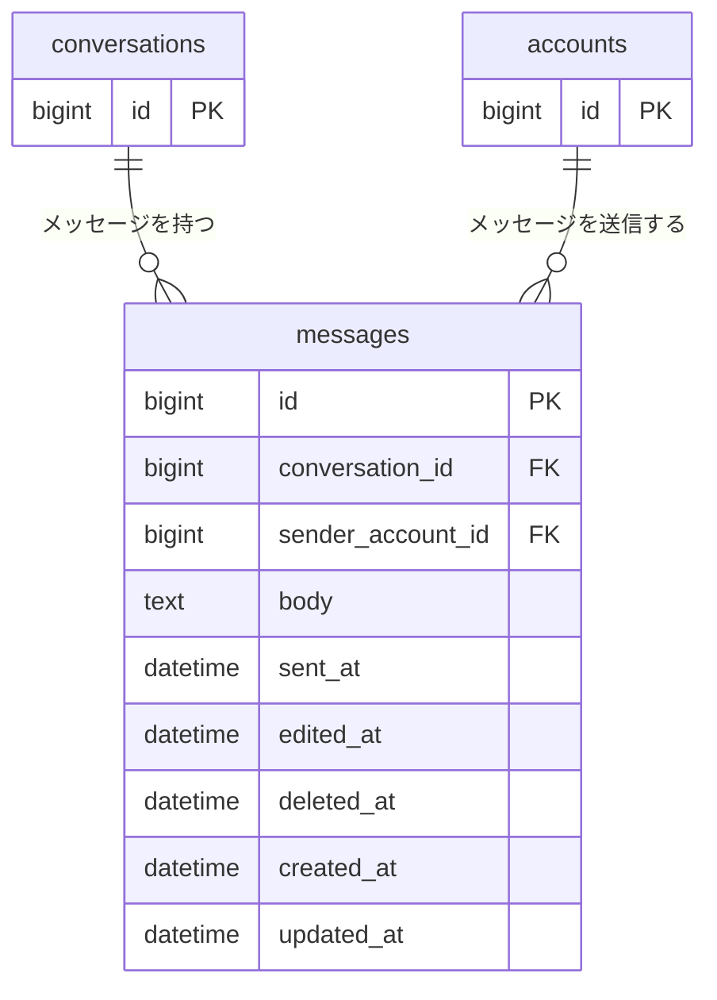

# チャット関連 ER 図

求人応募または宿泊予約に関する、一般ユーザーとテナントユーザーの会話を管理する。

求人応募については [`n-job-application.md`](./n-job-application.md)、宿泊予約については [`02-stay-reservation.md`](./02-stay-reservation.md) を参照する。

## 全体関連図

## 会話

`conversations` は求人応募または宿泊予約ごとのチャットルームを管理する。

`job_application_id` と `stay_reservation_id` は、どちらか一方だけを設定する。

それぞれを一意にし、1つの求人応募または宿泊予約に複数の会話を作成しない。

`status` は次の値を取る。

| 値 | 状態 |
| --- | --- |
| `open` | 会話中 |
| `closed` | 終了 |

## 会話参加者

`conversation_participants` は会話へ参加できるアカウントと、そのアカウントの既読位置を管理する。

`conversation_id` と `account_id` は必須とし、その組み合わせを一意にする。同じアカウントを同じ会話へ重複参加させない。

`last_read_message_id` は、その参加者が最後に読んだメッセージを表す。値を設定する場合は、同じ会話に属するメッセージに限定する。

## メッセージ

`messages` は会話内で送信された本文と送信者を管理する。

`conversation_id`、`sender_account_id`、`body`、`sent_at` は必須とする。送信者は対象会話の有効な参加者に限定する。

メッセージを削除する場合はレコードを物理削除せず、`deleted_at` に削除日時を記録する。

## 主な制約・インデックス

| テーブル | カラム | 制約・インデックス |
| --- | --- | --- |
| `conversations` | `job_application_id` | unique index |
| `conversations` | `stay_reservation_id` | unique index |
| `conversations` | `job_application_id, stay_reservation_id` | どちらか一方だけを設定するCHECK制約 |
| `conversations` | `status, last_message_at` | composite index |
| `conversation_participants` | `conversation_id, account_id` | unique index |
| `conversation_participants` | `account_id` | index |
| `conversation_participants` | `last_read_message_id` | index |
| `messages` | `conversation_id, sent_at` | composite index |
| `messages` | `sender_account_id` | index |
