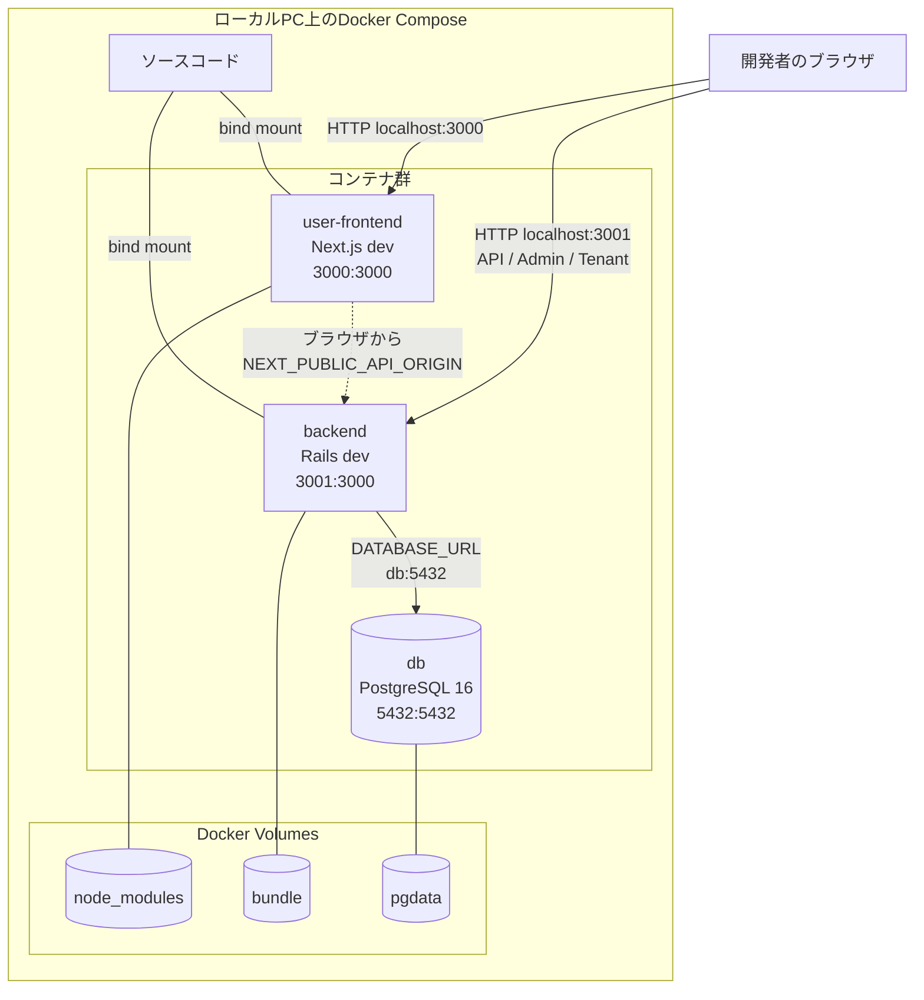
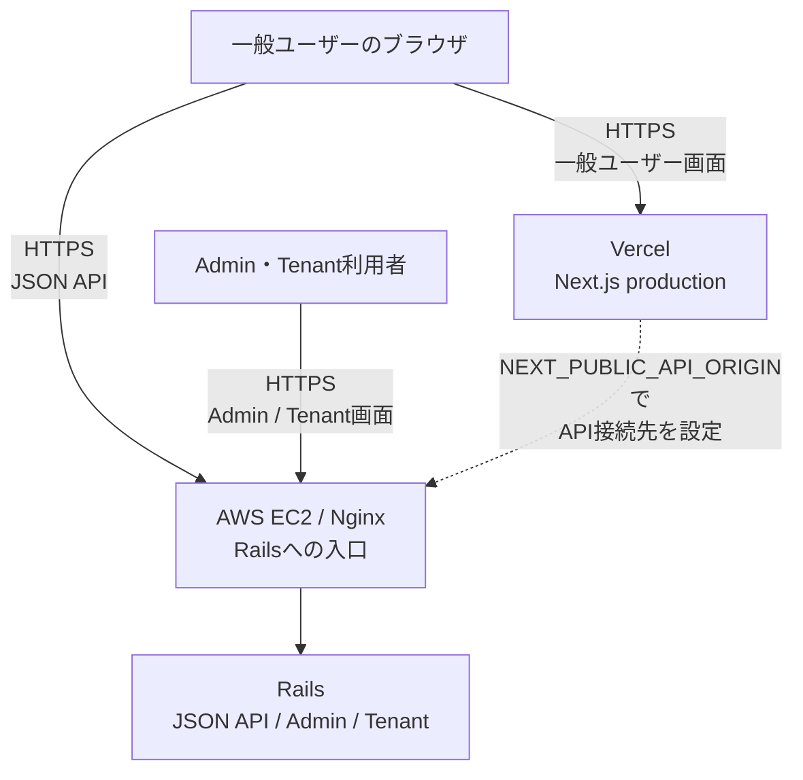
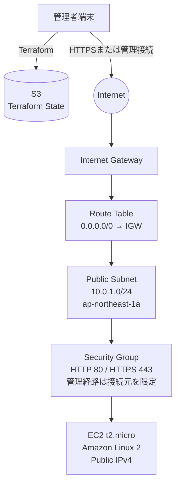
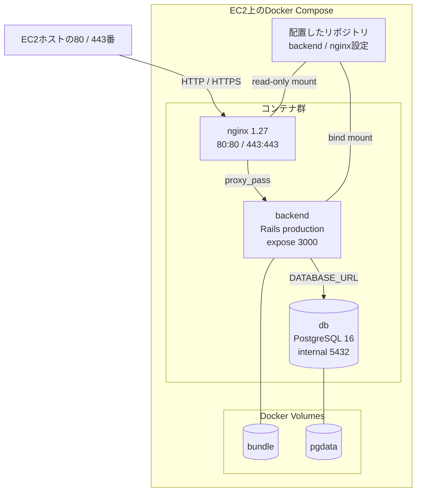

# インフラアーキテクチャ

## この文書の位置づけ

この文書は、リポジトリに現在定義されているローカル開発環境と、ポートフォリオ公開時に予定するVercel・AWS構成を示す。
ローカル環境は`docker-compose.yml`、AWS側の現在地は`docker-compose.server.yml`、`nginx/default.conf`、`infrastructure/`配下のTerraformコードを正本とする。公開環境には未実装の構成を含むため、実装状況を注記する。

## ローカル開発環境

- ホストの`3000`番をNext.js、`3001`番をRailsへ割り当てる。
- PostgreSQLの`5432`番もホストへ公開しており、ローカルのDBクライアントから接続できる。
- ソースコードはbind mountされるため、ローカルの変更が各開発コンテナへ反映される。
- DBデータと依存パッケージはDocker named volumeへ保持する。

## 公開環境（予定構成）

### 全体構成

Next.jsはVercelから配信する。現在のFrontend実装はClient ComponentからRails APIを呼ぶため、JSON API通信の主体はVercelではなくブラウザである。VercelとRailsには別のOriginを使用するため、Rails側で許可Originを限定したCORS設定が必要になる。

### AWSネットワーク

### EC2内部

### 現在の境界と注意点

- 一般ユーザー向けNext.jsはVercelで稼働させ、EC2上のDocker Composeには含めない。
- TerraformはVPC、Public Subnet、Internet Gateway、Route Table、Security Group、EC2、キーペアを作成する。
- Terraform Stateは東京リージョンのS3 backendへ保存し、S3 lockfileを使用する。
- EC2にはPublic IPv4を自動割り当てする。Elastic IPはTerraformコード上で無効化されている。
- Vercelには公開してよいRails APIのOriginを`NEXT_PUBLIC_API_ORIGIN`として設定する。
- VercelのOriginとRails APIのOriginを確定し、RailsはそのOriginだけをCORSで許可する。
- Security Groupが現在許可するInboundは管理者IPからのSSH（22番）のみである。公開時にはNginx用の80番と443番を許可する。
- サーバー用Composeに現在含まれるのはNginx、Rails、PostgreSQLであり、WorkerとCertbotはまだ含まれない。
- Railsは現在`development`環境で起動し、ソースコードをbind mountする。production向けイメージおよびComposeへの移行は未実装である。
- PostgreSQLはホストへポート公開せず、Compose内部からのみ接続する。一方、データはDocker named volumeであり、専用EBSへのbind mountはまだ実装されていない。

公開までの残作業は、[ポートフォリオ公開までの実装ロードマップ](../tasks/portfolio-readiness.md)を参照する。[単一EC2での低コストデプロイ構成](single-ec2-deployment.md)は、Next.jsもEC2で稼働させる場合の比較資料として扱う。
